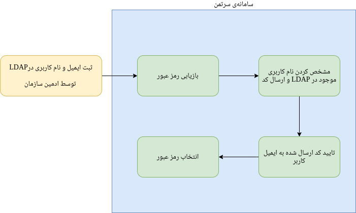

# Certman (Cloud Security)

## Introduction

The Certman subsystem is a centralized system designed to consolidate the management of all necessary protective and security measures for working with the Kubit cloud suite.

In other words, Certman can be considered a place to create various security certificates. Three different types of certificates can be created in Certman: Client Certificate for accessing all services and subsystems, Private Network Certificate for connecting to an OpenVPN server, and kubeconfig certificate used for connecting to a Kubernetes cluster.

:::info[Types of Certificates in Certman]
Three types of certificates are created in Certman: Client Certificate, OpenVPN, and kubeconfig.
:::

Some additional features of this system include registering and displaying a history of all user certificates and various user operation logs.

It is worth mentioning that the Certman system has two levels of access: Users and Administrators.

At the administrator access level, the history and logs of all users are visible, and the ability to create guest certificates, manage other user certificates, and manage users themselves exist alongside the system's primary functionalities, which we will explain in detail in this document.

Another task of the Certman system is completing the registration of users whose initial registration was done by the organization's administrator in OpenLDAP. Additionally, changing or recovering the passwords of registered users is also done through this system.

:::info[Managing User Passwords]
Alongside certificate creation, managing passwords for accessing Kubit is the responsibility of the Certman system.
:::

:::tip[Note]
Certman is connected to OpenLDAP for user authentication.
:::

## Client Certificate {#client-cert}

By default, all Kubit services and subsystems are behind a security layer. To bypass this security layer and access each of the subsystems, the user needs to install the required certificate on their browser. This certificate is created through the Certman subsystem.

:::caution[Warning]
The Certman subsystem is not behind any security layer.
:::

To obtain a client certificate from Certman, follow these steps:

- From the right-side menu, select "Client Certificate."
- Click on the "New Certificate" button.
- Click on the "Send Verification Code" button.
- Enter the verification code received via SMS along with your Certman system password and click "Send." (The number and password are determined by the user in the [User Registration Completion](#sso) step.)
- After completing the previous steps, you will be taken to the certificate details page where you can download the certificate in p12 format from this page. The downloaded certificate can be installed on the browser according to the instructions in [this section](#install). Also, remember that during the certificate installation, the browser will request a password, which is the same as your registered number.

:::tip[Note]
The certificate password is your registered phone number.
:::

Please note that at any given time, only one active certificate exists for a user, and creating a new certificate will invalidate all your previous certificates.

:::caution[Warning]
Each user can have a maximum of one active certificate (of each type).
:::

In the certificate details page, besides the p12 format used for installing the client certificate on the browser, other files related to the certificate such as the pem format of the certificate and its private and public keys are available. These can be used for other purposes such as curl commands or connecting with stunnel, and more. Also, it's important to note that re-downloading the certificate requires resending the code to your registered mobile number.

After installing the client certificate on your browser, you can access the subsystems (such as Risman, Kubchi, User Management, etc.) and services (like GitLab, Jira, Grafana, etc.) of Kubit.

## OpenVPN Certificate {#vpn-cert}

The Certman system administrator can define any number of VPN servers through the admin panel and add them to the system. For each server added, a menu will appear on the right side of the Certman system, allowing the user to create and download the necessary security certificate to access that server.

To do this, follow these steps:

- Right-click on the desired VPN name from the right-side menu.
- Click on the "New Certificate" button.
- Click on the "Send Verification Code" button.
- Enter the verification code received via SMS along with your Certman system password and click "Send." (The number and password are determined by the user in the User Registration Completion step.)
- After completing the previous steps, you will see the certificate details page where you can download the OpenVPN certificate in ovpn format. You can also download the public and private keys of the certificate from this page.

Keep in mind that to use the downloaded OpenVPN certificate, you need a username and password, which are the same as your Certman system's username and password.

:::tip[Note]
The VPN certificate username and password are the same as the Certman system's username and password.
:::

## Kubeconfig Certificate {#kubeconfig}

After creating a cluster in Kubernetes, it is necessary for the Certman system administrator to configure the necessary settings to add a kubeconfig certificate issuer in the admin panel. For each issuer (corresponding to a Kubernetes cluster), a tab will appear in the Certman system's right-side menu.

Users need a kubeconfig file to access each Kubernetes cluster (via kubectl and other tools), which contains the necessary certificate to connect to that cluster. This file is also created and downloaded through the Certman system.

The steps for creating and obtaining a kubeconfig certificate are as follows:

- Right-click on the kubeconfig certificate issuer name in the right-side menu.
- Click on the "New Certificate" button.
- Click on the "Send Verification Code" button.
- Enter the verification code received via SMS along with your Certman system password and click "Send." (The number and password are determined by the user in the User Registration Completion step.)
- After completing the previous steps, you will be taken to the certificate details page where you can download the kubeconfig file. Additionally, other certificate-related files such as the pem format of the certificate and its public and private keys are available on this page for users.

## History

In the Certman system's right-side menu, there is a list of certificate issuers, including client certificates, certificates for OpenVPN servers, and certificates for connecting to various Kubernetes clusters. By clicking on each certificate issuer, the user can view a list of certificates created by that specific issuer. In this list, there is a maximum of one active certificate, and the rest of the certificates are expired or invalidated. This is because creating a new certificate will invalidate the previous certificates created by that issuer.

:::caution[Warning]
Each user can have a maximum of one active certificate (from each issuer).
:::

## Log {#log}

Users can navigate to the Log section through the right-hand menu and view all their operations within the system. These operations include system login, certificate creation, verification code submission, certificate download, and any other functions the user performs in the system. You can see the type of operation, the time it was performed, and the IP through which the operation was carried out for each line on this page. Additionally, there is the option to filter the table of operations based on the type of operation.

## System Management Access

Sertman system has two levels of access: users and administrators. By logging into the system as an administrator, new sections and features become visible. Among these features are the ability to view the log of all users, the ability to create guest certificates, the ability to manage users, and also manage their certificates.

In the user management section, the system administrator can view a list of all active and inactive system users and search by name or mobile number. Additionally, the administrator can deactivate the status of any user to prevent them from accessing the system. Furthermore, by deactivating a user, all certificates of that user will become void.

In the user certificate management section, the administrator can view, filter, and search through all issued certificates, and invalidate any desired certificate. Also, in the Users Log section, a list of all users' activities is available in one place, with the option to filter based on the user and the type of operation among the administrator's capabilities in this section.

### Guest Certificate

One of the available features for the system administrator is the creation of a guest client certificate or a temporary certificate. The use of a guest certificate is when an individual outside the organization, who is not a member of the system, needs temporary access to an address that is only possible with a client certificate but without logging in. In this case, the system administrator can create a temporary or guest certificate for them via Sertman.

When creating a guest certificate, the administrator can determine its expiration date and also, by specifying an email, the system will send the created certificate to the mentioned email. Additionally, the system administrator can invalidate any of the guest certificates at any time.

By selecting the "Guest Certificate" section in the right-hand menu, the administrator can view a list of created guest certificates along with the creator's name, the status of the certificate, expiration date, and more. Also, the option to filter this list based on the creator's name is available.

## Single Sign-On (SSO) Management {#sso}

Access to each of the Cubit's sub-systems and services behind the security layer requires authentication. This authentication is done uniformly with a username and password managed by Sertman.

Initially, after registering the email and username by the organization's admin, the user's registration completion stages are done by the user themselves by logging into the Sertman system. First, the user needs to go to the Sertman system and select "Password Recovery". Then, by entering their username, a code will be sent to the user's registered email by the Sertman system. In the next step, the user enters the sent code into the system and after verification by Sertman, we will proceed to the password selection stage.

 Completion stages of registration in Sertman 

 
 

After setting the password and completing the registration by the user, logging into each of the services and Cubit sub-systems will be done through the user's registered username and the password set by the user themselves in Sertman.

If there is a need to change the password or recover it in case of forgetfulness, these same steps are done through the Sertman system. Therefore, one of the most important tasks of this system is managing passwords for unified access to all Cubit components and realizing user authentication.

## Installing Certificate on Browser {#install}

To install a certificate on your browser, after receiving it from the Sertman system, follow the instructions according to your browser type. Note that the password for the client certificate is the same as the phone number registered in the system.

:::caution[Caution]
All responsibility for using the Certificate file and its password is yours. Never share it with others.
:::

:::tip[Note]
The certificate password is your registered phone number.
:::

### Installing Certificate on Chrome Browser {#chrome}

To install a certificate on Chrome, follow these steps:

- Go to the browser settings
- Select the Privacy and security option from the left menu
- Navigate to the Security section as shown in the image below

- At the bottom of this section, select the Manage certificates section
- In the Your certificates tab, select the certificate file received from Sertman via the Import button, and after entering the password, the certificate will be installed on Chrome.

### Installing Certificate on Firefox Browser {#firefox}

To install a certificate on Firefox, follow these steps:

- Go to the browser settings
- Select the Privacy & Security option from the left menu
- As shown in the image below, at the bottom of this section, click on View Certificates under the Security title

- In the dialog box that opens, via the Import button, select the certificate file received from Sertman, and after entering the password, the certificate will be installed on Firefox.

### Installing Certificate on Android {#android}

#### Opening the Certificate File and Entering its Password

After downloading, open the Certificate file. Then, in the opened window, enter your Password and select the Confirm button.

#### Assigning a Name and Selecting the Type of Usage

In the next step, enter a name and select the usage type as apps.

#### Restart the Browser

Then, completely close and reopen your browser.

#### Visiting the Address of the Desired Service and Selecting the Installed Certificate

Now, go to the address of the desired service and in the opened window, select the Certificate and click Allow.

#### Accessing the Desired Service

Now the desired address is available to you.

### Installing Certificate on iPhone {#iphone}

#### Opening the Certificate File and Selecting the Allow Option

After downloading, open the Certificate file. Then, in the opened window, select the Allow option.

#### Selecting the Install Option

On the opened page, select the Install option.

#### Entering the Certificate File Password

In the next step, enter your Certificate file Password.

#### Selecting the Done Option

By selecting the Done option, the installation process is completed.

#### Accessing the Desired Service

Now the desired address is available to you.
