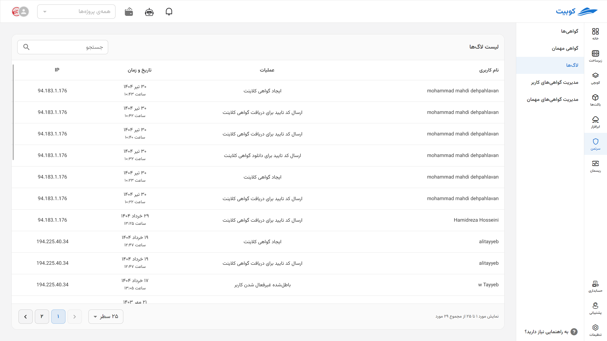

# Logs

## History

In the right-side menu of the system, there is a list of certificate issuers, including client certificates, certificates for OpenVPN servers, and certificates for connecting to various Kubernetes clusters. By clicking on each certificate issuer, the user can view a list of certificates created by that specific issuer for themselves. In this list, there is at most one active certificate, and the remaining certificates are either expired or revoked. This is because creating a new certificate invalidates any previous certificates issued by the same issuer.

:::caution[Warning]
Each user can have a maximum of one active certificate (from each issuer) at a time.
:::

## Log {#log}

Users can navigate to the log section through the right-side menu and view all their operations within the system. These operations include logging into the system, creating certificates, sending verification codes, downloading certificates, and any other user actions within the system. In each row of this page, you can see the type of operation, the time it was performed, and the IP address from which the operation was conducted. Additionally, it is possible to filter the operations table based on the type of operation.

