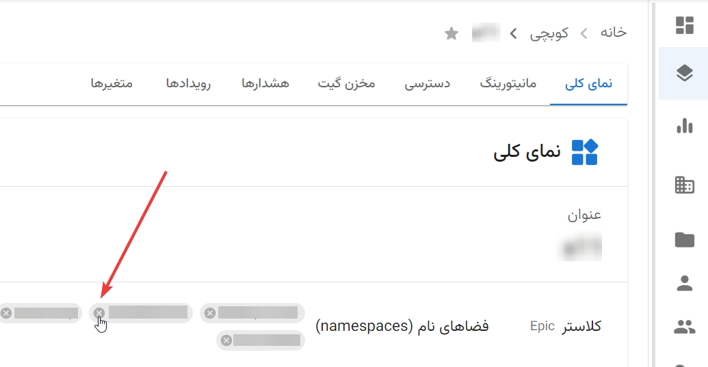

# Frequently Asked Questions

## How to Update a Pack (Deploy a New Version)?

If you have fully configured [CI/CD](https://en.wikipedia.org/wiki/CI/CD), this process is done automatically (usually by pushing to the master/main branch).

However, if you only have [CI](https://en.wikipedia.org/wiki/Continuous_integration) (without [CD](https://en.wikipedia.org/wiki/Continuous_deployment)), it’s still very simple. Just go to the **Configuration** section of your pack, edit the `DOCKER_TAG`, and click **"Apply Changes"**.

Important note: Before clicking **"Apply Changes"**, ensure that your image has been built (i.e., the CI pipeline related to the desired commit must have completed successfully).

## What to Do When a Pack’s Status Is “Deleted”?

Packs enter this status after being deleted. The only purpose of a pack remaining in this status is to allow you to view its specifications and configuration. If you no longer need this information, you can completely delete the pack.

## How to Transfer a Namespace from One Project to Another?

Simply go to the first project’s page and unbind the desired namespace there:

Then, go to the second project’s page and click on “Bind to Namespace”:

