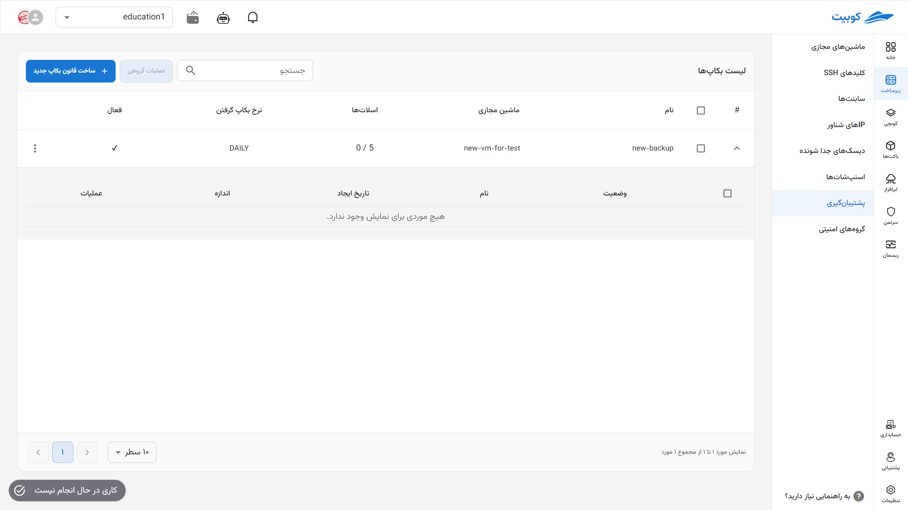
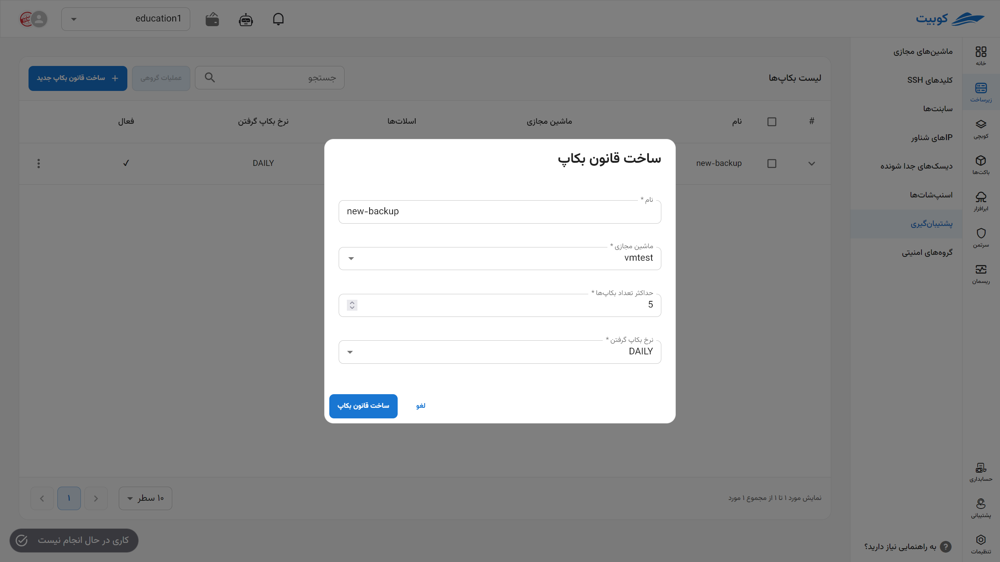
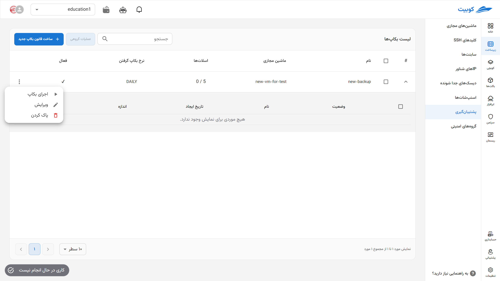
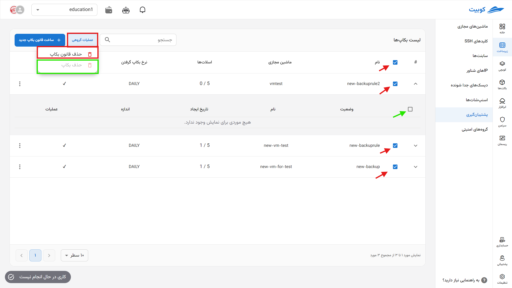

## Backup

In this section, you can create and manage **backup rules** for virtual machines in the project. Each backup rule takes snapshots of the specified virtual machine **periodically (daily, weekly, or monthly)** and retains them up to a **specified number of versions**.  
Supported operations include **creating a new rule**, **deleting a rule**, and **managing backup versions**.

## Creating a Backup Rule

- Click on the **Create New Backup Rule** button.
- Enter a **name** for the rule and select the desired virtual machine from the list.
- Specify the **maximum number of versions** to keep (e.g., 3 versions).
- Choose the time period from the following options:
  - **Daily**
  - **Weekly**
  - **Monthly**
- Finally, click on the **Create Backup Rule** button.
  

---

## Backup Rule Details

To view the backup versions created under each rule and perform operations on them, click on the (▼) icon in the image:

### Restore

- Click on the **Restore** icon for the desired version.
- After reviewing, click the **Confirm** button in the opened dialog to restore the virtual machine to that version.

### Delete Version

- To delete a backup version, click on the **Trash Can** icon next to it.
- In the opened window, confirm the **Delete** option.

## Deleting a Backup Rule

- If no longer needed, a backup rule can be deleted. If the rule contains backup versions, deletion will be prevented.
- Select the **Delete Rule** option.
- If you are sure, click the **Delete** button in the confirmation dialog.

## Batch Backup Operations

For convenience, simultaneous operations on multiple backups are available through the **Batch Operations** option. First, select one or more backups. After selection, the **Batch Operations** button will become active:

