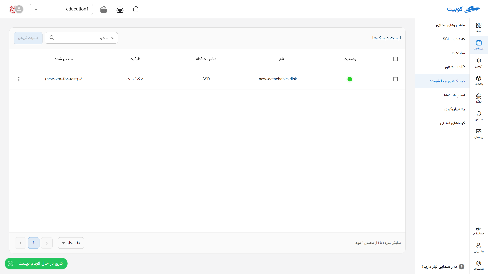
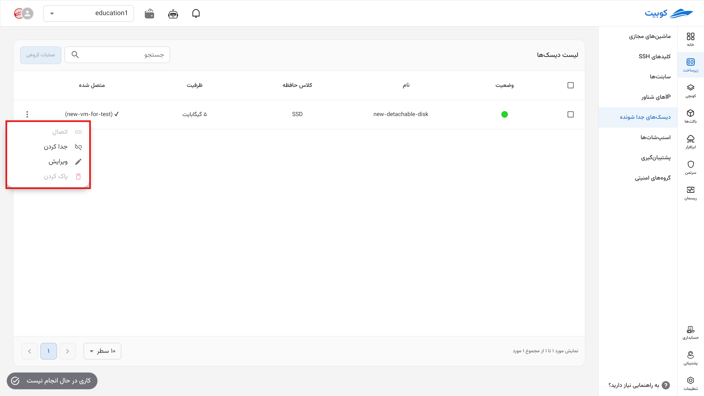
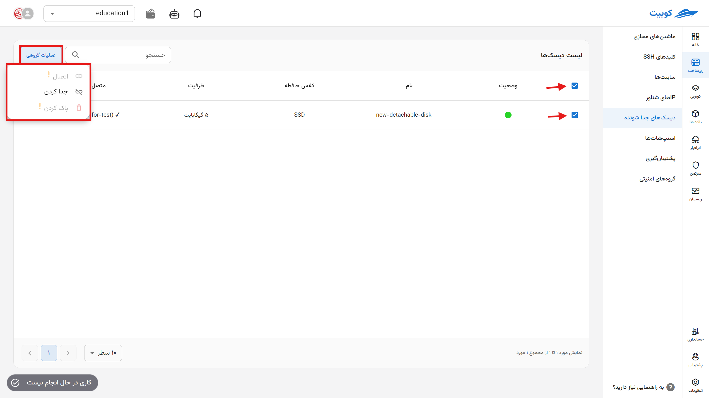

## Detachable Disks

In this section, you can view and manage the list of your detachable disks. Each disk includes the following information:

- **Attachment Status (Attached/Detached)**
- **Storage Class**
- **Disk Capacity (GB)**
- **Connected Machine (if applicable)**

## Operations Available for Disks

For each disk, the following options are available through the operations menu:

### Attach

Attach the disk to one of the active virtual machines in the project.

### Detach

Disconnect the disk from the connected machine without deleting the data.

### Edit

Edit details such as the disk name or description (if applicable).

### Delete

Completely delete the disk from the project (if it is not attached to any machine).

## Batch Backup Operations

For convenience, simultaneous operations on multiple disks are available through the **Batch Operations** option. First, select one or more backups. After selection, the **Batch Operations** button will become active:

