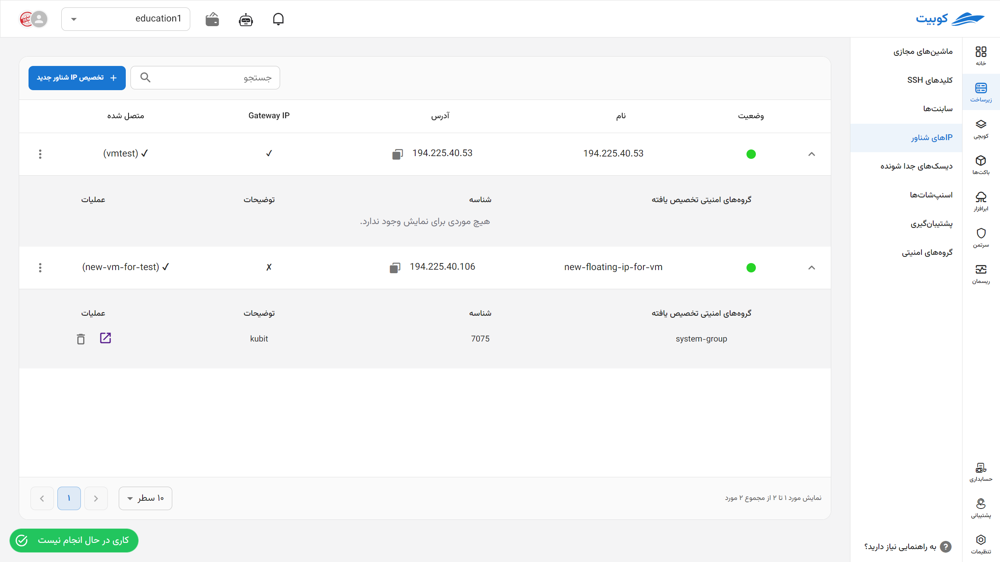
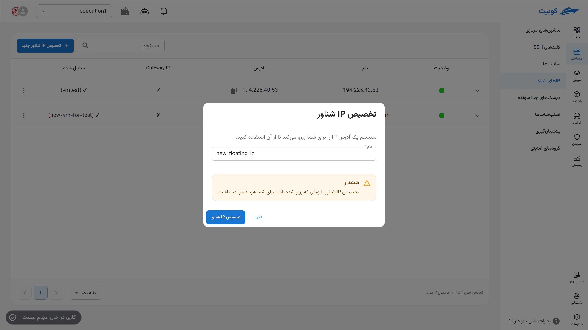
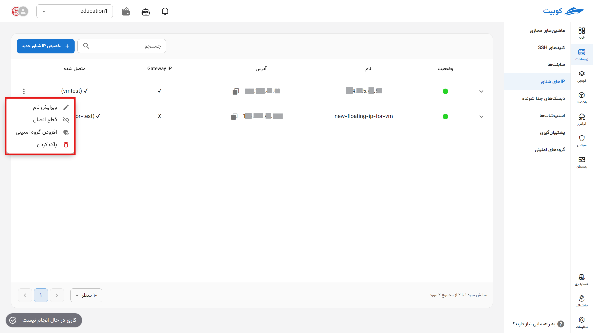
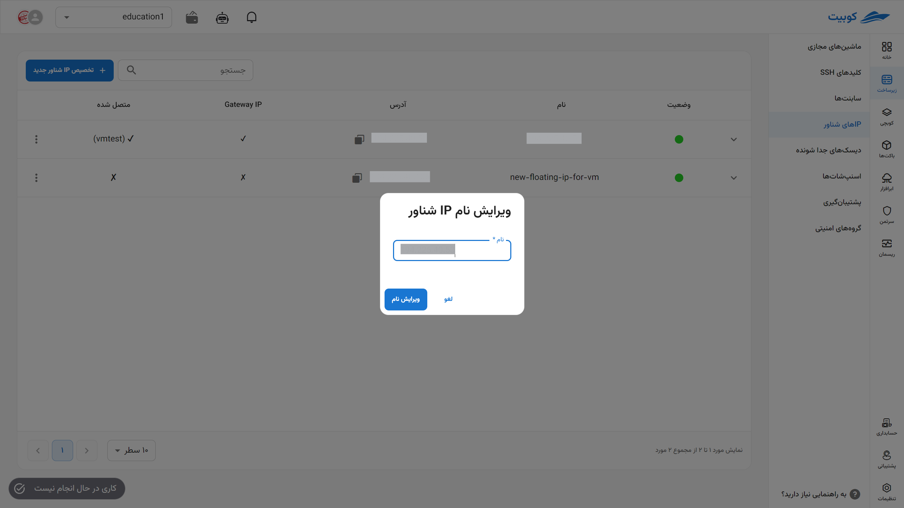
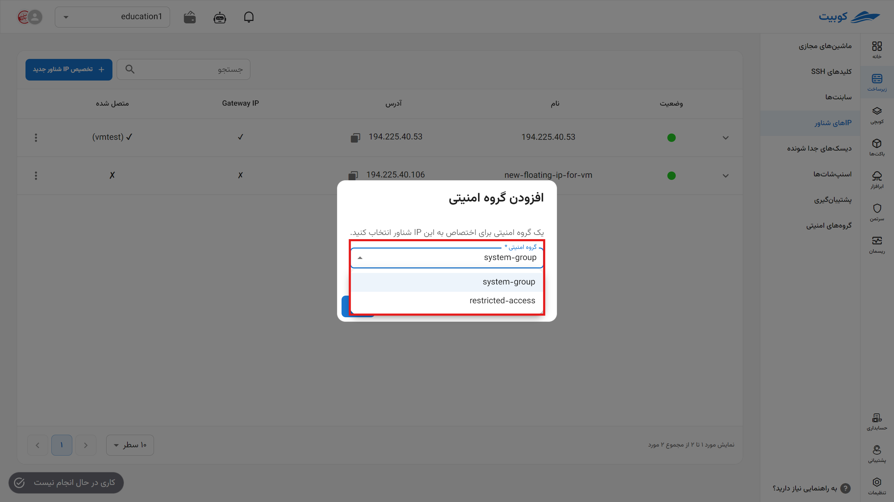
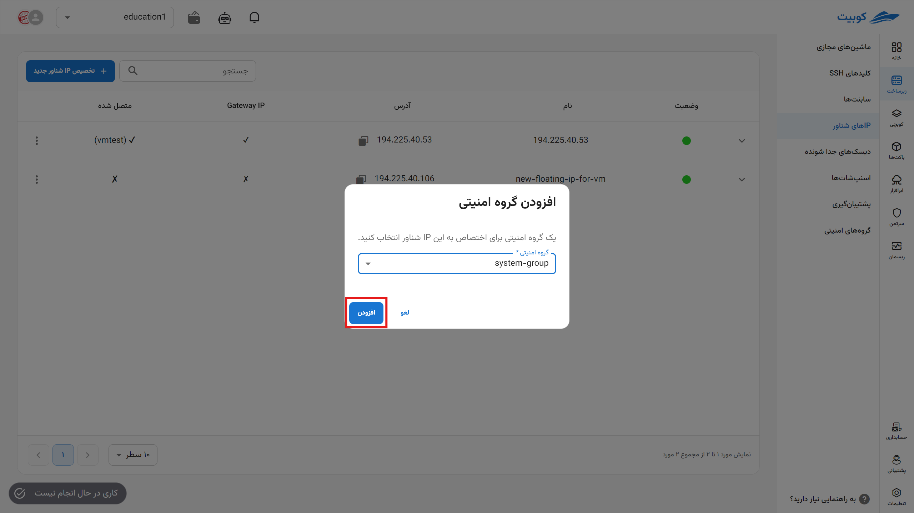

# Floating IPs

In this section, you can access the list of floating IPs available in the project and manage them, including **assignment**, **deletion**, and **disconnection**.

## Assigning a Floating IP

- Click on the **Assign New Floating IP** option.
- In the opened dialog, enter a **valid and unique name**.
- Then, click on **Assign Floating IP**. A **job** related to the floating IP assignment will also be created, showing the status of this request.
- Upon successful completion of the created job, you can use your new floating IP.

  

:::caution[Note!]
Note that assigning a floating IP will incur costs as long as it remains reserved.
:::

## Floating IP Operations

To view possible operations for a floating IP, click on the three-dot button in the **Operations** column to display a list of operations:

### Editing the Name

- To edit the name, click on the three-dot button in the **Operations** column and select the **Edit Name** option.
- In the opened dialog, choose the new name and click the **Edit Name** button.
  

### Disconnecting

- To disconnect from all resources, click on the three-dot button in the **Operations** column and select the **Delete** option.
- Then, if you are sure about the deletion, click the **Confirm** button in the opened dialog.

### Connecting to a Security Group

- To add a security group to this IP address, first click on the three-dot button in the **Operations** column and select the **Add to Security Group** option.
- Choose the appropriate security group from the list of available security groups.
  
  

### Deleting a Floating IP

- To delete, click on the three-dot button in the **Operations** column and select the **Delete** option.
- Then, if you are sure about the deletion, click the **Delete** button in the opened dialog.
