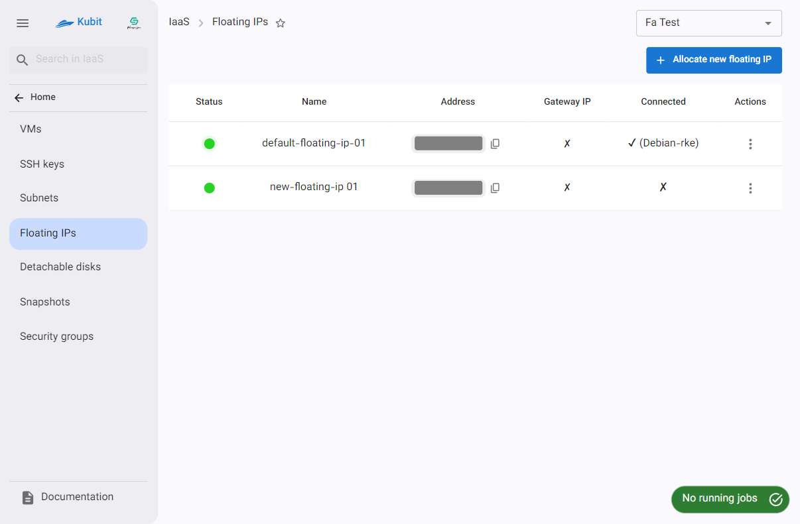
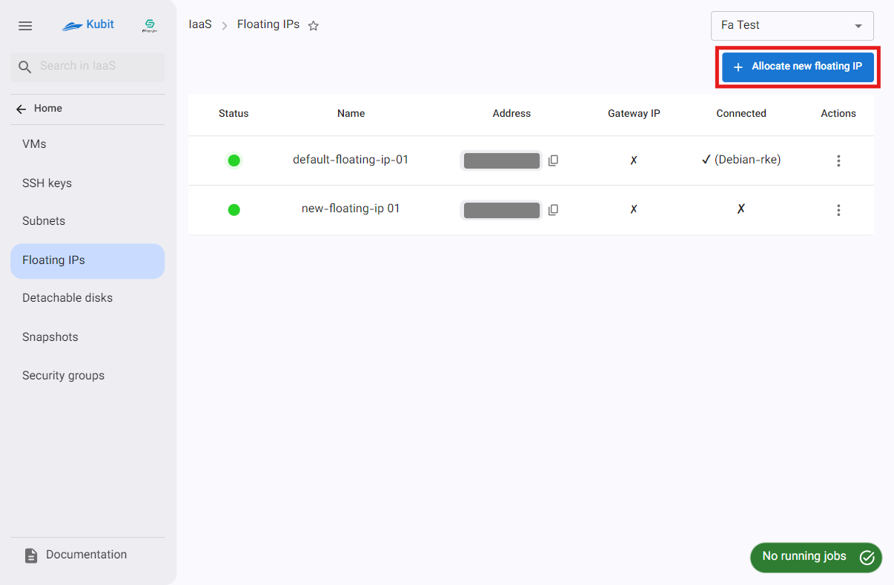
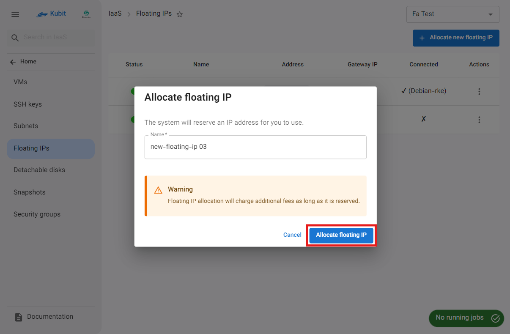
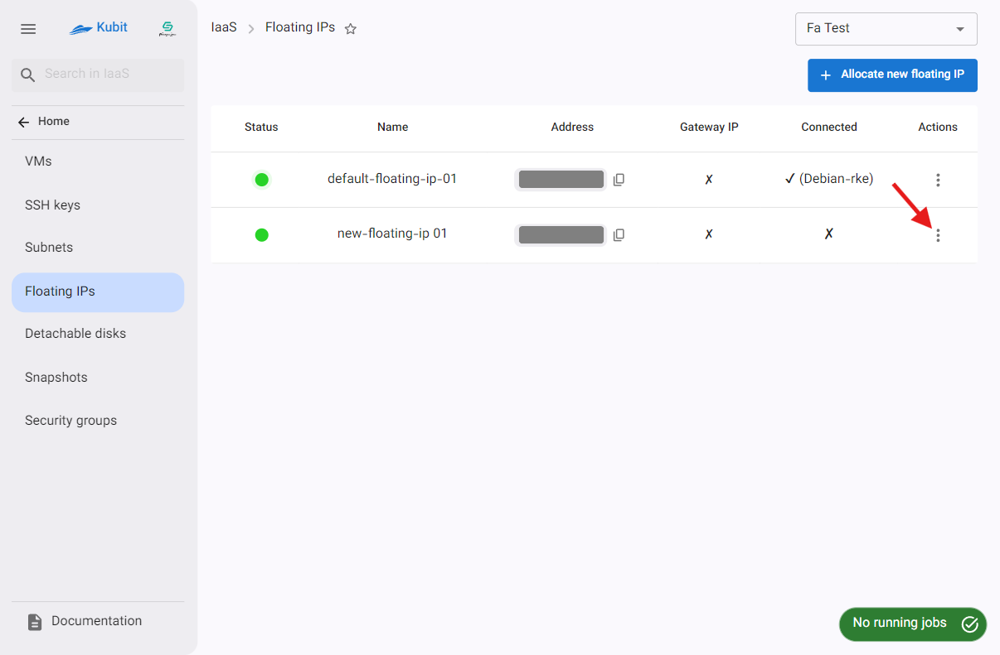
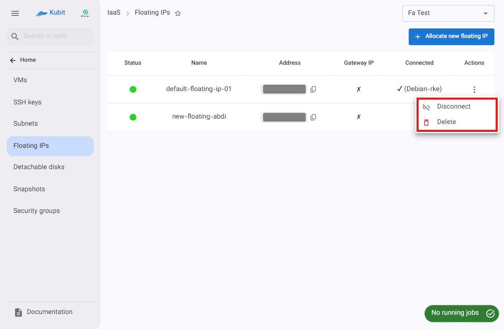
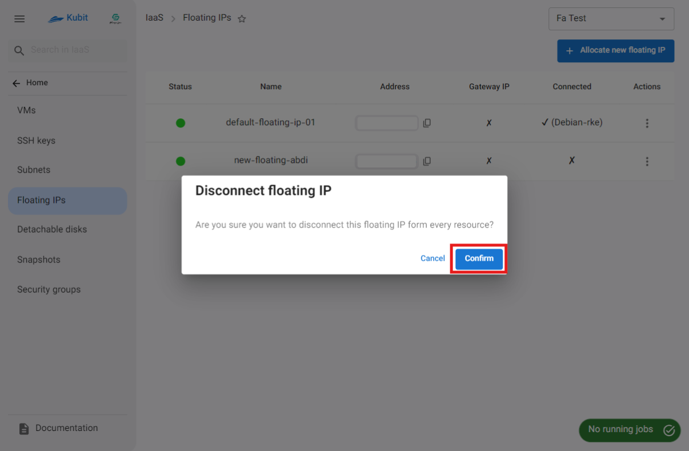
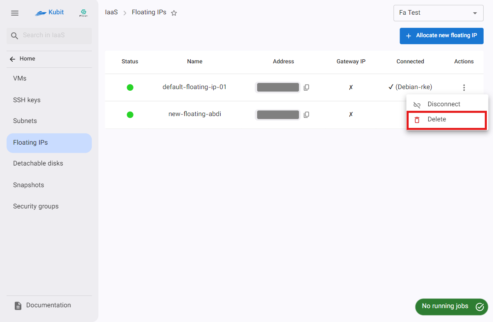
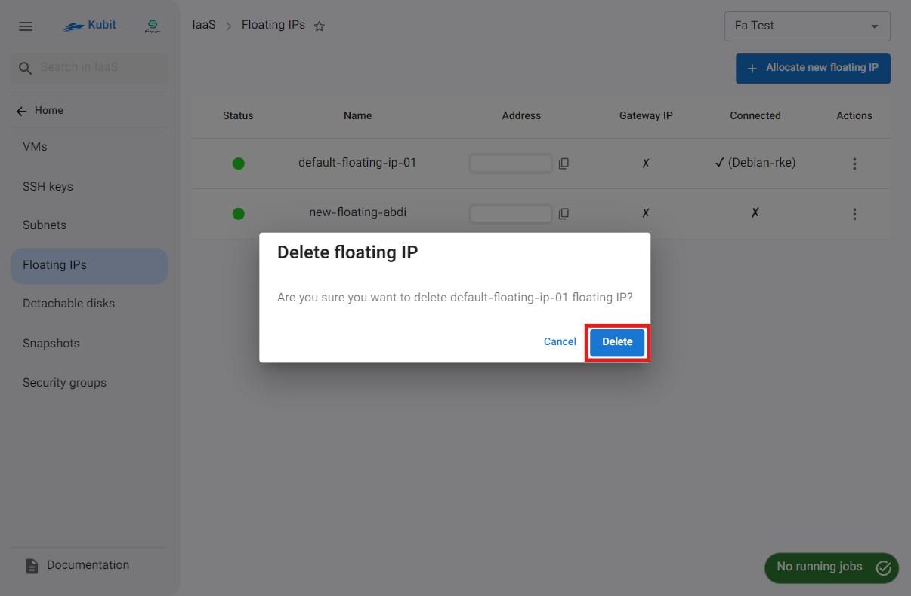

# Floating IPs

In this section, you can view the list of available floating IPs in the project and manage them, including **allocation**, **deletion**, and **disconnection**.

## Allocate a Floating IP

- Click on the **Assign New Floating IP option**.
- In the opened dialog, enter a **valid and unique name**.
- Then, click on **Allocate Floating IP**. A **job** related to the floating IP assignment will be created, showing the status of the request.
- After the successful completion of the job, you can start using your new floating IP.
  
  

:::caution[Note!]
Please note that as long as the floating IP is reserved, it will incur costs for you.
:::

## Floating IP Actions

To view the possible operations for a floating IP, click the three-dot button in the **Actions** column to display a list of actions:

### Disconnect

- To disconnect from all resources, click the three-dot button in the **Actions** column and select **Disconnect**.
- Then, if confirmed, click the **Confirm** button in the opened dialog.
- 
  

## Deleting a Floating IP

- To delete a floating IP, click the three-dot button in the **Actions** column and select **Delete**.
- Then, if confirmed, click the **Delete** button in the opened dialog.
  
  
