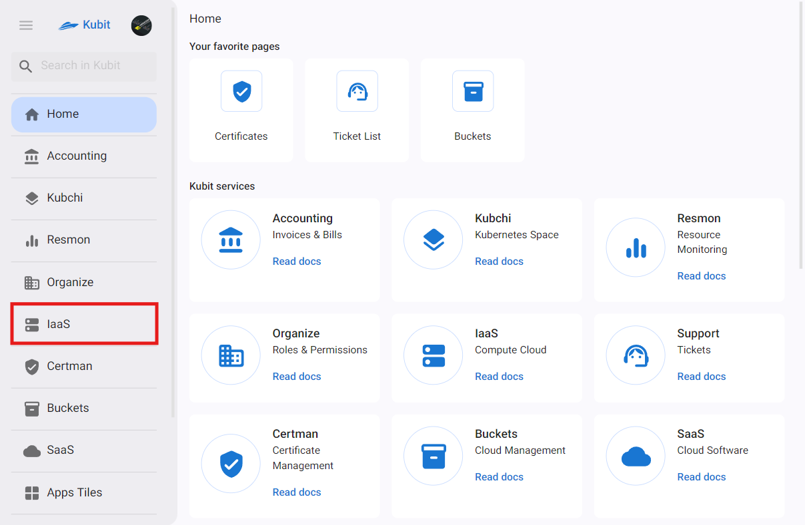

---
subDocuments:
  - settings
  - create-vm
  - vms
  - vm
  - ssh-keys
  - subnets
  - floating-ips
  - snapshots
  - security-groups
---

# Infrastructure (Cloud Computing)

The Infrastructure Services section of Kubit is responsible for providing cloud computing resources such as processors, memory, disks, and network, based on demand and on a pay-as-you-go basis for the user. In this section, you will be able to create your virtual machines under different projects by selecting the type of operating system, CPU and memory capacity, disk size and number, network settings, and security features such as SSH keys.

## Basic Concepts

### Virtual Machine

A Virtual Machine (VM) is a software simulation of a physical computer. Each virtual machine runs its own operating system and applications in isolation from other software on the same physical hardware. This isolation allows multiple virtual machines to coexist on a single physical machine, sharing resources such as CPU, memory, and storage space. Virtual machines are used to optimize hardware utilization, test software in controlled environments, and run applications that require different operating systems on a single device. They provide flexibility and efficiency in managing computing resources.

### SSH Key

An SSH key is a critical security feature used for authentication and access to virtual machines (VMs). This key consists of an encryption key pair: a public key stored on the server and a private key held by the user. This key pair enables secure, passwordless access to virtual machines and ensures that only authorized users with the correct private key can gain access.

### Subnet

A subnet refers to a logical subdivision of an IP network within a virtual private cloud (VPC). These subnets divide the VPC into distinct segments, each with its own specific IP address range, to manage and isolate different resources. Subnets are essential for organizing network architecture, implementing security controls, and optimizing traffic management in a cloud environment, enabling efficient resource allocation and enhanced security.

### Floating IP

Floating IP addresses are public IPv4 addresses that can be attached to any cloud server in the same region. They direct traffic to a server at any time and can be moved to another server in the same region without downtime and without needing to reboot the server.

### Snapshot

A snapshot is a saved state of a virtual machine or volume at a specific point in time. This snapshot captures the configuration and data of the resource, allowing for quick restoration in case of data loss or other issues. Snapshots are used for backup, disaster recovery, and cloning virtual machines for scaling or testing, providing a reliable mechanism for managing data and system states in a cloud environment.

### Security Group

A security group acts as a virtual firewall, defining rules that control incoming and outgoing network traffic to and from virtual machines or other resources. These rules specify allowed protocols, ports, and IP ranges, thereby controlling access to resources.
