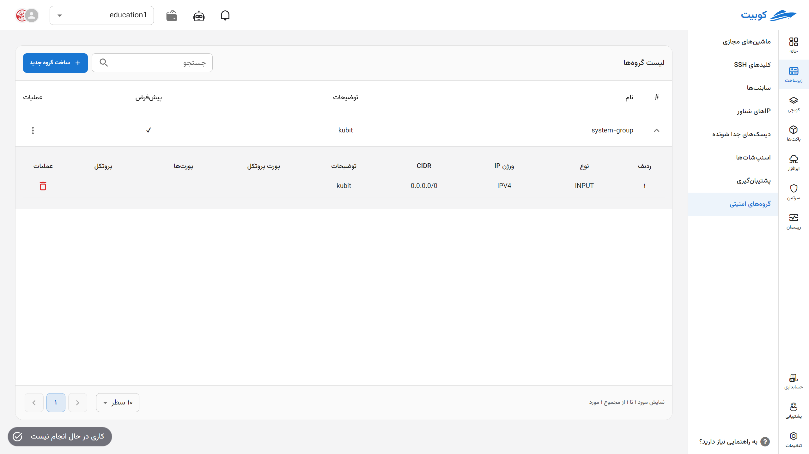
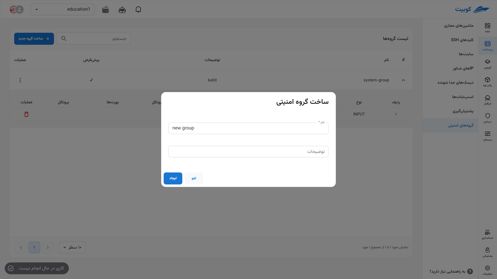
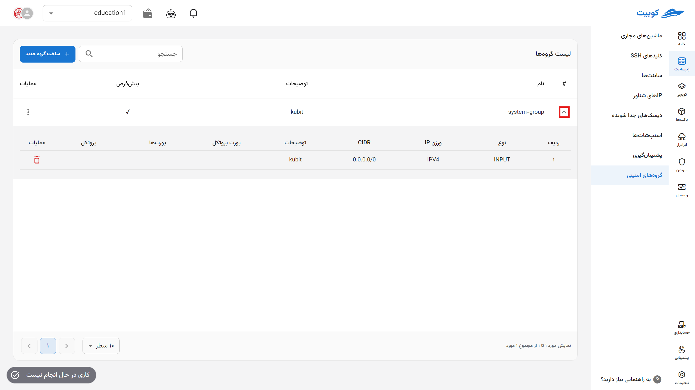
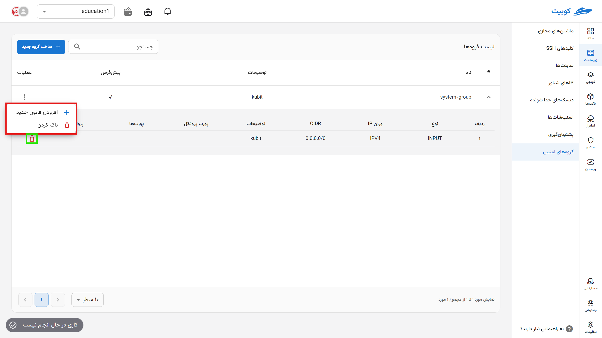
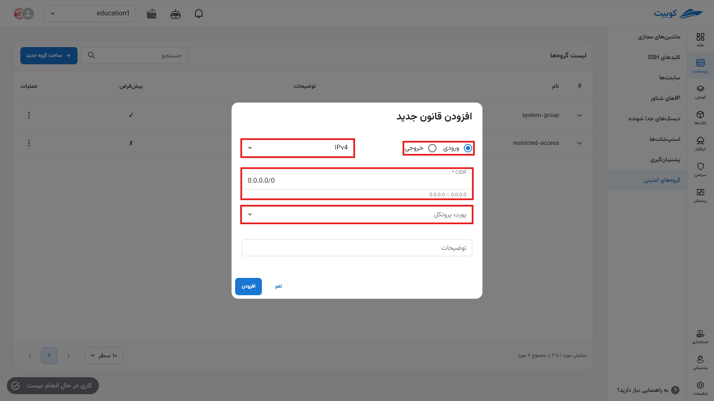

# Security Groups

In this section, you can access the list of security groups for the project and manage them, including **creating**, **adding rules**, **viewing group status**, and **deleting**.

:::info[Default Group]
After connecting the project to the service, a default security group is created by Kubit for the project, which can be distinguished from other groups through the **Default** column.
:::

## Security Group Rules

Before discussing security groups, we must first examine their rules. Rules are a set of criteria and actions that determine which traffic is allowed to pass through the firewall. These rules are typically defined based on criteria such as IP addresses, protocols, ports, and traffic direction (inbound or outbound).

## Creating a New Group

- To define a new security group, click on the **Create New Group** button.
- Then, enter the **Name** and **Description** of the group and click the **Create** button.
  

After creating the new group, you can define rules for it or assign it to a virtual machine or subnet.

## Viewing Details and Status

By clicking on the (▼) icon for each group, a list of the group’s rules and their details is displayed:

### Deleting a Rule from a Group

- To delete a rule from a group, simply click on the **Trash Can** icon associated with the rule.
- Then, if you are sure about the deletion, click the **Confirm** button in the opened dialog.

## Group Operations

### Adding a New Rule

The rules of each group determine the level and type of access. To assign a new rule, click on **Add New Rule**. Then, you need to define the required information for the rule:

- **Inbound/Outbound**: Specifies the traffic direction.
- **IP Version**: Specifies the IP version.
- **CIDR**: The IP range that gains access to resources through this rule.
- **Protocol Port**: Select the protocol port you want to open access for. This section includes a list of commonly used protocol ports, and if you need to define another protocol, you can select the **Custom** option and enter the desired information.
  

Finally, by clicking **Add**, the rule is created and assigned to the desired group.

### Deleting

- To delete a security group/rule, click on the three-dot button in the **Operations** column and select the **Delete / Trash Can** option.
- Then, if you are sure about the deletion, click the **Delete** button in the opened dialog.

