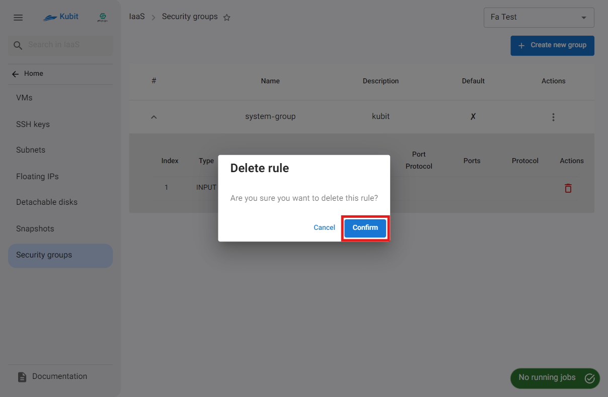

# Security Groups

In this section, you will have access to the list of the project's security groups and manage them, including **creating**, **adding rules**, **viewing group status**, and **deleting** them.

:::info[Default Group]
After connecting the project to the service, a default security group is created by Kubit for the project. This group can be distinguished from other groups via the **default** column.
:::

## Security Group Rules

Before learning about security groups, it's essential to first examine their rules. Rules are a set of criteria and actions that determine what traffic is allowed to pass through the firewall. These rules are typically defined based on criteria like IP addresses, protocols, ports, and traffic direction (inbound or outbound).

## Creating a New Group

- To create a new security group, click the **Create new group** button.
- Then, enter the group's **name** and **description**, and click the **Create** button.
- 
  

After creating the new group, you can define its rules or assign it to a virtual machine and subnet.

## Viewing Details and Status

By clicking on the specified icon for each group, a list of the group's rules and their details will be displayed:

### Deleting a Rule from a Group

- To delete a rule from the group, simply click on the **trash** icon associated with the rule.
- Then, if confirmed, click the **Confirm** button in the opened dialog.
  
  

## Group Operations

### Adding a New Rule

The rules of each group determine the level and type of access. To assign a new rule, click **Add new rule**:

You will then need to define the necessary information for the rule:

- **Inbound/Outbound**: Determines the traffic direction.
- **IP Version**: Specifies the IP version.
- **CIDR**: The IP range that will access the resources through this rule.
- **Protocol Port**: Select the protocol port for which you intend to open access. A list of commonly used protocol ports is available, and if you need to define a different protocol, you can choose the **Custom** option and enter the desired information.
  
  

Finally, by clicking **Add**, the rule will be created and assigned to the desired group.

### Deleting a Group

- To delete a security group, click the three-dot button in the **Actions** column and select **Delete**.
- Then, if confirmed, click the **Delete** button in the opened dialog.
  
  
