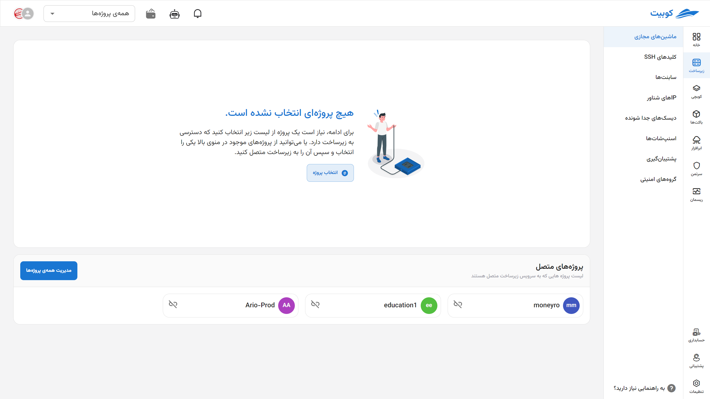
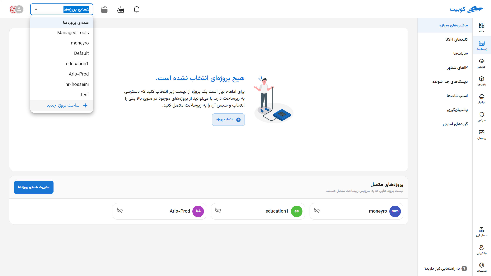
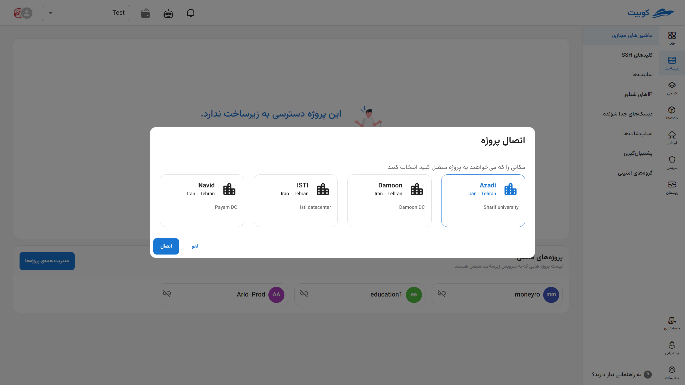
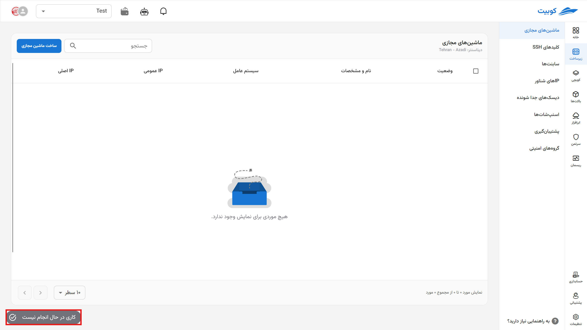

# Infrastructure Service Prerequisites (Step Zero)

Before starting to create infrastructure resources such as virtual machines or disks, your project must be connected to the infrastructure service. In this step (Step Zero), you first enable access to resources by connecting the project to the infrastructure. Then, by **selecting the active project**, all subsequent operations, such as creating or managing resources, will be performed within that project. Additionally, if no longer needed, you can **disconnect** the project from the infrastructure. This section also provides details about **Jobs** for tracking the status of infrastructure operations and information regarding **Quota** and its management.

## Connecting a Project to the Infrastructure Service

- Open the list of current organization projects through the **All Projects** option.
- Select the desired project from the list.
- If the project is not connected, an error will appear. To connect the project, click the **Connect** button.
- Choose your desired location from the available locations in Kubit and click **Connect**.
  
  
  
  

Finally, the project will be connected to the infrastructure service, and you will be redirected to the project’s virtual machines page:

:::info[Default Project Settings After Connection]
After connecting the project to the infrastructure, default values for **Subnet**, **Floating IP**, and **Security Group** are also set for it.

If these values have already been created as shared within the organization, they will be used for the new project. Otherwise, new values will be created for the new project.
:::

## Selecting a Project {#select-project}

On the service’s main page, a list of connected projects is visible. You must first select the desired project from this list:

Afterward, you will be redirected to the virtual machines page.

### Virtual Machines List

After selecting a project, you will be redirected to the virtual machines page for that project. This list displays information about each machine, which we will describe and explain below.

- **Status**: Displays the machine’s on/off status with gray/green color.
- **Name and Specifications**: Shows the machine’s name along with its size and disk.
- **Operating System**: Displays the name and version of the machine’s operating system.
- **Public IP**: Shows the public IPs configured for the machine.
- **Labels**: Displays the machine’s labels.
- **Operations**: Provides access to actions such as turning on/off, accessing the console, rebooting, editing the name, resizing, powering off, and deleting.
  

For more details and explanations, refer to the [Virtual Machines](../vms) document.

:::tip[Creating a Project]
If you wish to create a new project, you can do so via the **Create New Project** option:
Then, enter the **Title** and **Key** of the project and click **Create**:

:::

## Disconnecting a Project

- To disconnect a project from the infrastructure service, use the disconnect icon on the desired project’s card.
- Then, if you are sure, click the **Confirm** button in the opened dialog.
  
  

## Jobs {#jobs}

The button at the bottom of the infrastructure page provides quick access to a list of completed/in-progress jobs. If there is an ongoing job, its status is displayed; otherwise, the status of the last completed job is shown.

:::tip[Jobs at Different Levels]
Jobs exist at two levels: **Project** and **Machine**. Depending on the page you are on, you can access the jobs for that page and level.
:::
Users can use the following filters to narrow down the list of jobs based on execution status or resource type:

1. **Task Status**

You can select one of the following statuses to display only jobs with a specific status:

- **All**: Displays all jobs regardless of execution status.
- **Failed**: Displays jobs that have not completed or encountered an error.
- **Pending**: Jobs that have not yet started.
- **Running**: Jobs currently in progress.
- **Success**: Jobs that have completed successfully.

2. **Resource Type**

Using this filter, you can limit the resource type associated with jobs:

- **All**
- **Virtual Machine**
- **Virtual Private Cloud (VPC)**
- **Disk**
- **Backup**
- **Subnet**
- **Project**
- **Snapshot**

- **Backup Rules**
- **Floating IP**
- **Interface**
- **Security**
  
- Sample jobs at the project level
  

- Sample jobs at the machine level
  

## Resource Quota

**Quota** is a limit set for each project or organization on the use of cloud infrastructure resources. These quotas are used to prevent excessive resource consumption and maintain system stability.

### Restricted Resources

The quota includes the following:

| Resource Type            | Controlled Parameter                            |
| ------------------------ | ----------------------------------------------- |
| Virtual Machine (VM)     | Number of VMs that can be created               |
| Memory (RAM)             | Total gigabytes that can be allocated           |
| Processor (vCPU)         | Total number of vCPUs that can be used          |
| Network                  | Number of virtual networks that can be created  |
| Floating IP              | Number of IPs that can be allocated             |
| Detachable Disk (Volume) | Number of disks and total allowed storage space |

### System Behavior When Reaching the Quota

If resource usage exceeds the quota during creation or modification:

- The operation is halted.
- An error message is displayed.
- The user must increase the project’s capacity or free up resources.

### Quota Management

The organization admin can request an increase in quota through the **Admin Panel** or **Support**. The current consumption and quota status are also visible in the panel.
