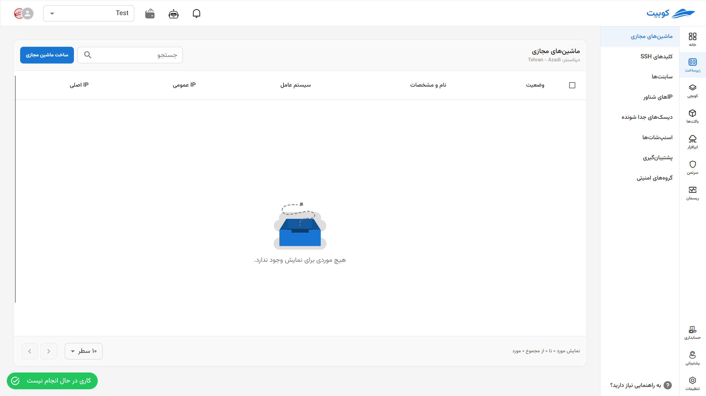

# Infrastructure Service Management

In the Kubit panel's Infrastructure page, you will be able to create your virtual machines and access management for **virtual machines**, **SSH keys**, **Subnets**, **Floating IPs**, **Snapshots**, and **Security groups**.

## Connecting the Project to the Infrastructure Service

- Open the list of the organization's current projects through the **All Projects** option.
- From the list of projects, select your desired project.
- Then, the project connection error will appear. To bind the project, click on the **Bind** button.
- Choose your desired location from the available locations in Kubit, and click **Bind**.
  
  
  
  

Finally, the project is connected to the Infrastructure service, and you will be redirected to the project's virtual machines page:

:::info[Default Project Settings After Binding]
After connecting the project to the Infrastructure, the default values for **subnet**, **floating IP**, and **security group** will also be set for it.
If the above values have been previously created in the current organization, those values will be used for the new project; otherwise, new values will be created for the new project.
:::

## Selecting a Project{#select-project}

On the first page of the service, a list of connected projects is visible. First, you need to select your desired project from this list:

### Virtual Machines List

After selecting the project, you will be redirected to the virtual machines page for that project. In this list, information about each machine is displayed, which we will explain and detail below.

- **Status**: Displays the on/off status of the machine with gray/green color.
- **Name and Specifications**: Displays the machine's name along with its size and disk.
- **Operating System**: Displays the name and version of the machine's operating system.
- **Public IP**: Displays the public IPs configured for the machine.
- **Tags**: Displays the tags associated with the machine.
- **Operations**: Access to power on/off, redirect to console, restart, edit name, resize, power off, and delete.
  

For more information and details, refer to the [Virtual Machines](../vms) document.

:::tip[Creating a Project]
If you wish to create a new project, you can do so by selecting the **Create New Project** option:
Then enter the **Title** and **Key** of the project and click on **Create**:

:::

### Unbinding a Project

- To unbind a project from the Infrastructure service, you can click on the unbind icon on the desired project card.
- Then, if you are sure, click on the **Confirm** button in the opened dialog.
  
  

### Jobs

The button at the bottom of the Infrastructure page provides quick access to a list of completed/ongoing jobs. If there is a current job, its status will be shown; otherwise, the status of the last completed job will be displayed.

:::tip[Jobs at Different Levels]
Jobs exist at two different levels: **project** and **machine**. Depending on the page you are on, you can access the jobs of that page and level.
:::

- Example jobs
  
