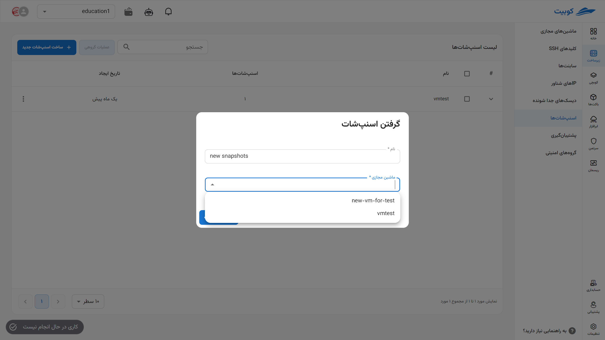
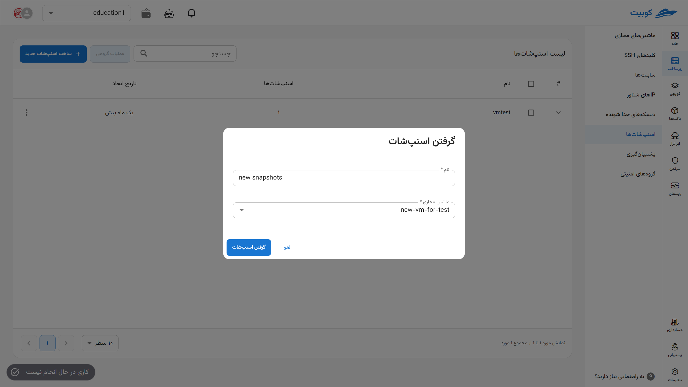
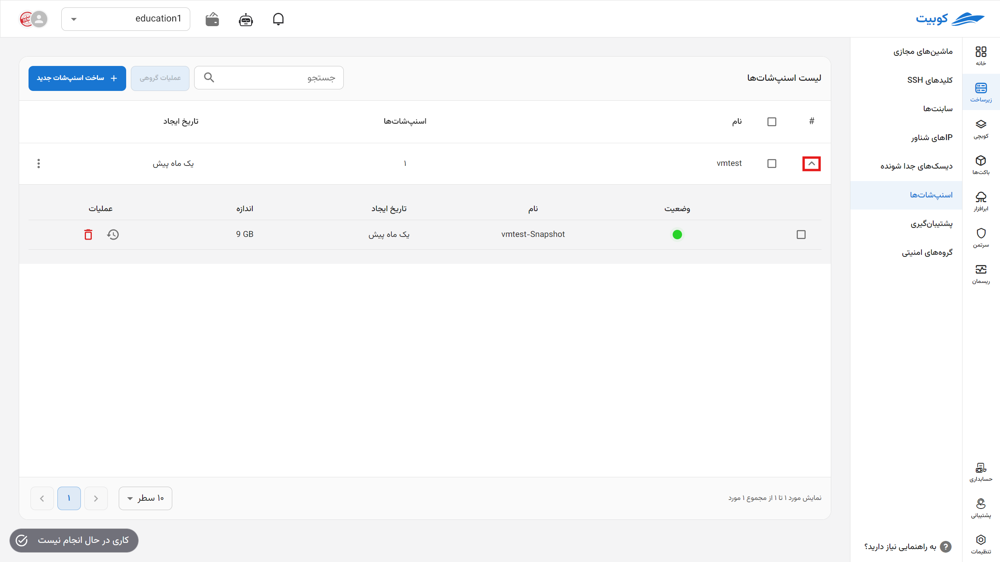
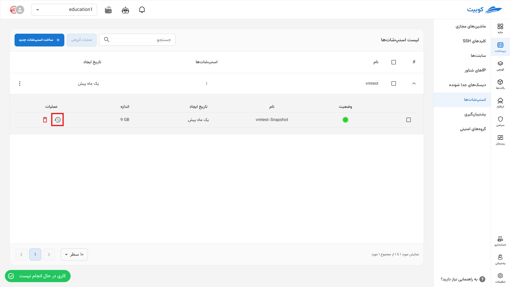
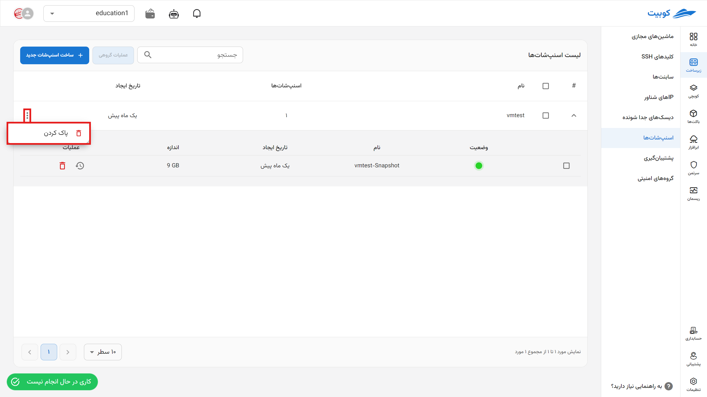
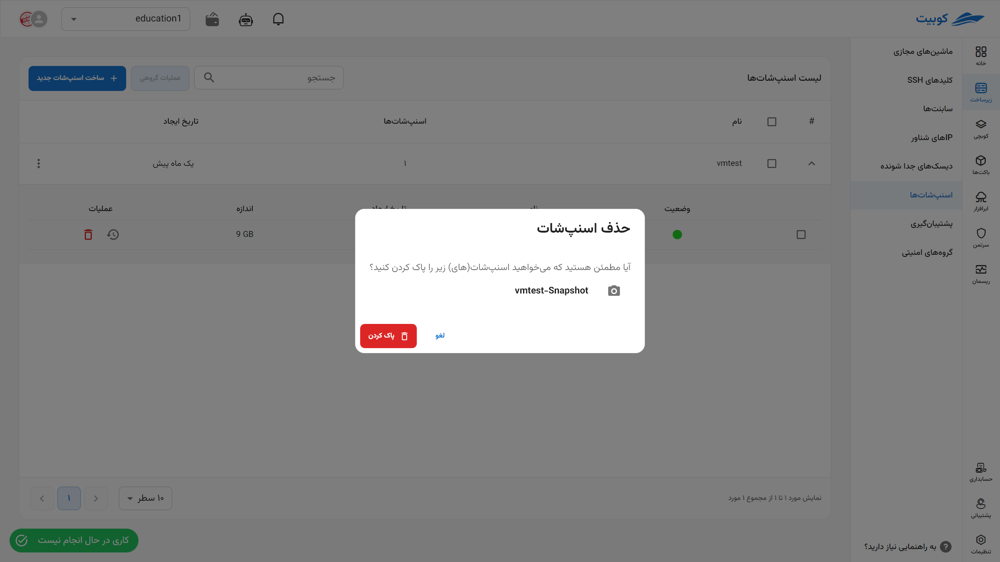
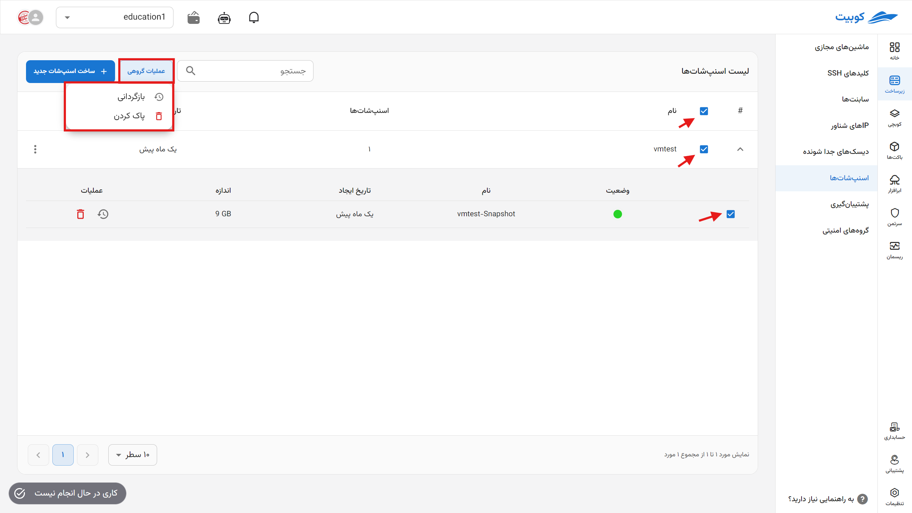

# Snapshots

In this section, you can access the list of snapshots for virtual machines in the project, as well as manage them, including **creating**, **deleting**, and **restoring** snapshots.

## Creating a Snapshot

- First, click on the **Create New Snapshot** button.
- Then, enter the **Name** and select the desired **Virtual Machine** from the list of machines.
- Finally, click on **Take Snapshot**.

  
  
  

## Snapshot Details for a Machine

To view details such as **Name** and **Creation Date** of a snapshot and perform operations on them, click on the (▼) icon:

### Restoring

- To restore a snapshot, click on its **Restore** icon.
- Then, if you are sure, click the **Confirm** button in the opened dialog.
  

### Deleting

- To delete a snapshot, click on its **Trash Can** icon.
- Then, if you are sure about the deletion, click the **Delete** button in the opened dialog.
  

## Deleting All Snapshots of a Machine

- To delete all snapshots of a machine, click on the three-dot icon in the operations column of the relevant machine.
- Then, click on the **Delete** option.
- If you are sure, click the **Delete** button in the opened dialog.
  

  

## Batch Snapshot Operations

For convenience, performing simultaneous operations on multiple snapshots is available through the **Batch Operations** option. First, select one or more options. After selection, the **Batch Operations** button will become active:

