# Snapshots

In this section, you will have access to the list of snapshots of the virtual machines available in the project, as well as manage them, including creating, deleting, and restoring snapshots.
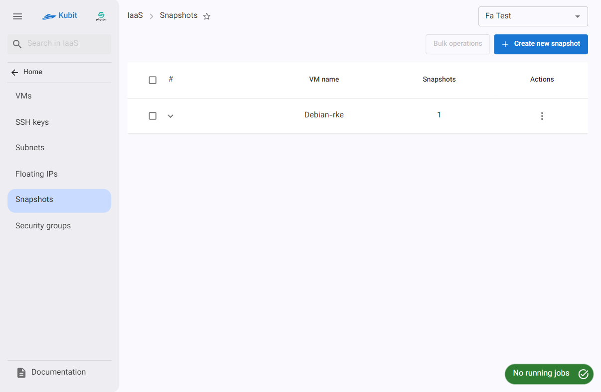

## Creating a Snapshot

- First, click the Create New Snapshot button.
- Then, enter the name and select the desired virtual machine from the list of machines.
- Finally, click on Take Snapshot.
  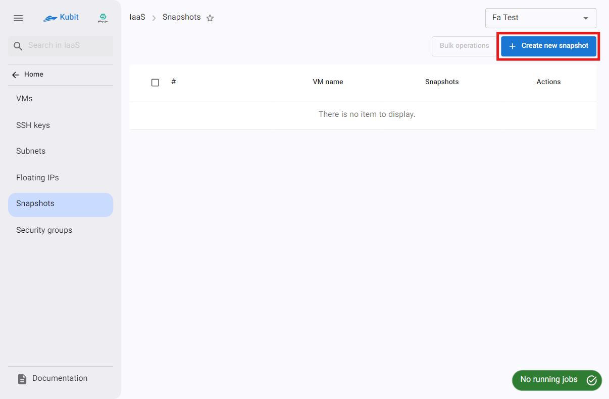
  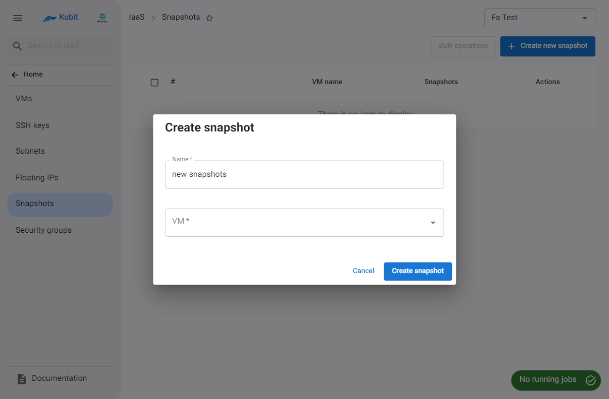
  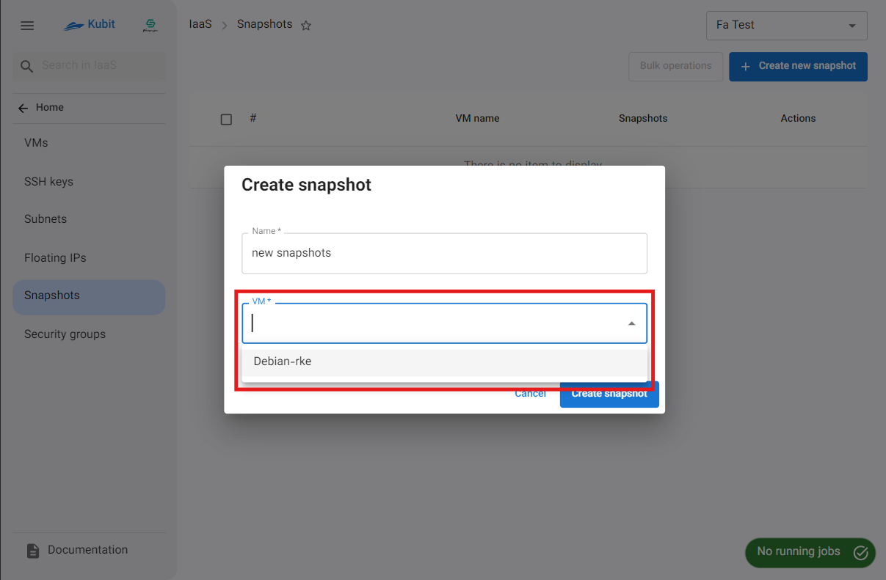
  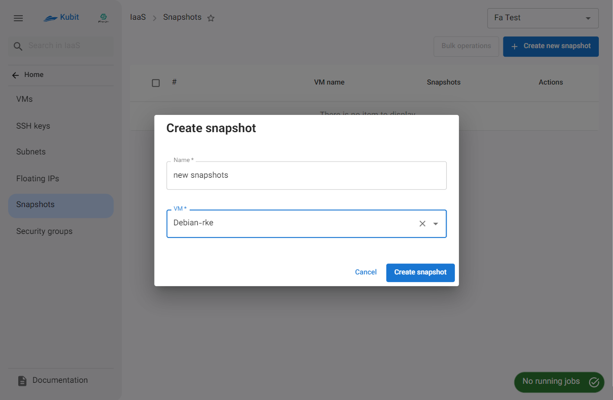

## Details of a Machine's Snapshots

To view details such as the name and creation date of the snapshot, and to perform operations on them, click on the icon shown in the image below:
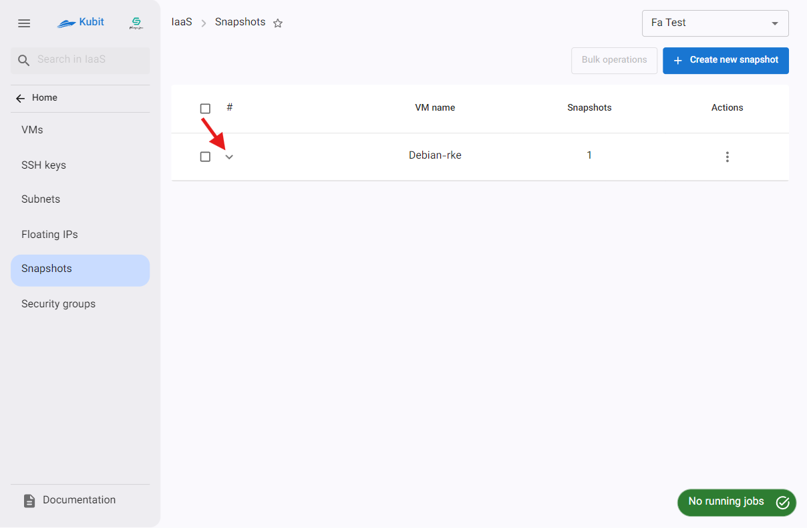
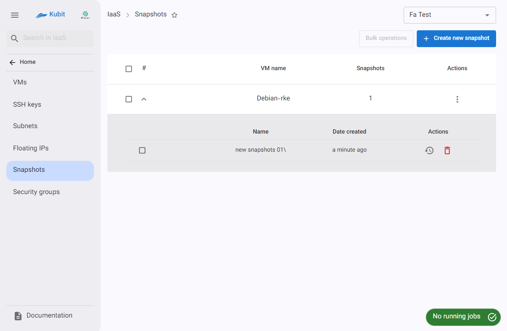

### Restoring

- To restore a snapshot, click the restore icon.
- Then, if confirmed, click the Confirm button in the opened dialog.
  
  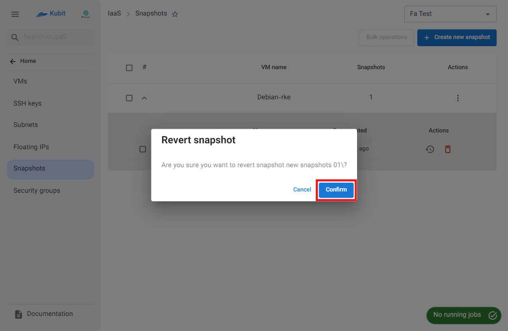

### Deleting

- To delete a snapshot, click the trash icon.
- Then, if confirmed, click the Delete button in the opened dialog.
  
  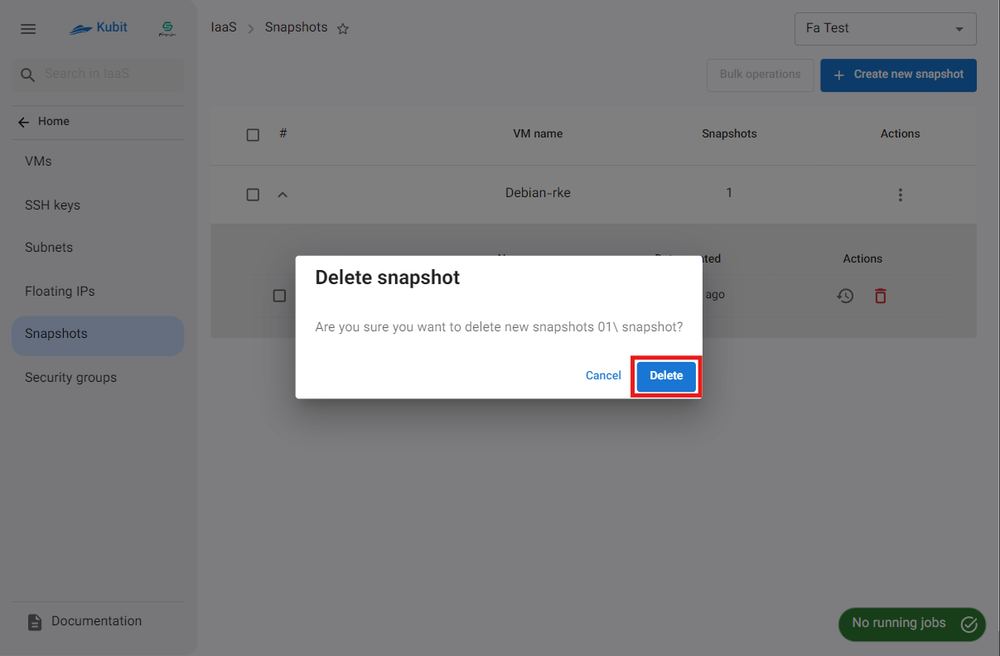

## Deleting All Snapshots of a Machine

- To delete all snapshots of a machine, click the three-dot icon in the operations column of the respective machine.
- Then, click on the Delete option.
- If confirmed, click the Delete button in the opened dialog.
  
  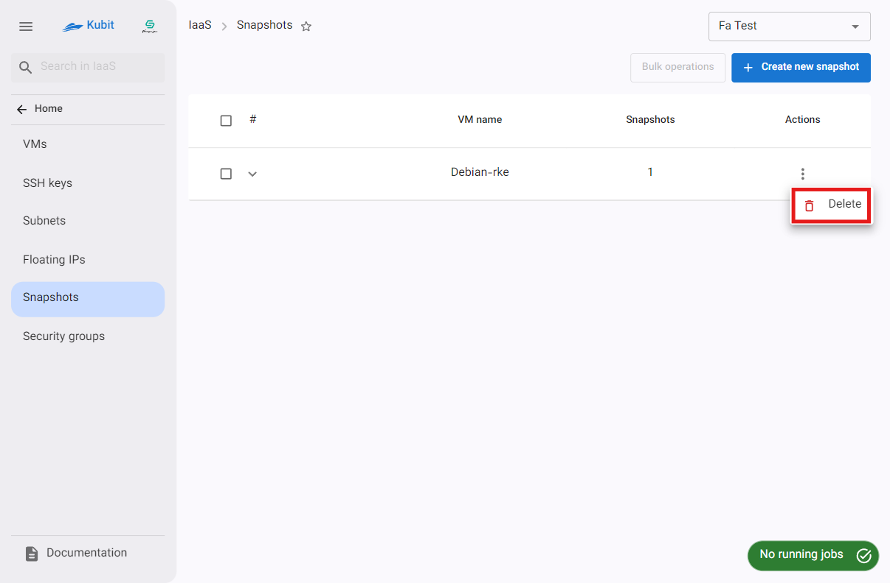
  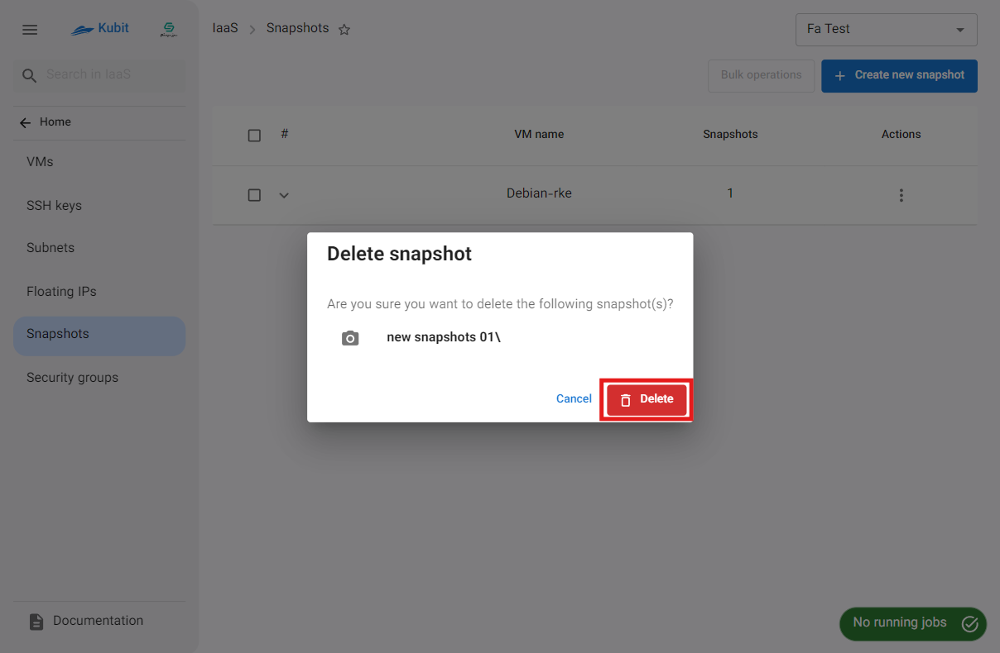
