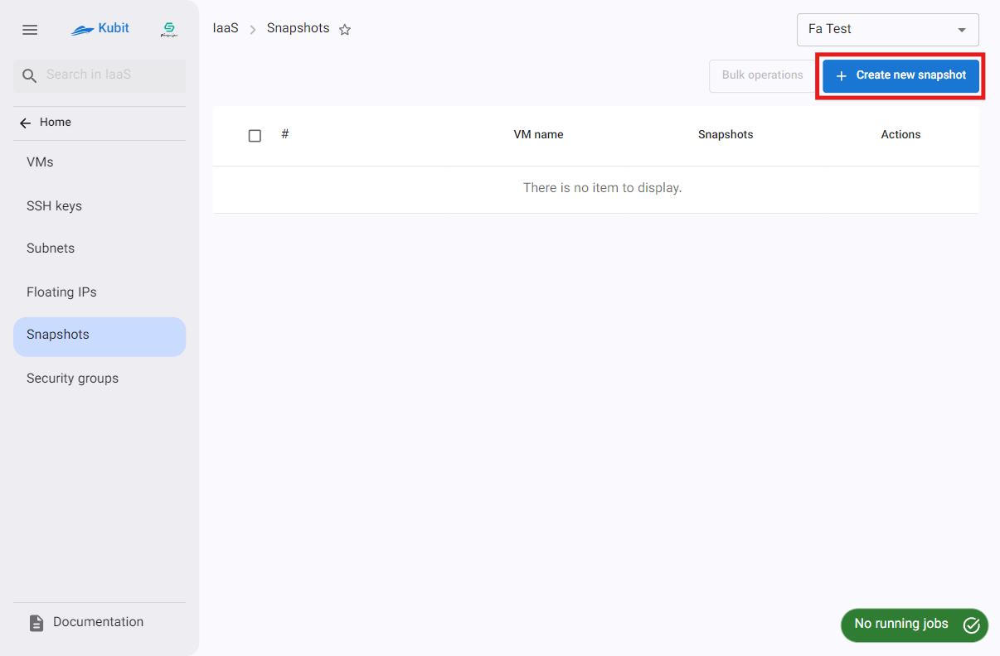
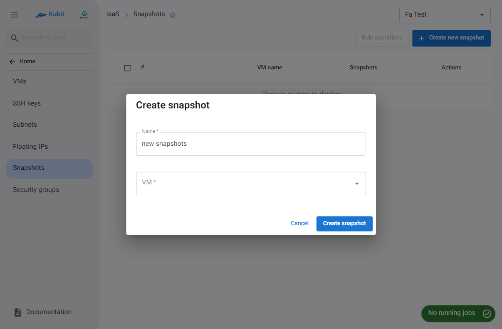
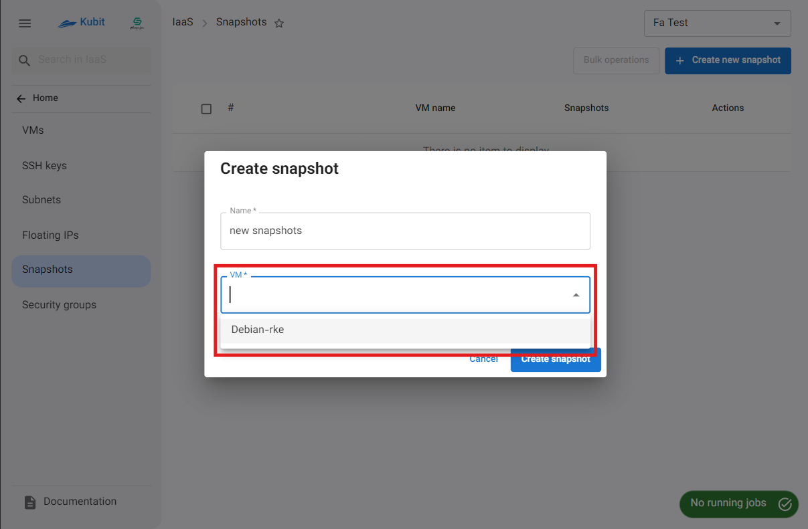
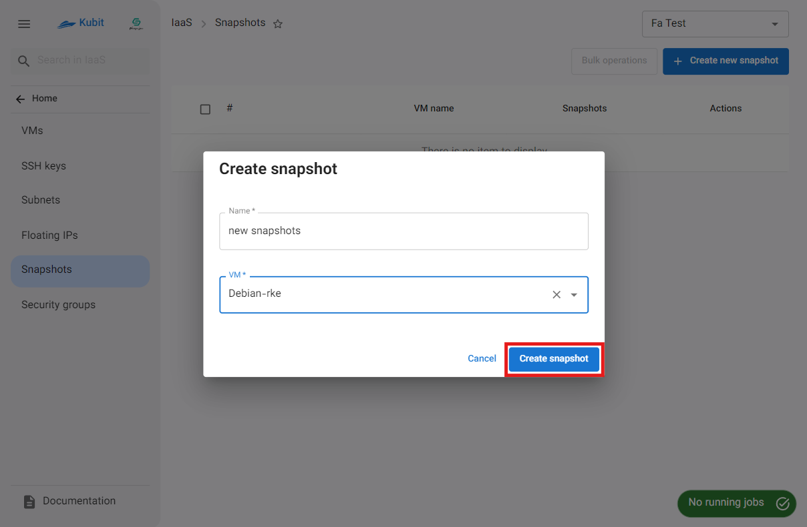
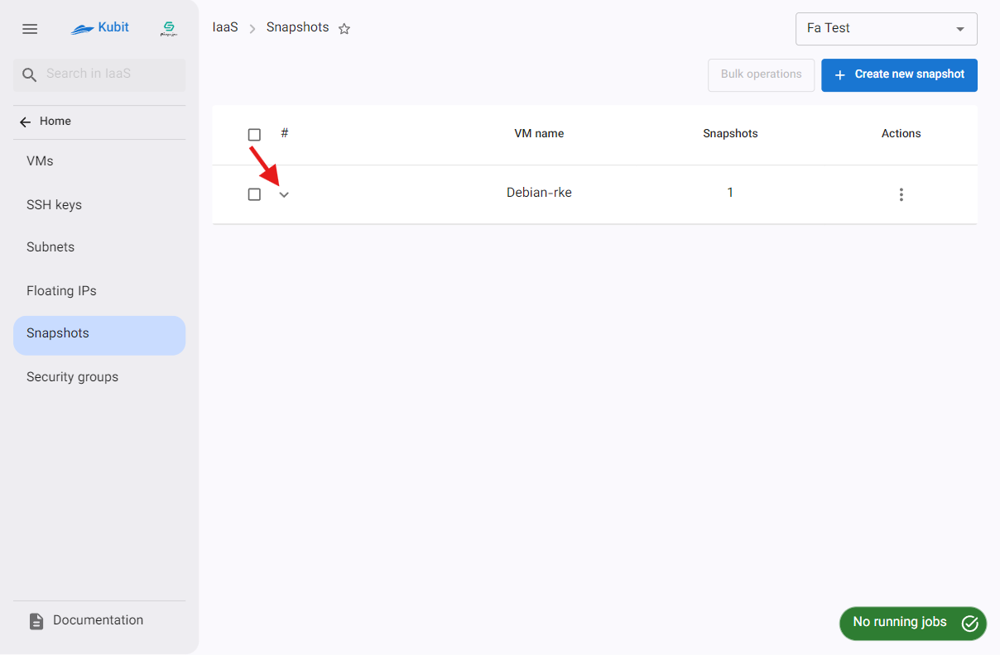
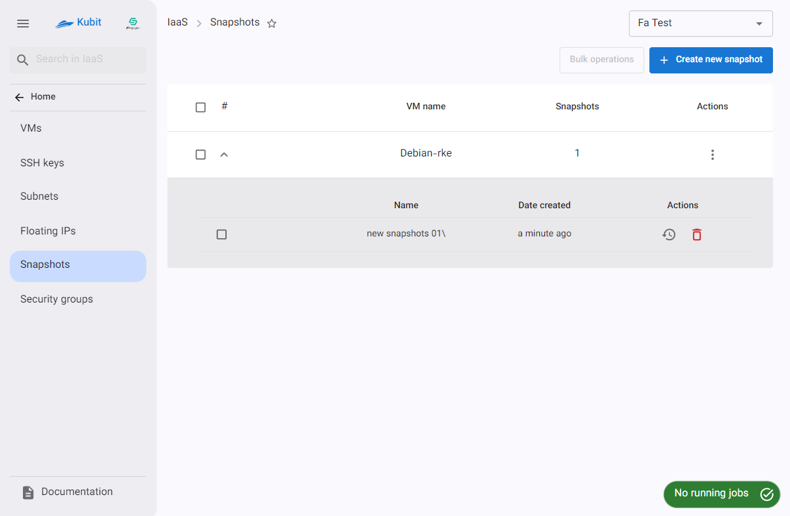
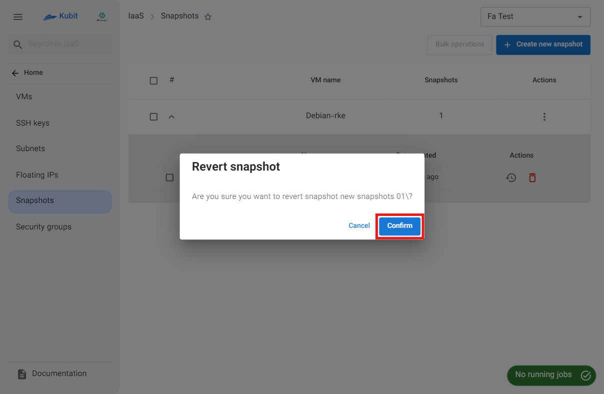
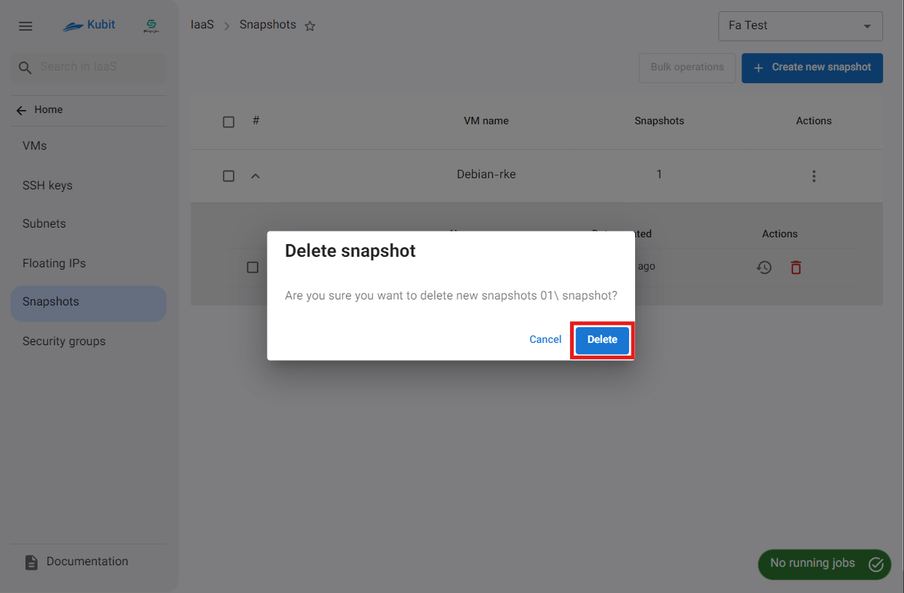
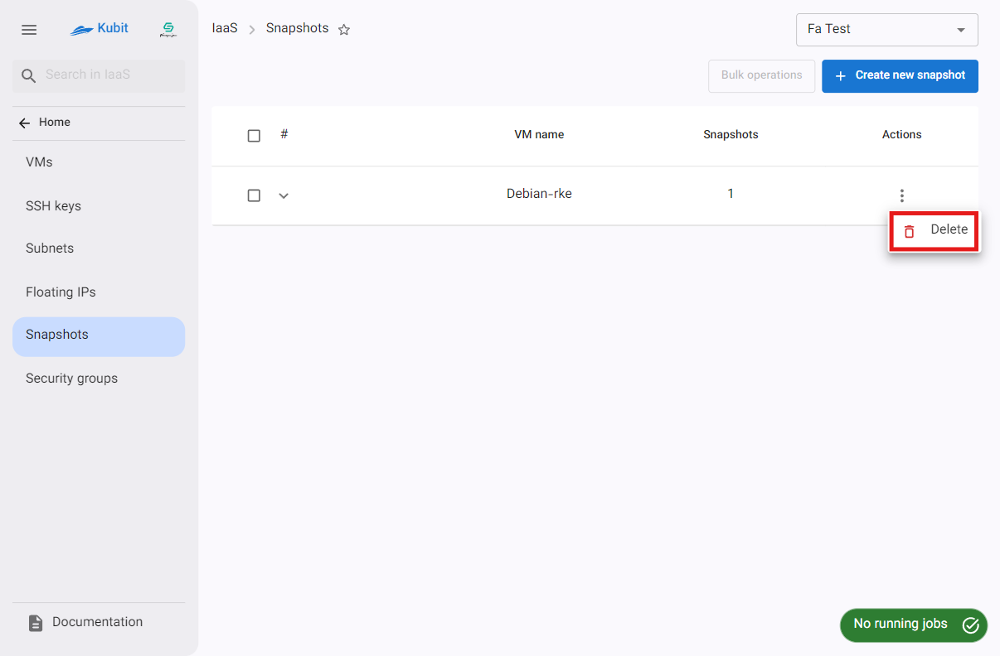
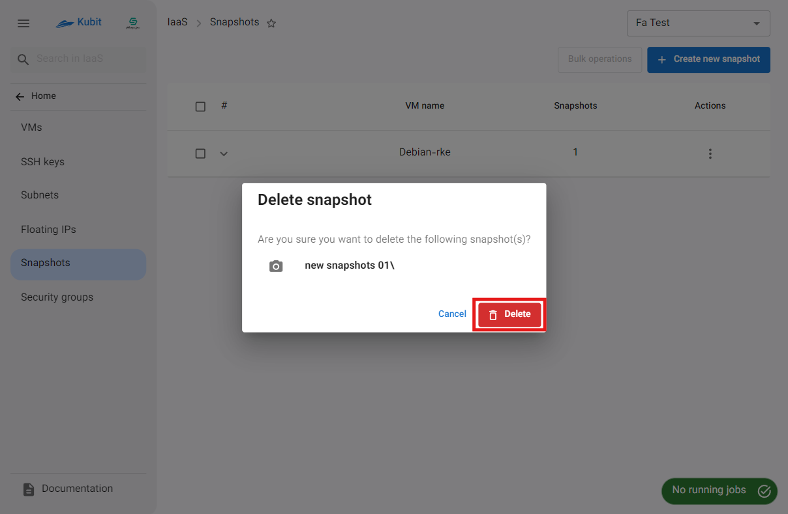

# Snapshots

In this section, you will have access to the list of snapshots of the virtual machines available in the project, as well as manage them, including **creating**, **deleting**, and **restoring** snapshots.

## Creating a Snapshot

- First, click the **Create New Snapshot** button.
- Then, enter the **name** and select the desired VM from the list of VMs.
- Finally, click on **Create Snapshot**.
  
  
  
  

## Details of a Machine's Snapshots

To view details such as the **name** and **creation date** of the snapshot, and to perform operations on them, click on the icon shown in the image below:

### Restore

- To restore a snapshot, click the **restore** icon.
- Then, if confirmed, click the **Confirm** button in the opened dialog.
  
  

### Delete

- To delete a snapshot, click the **trash** icon.
- Then, if confirmed, click the **Delete** button in the opened dialog.
  
  

## Deleting All Snapshots of a Machine

- To delete all snapshots of a machine, click the three-dot icon in the Actions column of the respective machine.
- Then, click on the **Delete** option.
- If confirmed, click the **Delete** button in the opened dialog.
  
  
  
