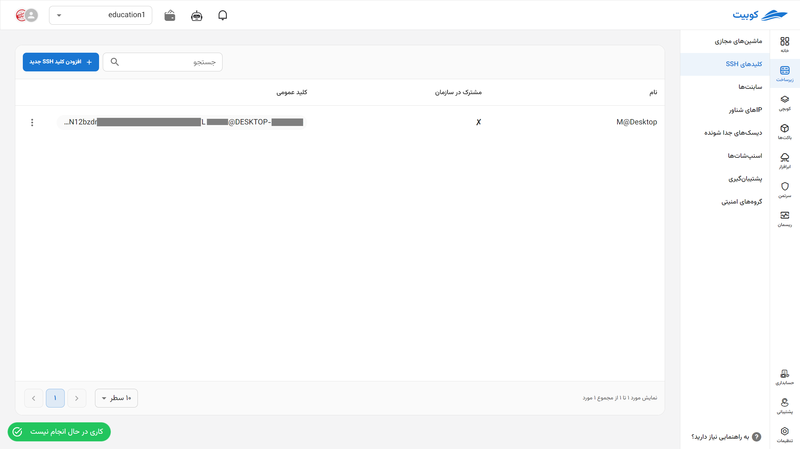
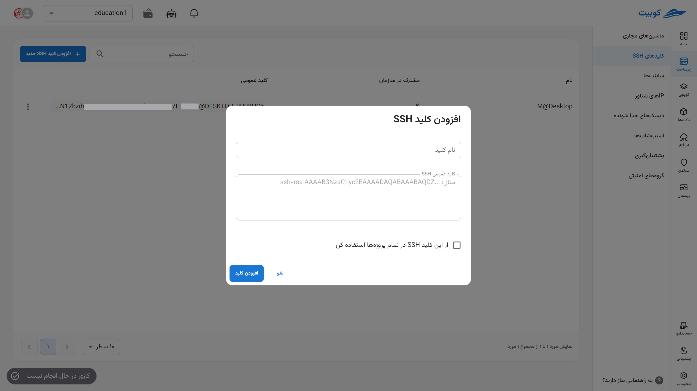
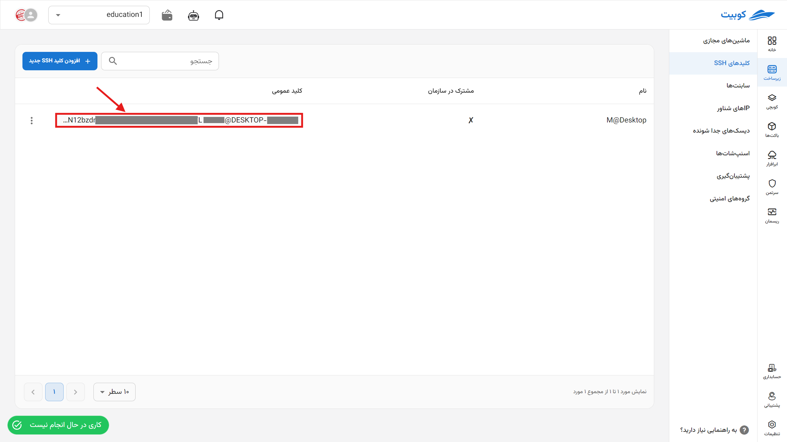
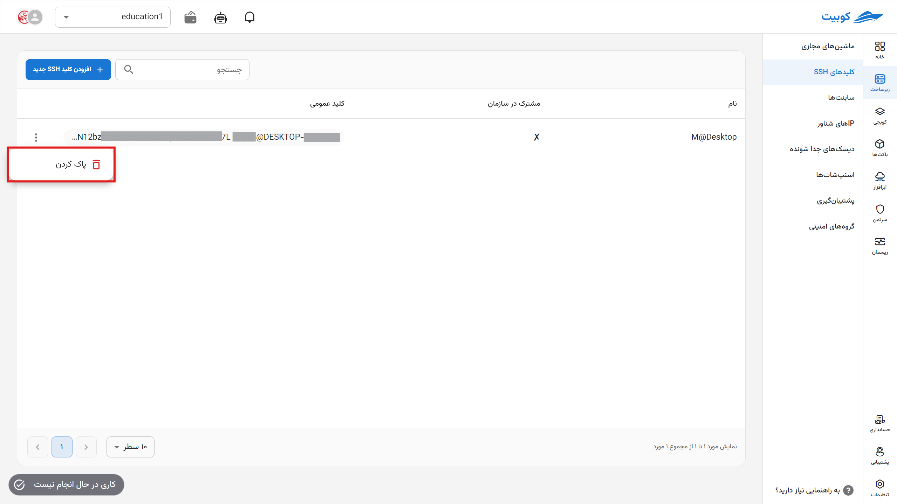

# SSH Keys

In the SSH Keys page, a list of SSH keys for the selected project and organization-shared keys is displayed, along with options to add a new key and delete existing keys.

## Adding an SSH Key

To add a new key, click on the **Add New SSH Key** button:

Then, enter the value of your key in the **SSH Public Key** field along with a name, and click on **Add Key**:
:::tip[Sharing the Key Across All Projects]
To use this key and share it across the organization (in all projects), select the **Use this SSH Key in all projects** option.
:::

Finally, the new key will be added, and you will be redirected to the SSH keys list.

### Copying a Key

To copy the value of an SSH key, simply click on the **Public Key** value of the desired key:

### Deleting a Key

- To delete a key, click on the three-dot button in the **Operations** column and select the **Delete** option.
- Then, if you are sure about the deletion, click the **Delete** button in the opened dialog.
  

  :::caution[Lack of Access to Delete Organization-Shared SSH Keys]
  Note that SSH keys shared across the organization and used in all projects can only be deleted by the key’s creator.
  :::
