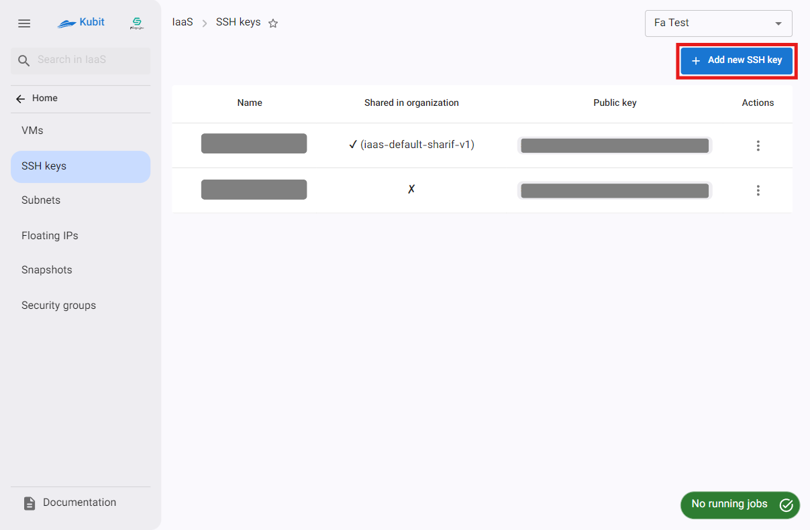
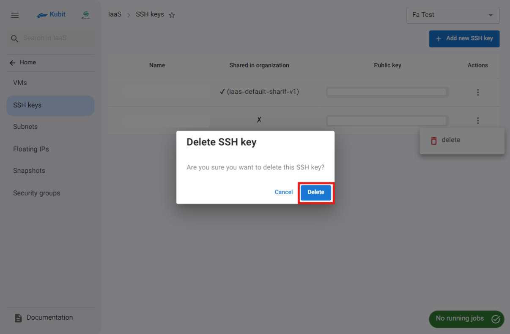

# SSH Keys

On the SSH Keys page, there is a list of the keys for the selected project and the shared keys in the organization, along with the ability to add new keys and delete current keys.

## Add SSH Key

To add a new key, click on the **Add New SSH Key** button:

Then enter your key in the **SSH Public Key** section along with a name, and click on **Add Key**:

:::tip[Share Key in All Projects]
To use this key and share it across the organization (in all projects), select the option **Use this SSH Key in all projects**.
:::

Finally, the new key will be added, and you will be redirected to the SSH keys list.

### Copy Key

To copy the SSH key value, simply click on the **Public Key** value of your desired key:

### Delete Key

- To delete a key, click on the three-dot button in the **Actions** column and select the **Delete** option.
- Then, if you are sure about the deletion, click on the **Delete** button in the dialog that appears.
  
  
  

:::caution[No Access to Delete Shared SSH Keys in the Organization]
Please note that SSH keys that are shared across the organization and used among all projects can only be deleted by the key creator.
:::
