# Subnets

In the Subnets page, a list of project-specific and organization-shared subnets is displayed, along with options to **add a new subnet** and perform operations such as **edit**, **connect to the internet**, **add a security group**, and **delete**.
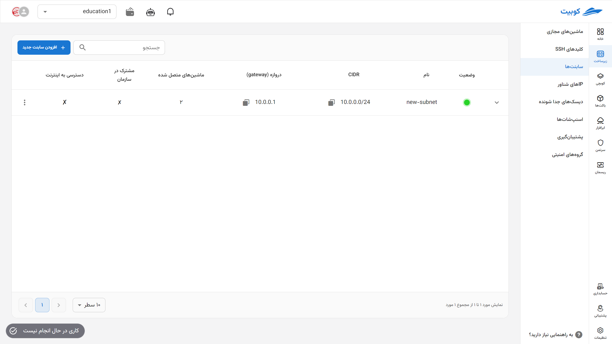

## Adding a New Subnet {#add-new-subnet}

- To add a subnet, click on the **Add New Subnet** button.
- Then, enter the requested information such as **Name**, **CIDR**, and **Gateway**.
- Finally, if you wish to share this subnet across the organization, select the **Use this subnet in all projects** option and click on **Create Subnet**.

  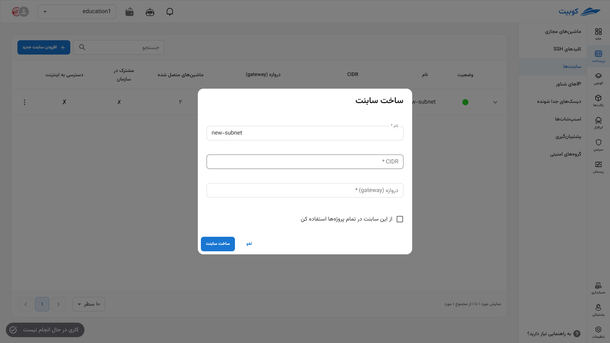

## Viewing Details and Status

To view details such as connected machines, allocated addresses for each machine, and perform operations on them, click on the (▼) icon. A list of the mentioned information will be displayed for the selected subnet:
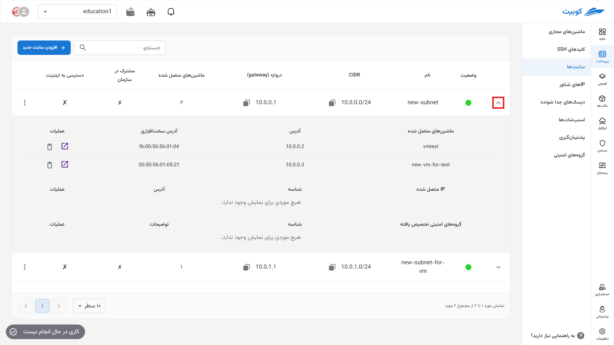

### Deleting a Network Interface

- To delete the network interface assigned to a virtual machine, click on the **trash can** icon for the relevant machine.
- Then, if you are sure about the deletion, click the **Delete** button in the opened dialog.
  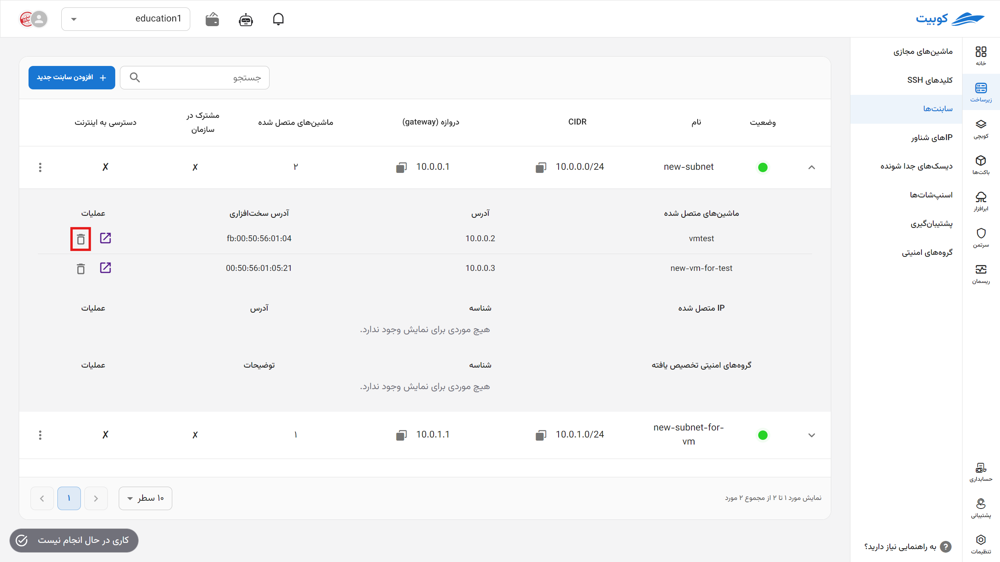

### Redirecting to the Virtual Machine

To directly navigate to the overview page of the virtual machine connected to the subnet, click on the specified icon:

## Subnet Operations

To view possible operations for a subnet, click on the three-dot button in the **Operations** column to display a list of operations:

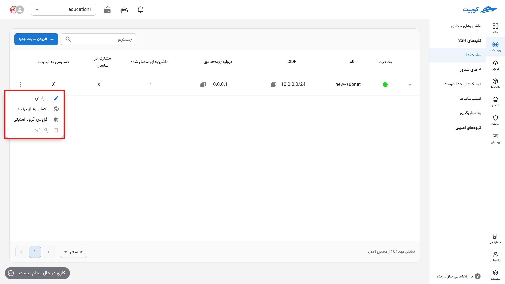

### Editing

- To edit a subnet, click on the **Edit** option.
- In the opened dialog, you can only edit the **Name** and **Sharing Status** of the subnet. After entering the desired changes, click on the **Update Subnet** option.

  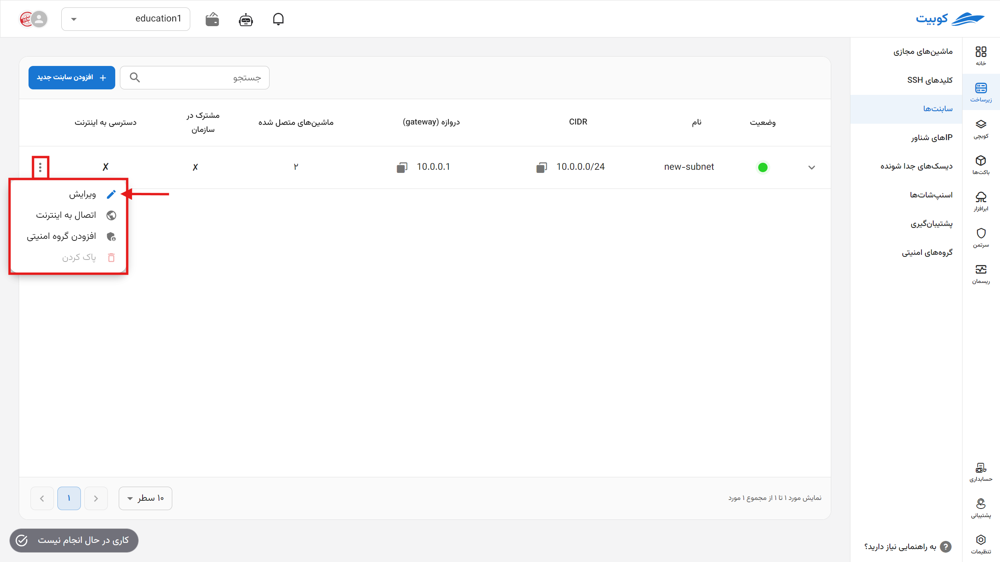

### Connecting to the Internet

- To connect a subnet to the internet, click on the **Connect to the Internet** option.
- To establish the connection, a floating IP is required. If a floating IP exists, you can select from the list of unassigned floating IPs or create a new floating IP.
  
  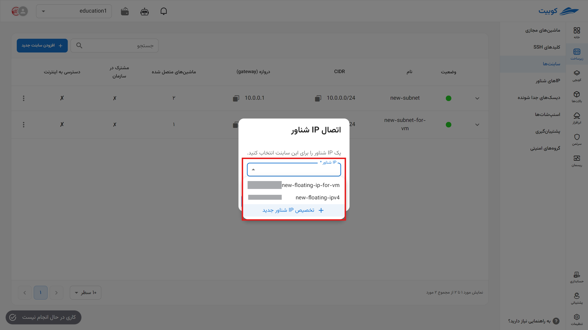

#### Selecting from Existing Floating IPs

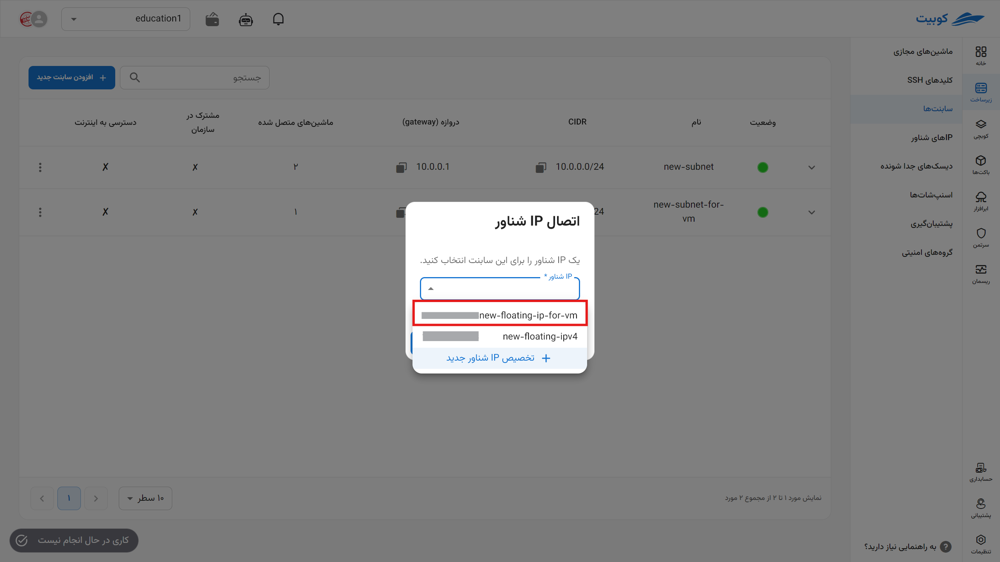
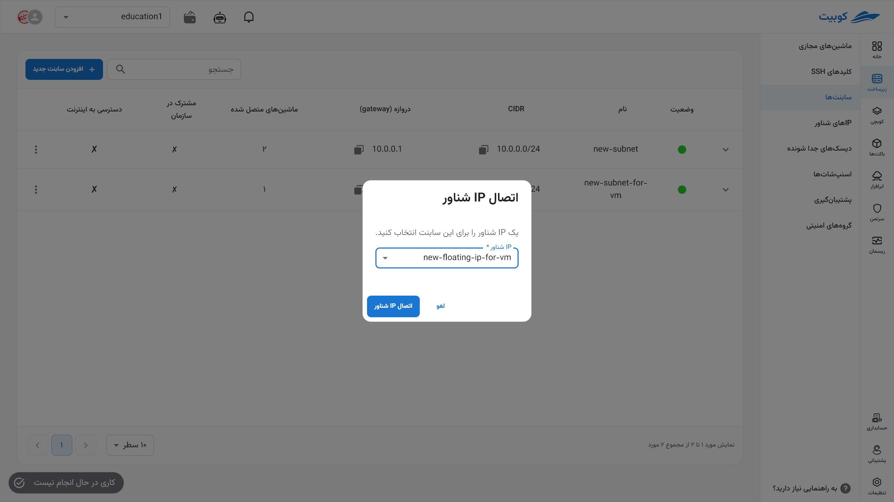

#### Assigning a New Floating IP

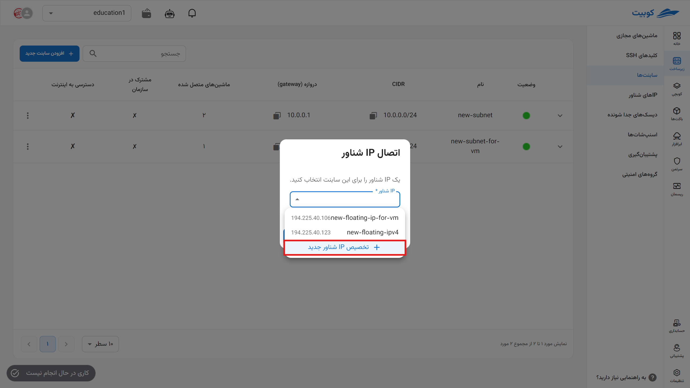
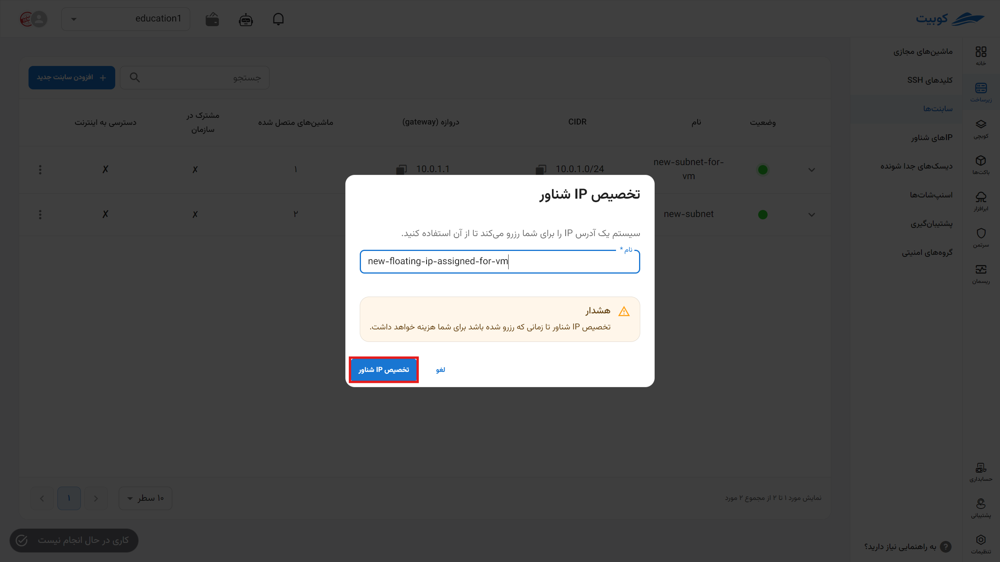
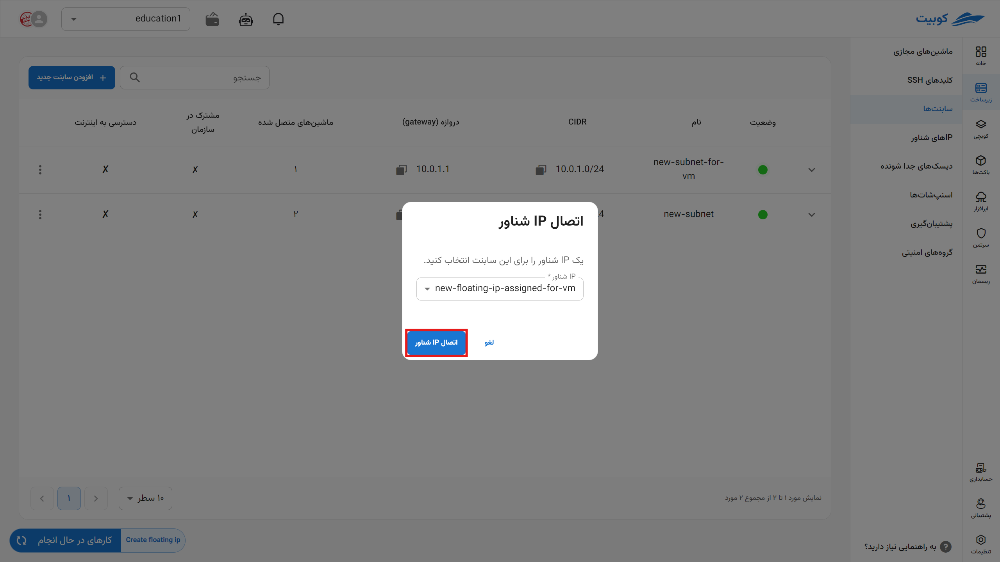

In both methods, after clicking **Connect Floating IP**, a task related to this operation is created, and if the task is successful, the subnet will be connected to the internet.
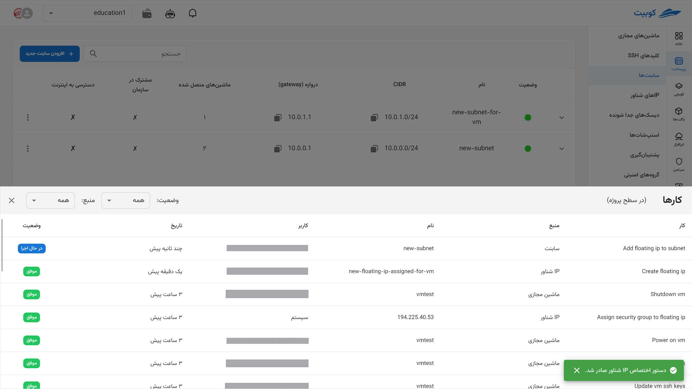

### Adding a Security Group

- To add a security group to the subnet, click on the **Add Security Group** option:
- Then, select the desired security group from the list of project-specific and organization-shared security groups and click on **Confirm**:
  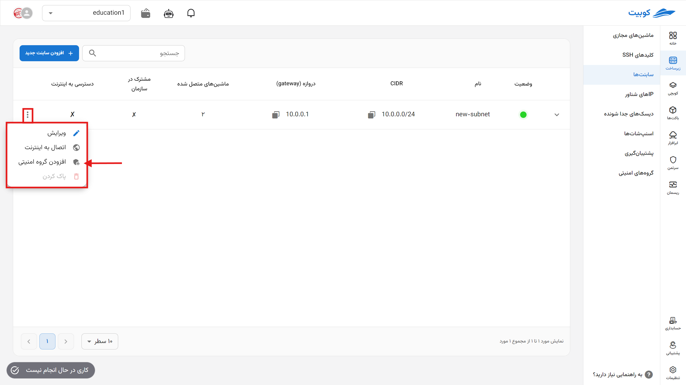
  

### Deleting a Subnet

- To delete a subnet, first detach all resources from it.
- Then, click on the **Delete** option.
- If you are sure about the deletion, click the **Delete** button in the opened dialog.
  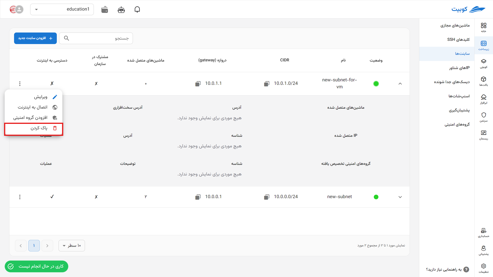
