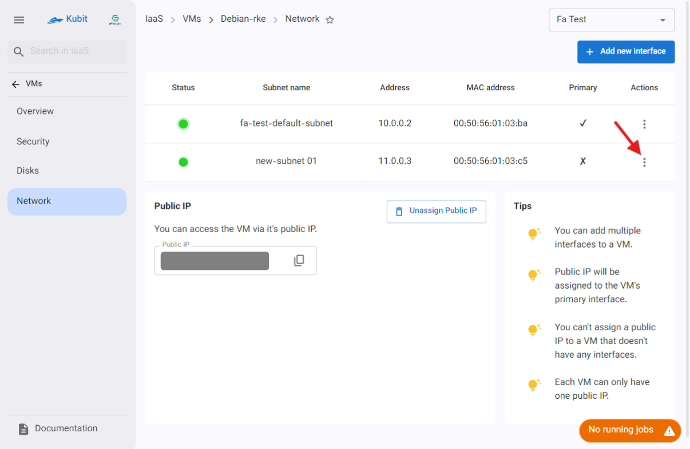
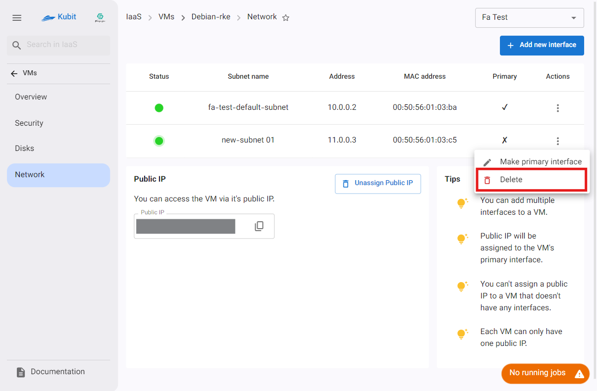

# Virtual Machine Settings

In the virtual machine settings, there are various subpages that display information and settings related to the virtual machine. These include details such as the operating system, processor, memory, security, disks, and networking.

:::caution[Note!]
Please note that some settings changes require the machine to be powered off. If this condition is not met, the changes cannot be applied.
:::

## Overview {#overview}

On this subpage, the virtual machine’s details are displayed. This includes **name**, **operating system** and **version**, **processor**, **memory**, **disk information**, along with the **public IP** and **monitoring status**.

### Accessing the Console

### Shutdown/Power On

### Machine Actions

## Security

In this section, you can view security-related items such as **password**, **SSH keys**, and **security groups**. Below are the settings for each.

### Displaying the Password

If a password is set for the machine, you can view it by clicking the **Show Password** button.

### Resetting the Password

- To change the password, ensure that the machine is powered off. Then, click the **Reset Password** button.
- Finally, if confirmed, click the **Confirm** button.
- After successful completion, the new password information will be sent to your email and displayed.
  
  

### Adding an SSH Key

- To add an SSH key, ensure that the machine is powered off. Then click the **Add SSH Key** button.
- Select the desired key from the existing keys or create a new one.
- Finally, click the **Add** button.
  
  
  

### Adding a Security Group

- To add a security group, click the **Add Group** button.
- Then, select the desired group from the available groups.
- Finally, click the **Add** button.
  
  

## Disks

In this subpage, information about the virtual machine’s disks is displayed. This includes **status**, **name**, **disk type**, **capacity**, and operations such as **adding**, **deleting**, and **resizing**.

### Adding a Disk

- To add a disk, click the **Add New Disk** button.
- Enter the **capacity** and **name** of the disk.
- Finally, click the **Create Disk** button.
  
  

### Disk Actions

Various operations available for a disk can be accessed through the **Operations** column:

#### Detach a Disk

- To detach a disk, click the **Detach** disk button in the operations column.
- Then, if confirmed, click the **Detach** button in the dialog that opens.
  
  

### Editing a Disk

- To edit a disk, click the **Edit** icon in the Actions column.
- Then enter the new size and name according to your needs.
- Finally, click the **Edit** button.
  
  

### Deleting a Disk

- To delete a disk, first click the **Delete** option in the Actions column.
- If you are sure about the operation, enter the name of the disk as a confirmation to delete and click on **Delete**.
  
  

### Bulk Operations

For convenience in performing operations on multiple disks, some of the above operations are available through the **Bulk Operations** option. First, select one or more disks:

After selecting the disks, the **Bulk Operations** button will be activated:

Clicking **Bulk Operations** opens a list of available operations for the selected disks:

By clicking any of the options, the desired operation will be applied to all selected disks.

## Network

In this subpage, the virtual machine’s network information is displayed. This includes **subnets**, **public IP address**, and operations such as **adding a network interface**, **removing a subnet**, and **unassign the public IP**.

### Adding a Network Interface

- To add a network interface, click the **Add New Interface** button.
- In the dialog, select a **subnet** from the available subnets and enter the desired **IP address**.
- Finally, click the **Create interface** button.
  
  

### Unassigning the Public IP

- To disconnect the public IP and remove the machine's internet access, click the **Unassign Public IP** button.
- If confirmed, click the **Delete** button.
  
  

### Subnet Actions

A list of available actions for subnets can be accessed by clicking the three-dot button in the **Actions** column:

#### Convert to Primary Network Interface

- To convert a subnet to the primary network interface, click on the Convert to Primary option.
- If you're sure, click the Confirm button
  
  

#### Removing a Subnet

- To remove a subnet, click the Remove button.
- If confirmed, enter the subnet name as confirmation and click Delete.
  
  
