# Virtual Machines

In the **Virtual Machines (VMs)** page, you can view a list of virtual machines created in the selected project. This list includes general specifications of the machines, and various operations can be performed on them.
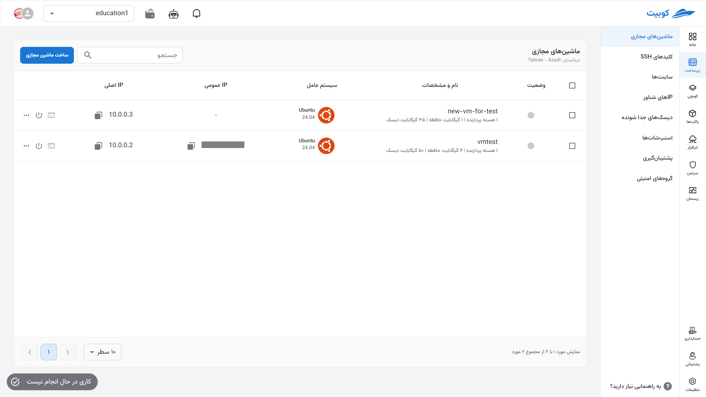

## Virtual Machine Overview

By clicking on any of the machines, you will be redirected to the machine’s overview page. For more information, refer to the [Overview](vm#overview) document.

## Machine Operations {#vm-operations}

Various operations are available for machines, which will be explained below.

- **Turn On/Off Virtual Machine**: Turning off or on a virtual machine is similar to powering off or on a physical computer; the operating system shuts down or starts naturally.
- **Power Off Virtual Machine**: Powering off is equivalent to an abrupt shutdown without the natural shutdown process, which may lead to data or operating system damage.
- **Restart Machine**: Restarting a virtual machine causes the operating system to reboot without fully shutting down and restarting the virtual machine.

:::caution[Note!]
Note that some operations require the machine to be in a specific state (on or off). If this condition is not met, the operation cannot be performed.

- **Off Condition**: Operations such as **Delete** and **Resize**
- **On Condition**: Operations such as **Restart** and **Power Off**

:::

:::info[Creating Jobs Corresponding to Each Operation]
Each operation performed on a machine creates a corresponding [**job**](../../settings#jobs) that indicates the status of the operation. An operation is considered successful only when its job completes successfully and reaches the **Success** status. You can view the status of jobs through the machine’s job list:

Users can filter the job list (at the project level) based on execution status or resource type using the following filters:

1. **Task Status**

You can select one of the following statuses to display only jobs with a specific status:

- **All**: Displays all jobs regardless of execution status
- **Failed**: Displays jobs that have not completed or encountered an error
- **Pending**: Jobs that have not yet started
- **Running**: Jobs currently in progress
- **Success**: Jobs that have completed successfully

2. **Resource Type**

Using this filter, you can limit the resource type associated with jobs:

- **All**
- **Virtual Machine**
- **Virtual Private Cloud (VPC)**
- **Disk**
- **Backup**
- **Subnet**
- **Project**
- **Snapshot**

- **Backup Rules**
- **Floating IP**
- **Interface**
- **Security**
  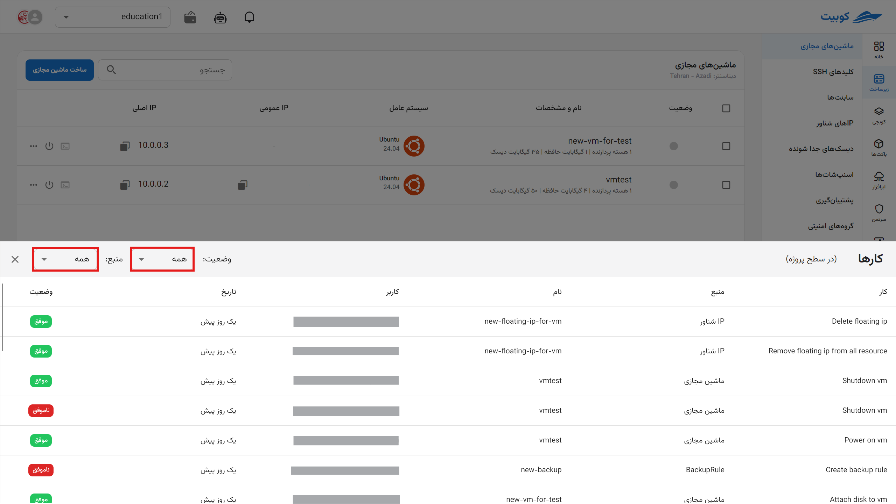
  **Sample Job in Progress**
  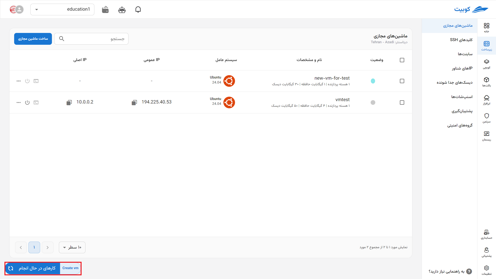
  :::

### Accessing the Console

To open the machine’s console, click on the **Console** icon to open the console window:
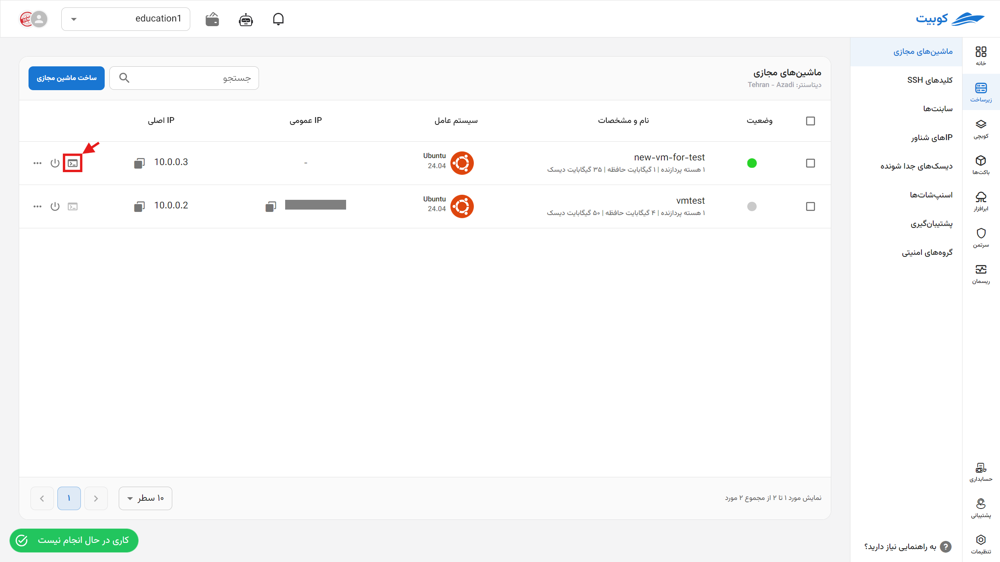
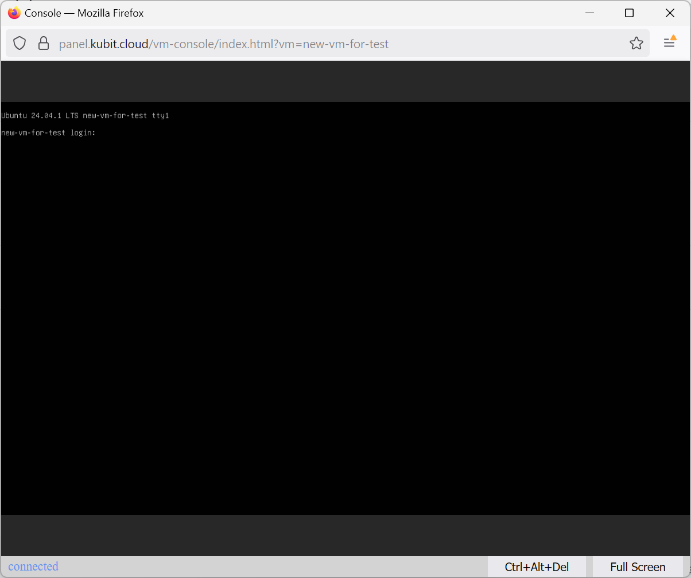

### Turning On/Off the Machine

- To turn on/off the machine, click on the **Turn On/Off** icon.
- For turning on, the system proceeds without requiring user confirmation. However, for turning off, a confirmation dialog opens, and if you are sure about the operation, click the **Shut Down** button in the opened dialog.
- Upon successful completion of the corresponding job, the machine’s status changes to **Off/On**.
  
  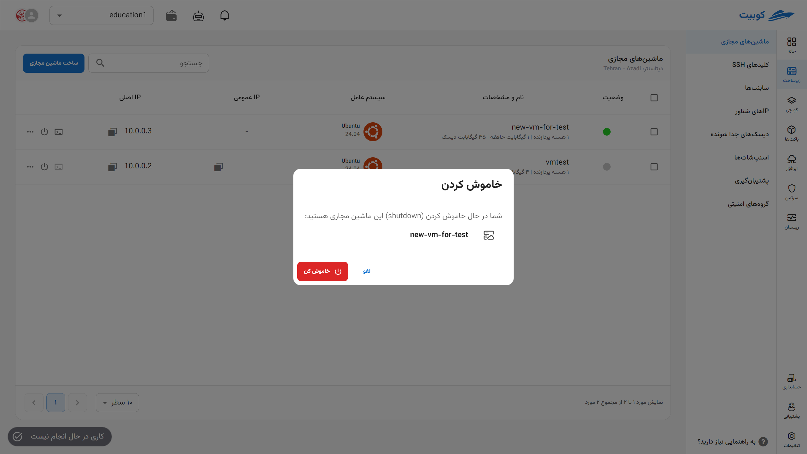

To view other operations, click on the three-dot button in the **Operations** column to display a list of operations:

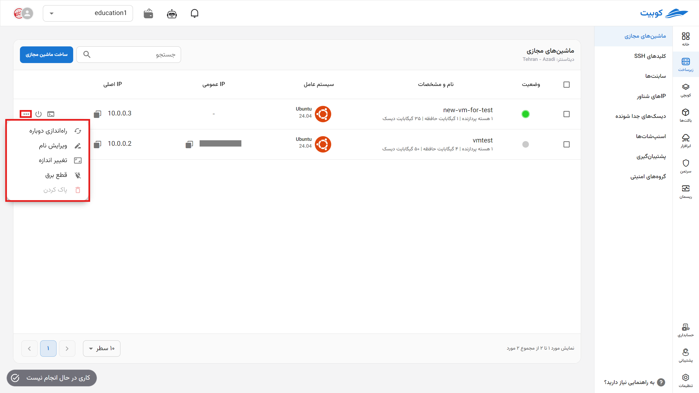

### Restart {#restart}

- To restart the machine, click on the **Restart** icon.
- If you are sure about the operation, click the **Restart** button.
- Upon successful completion of the corresponding job, the machine’s status changes to **On**.
  
  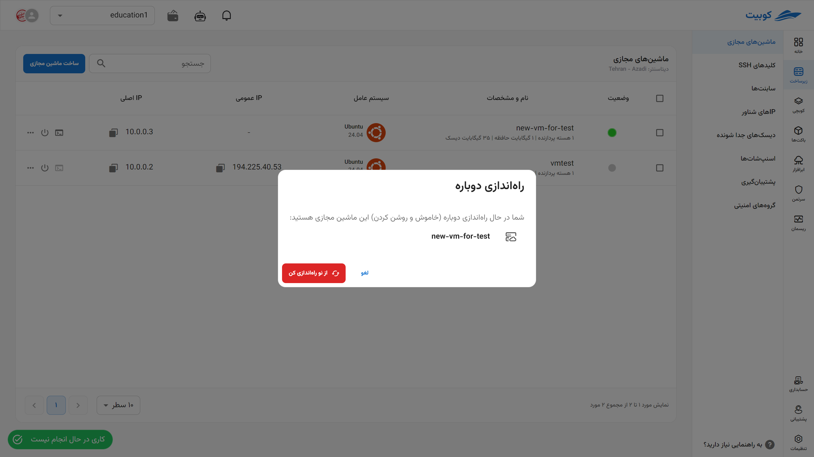

### Rename

- To change the machine’s name, click on the **Edit Name** option.
- In the opened dialog, enter a **valid and unique name** and click the **Edit Name** button.
  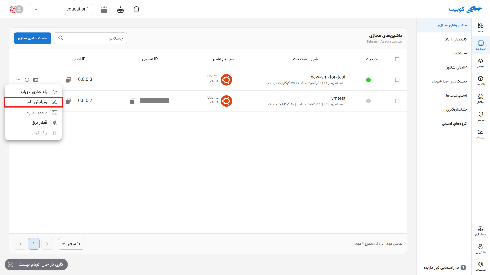
  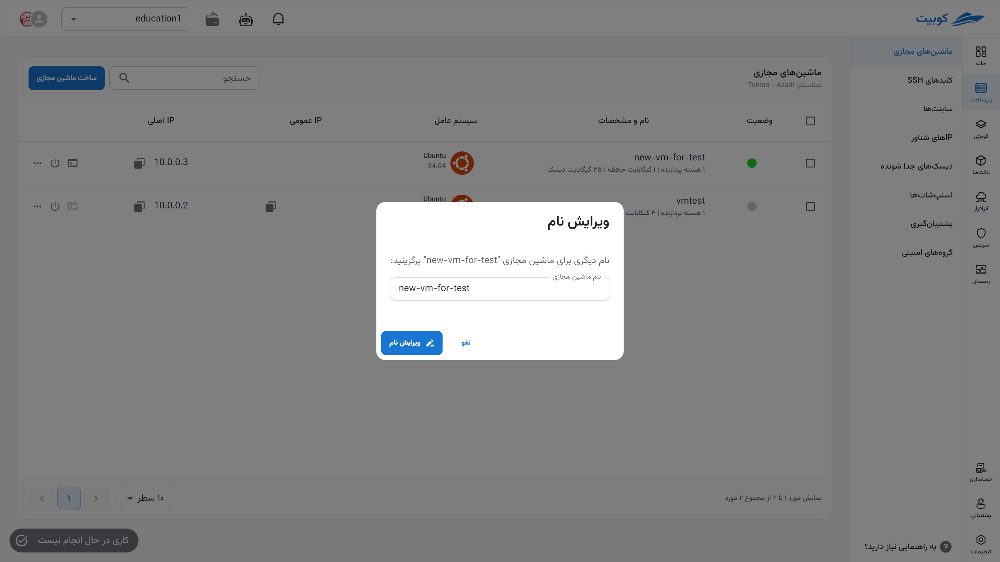

### Resize

- First, ensure the machine is turned off.
- To resize the machine, click on the **Resize** option.
- In the opened dialog, select the new machine size and click the **Resize** button.
  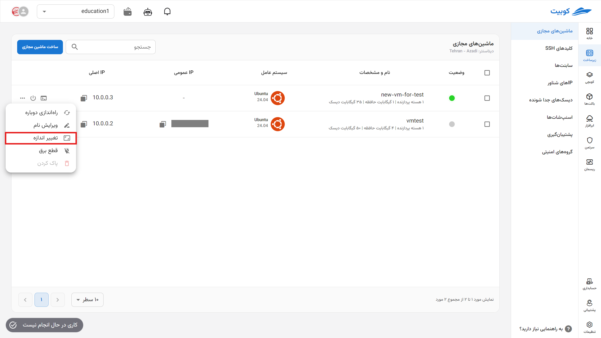
  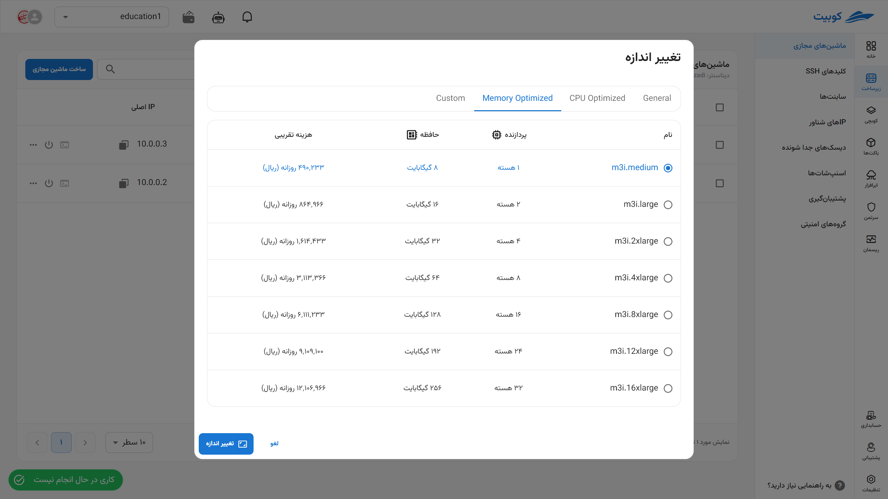

### Power Off

- First, ensure the machine is turned on.
- To power off the machine, click on the **Power Off** option.
- If you are sure about the operation, click the **Power Off Machine** button in the opened dialog.
- Upon successful completion of the corresponding job, the machine’s status changes to off.
  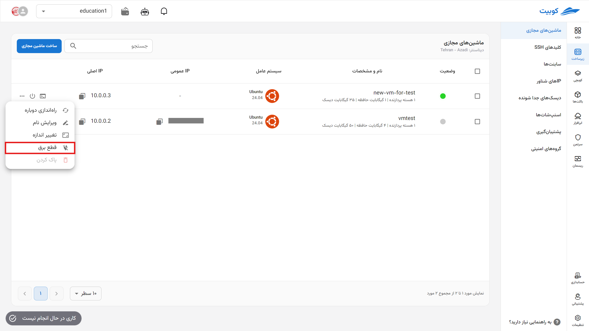
  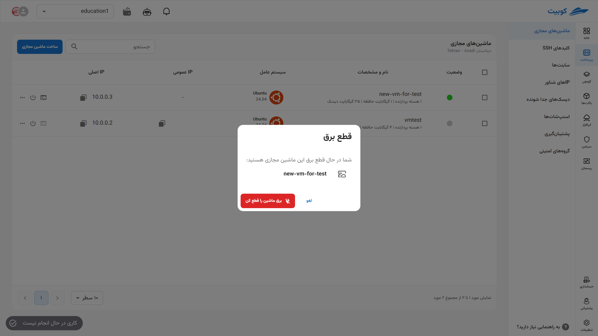

### Delete

- First, ensure the machine is turned off.
- To delete the machine, click on the **Delete** option.
- If you are sure about the operation, enter the machine’s name as confirmation for deletion and click **Delete**.
- Upon successful completion of the corresponding job, the machine will be removed from the list of machines.
  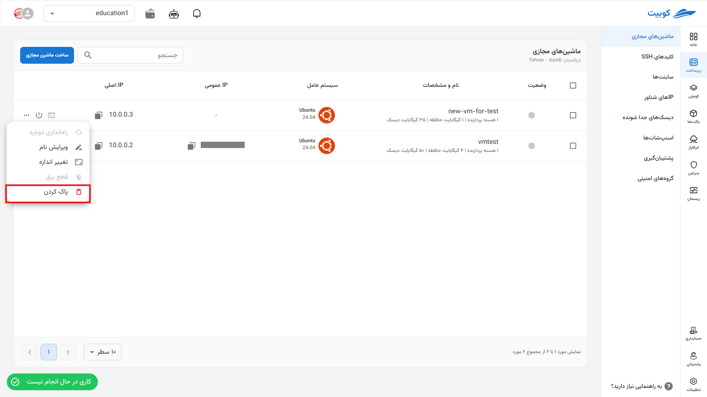
  From this section, you can also delete **detachable disks** connected to this machine or exclude them from this operation.
  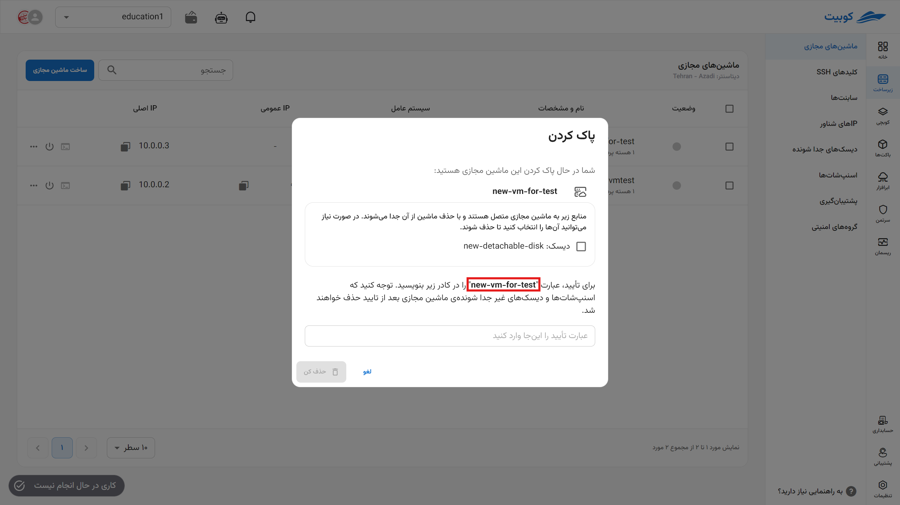
  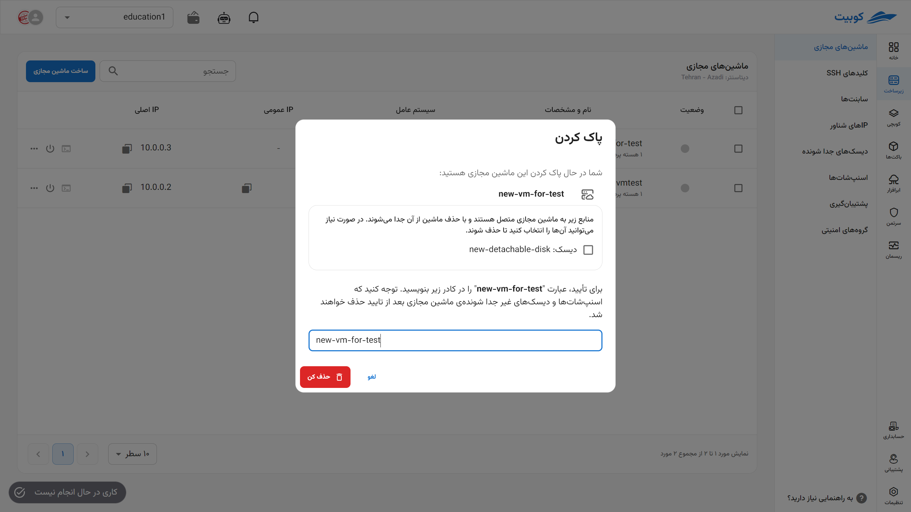

:::tip[Operations on Multiple Machines]
It is possible to apply all the above operations to multiple machines as a group. This capability will be explained below.
:::

## Batch Machine Operations

For ease of performing operations on multiple machines, all the above operations are available through the **Batch Operations** option. First, select one or more machines. After selecting the machine(s), the **Batch Operations** buttons will become active:
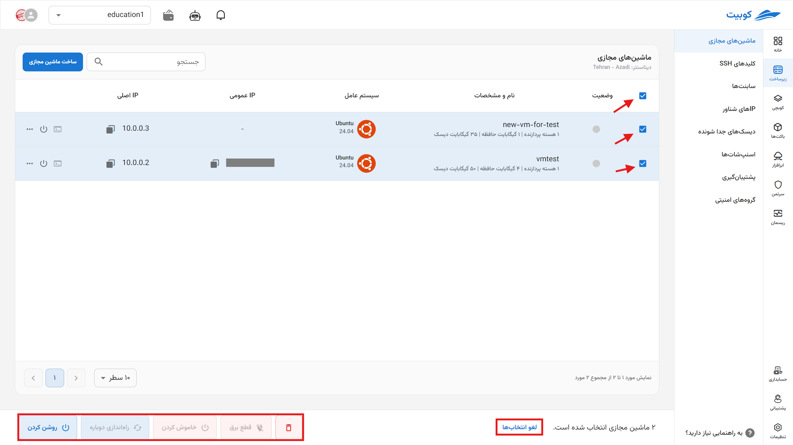

:::tip[Possible Operations]
Note that when multiple machines are selected, only operations that are possible for all selected machines will be displayed in the list. In other words, possible operations are those for which all selected machines have the same status. For example, if a turned-on machine and a turned-off machine are selected, the **Turn Off** and **Turn On** operations will be disabled because the machines do not have the same status, and neither operation is possible for both machines.
:::
By clicking on any of the options, the selected operation will be applied to all chosen machines, and the steps for performing them are consistent with those described for a single machine in the [Machine Operations](#vm-operations) section.
