# Virtual Machines

On the Virtual Machines page, you can view a list of virtual machines created in the selected project. This list includes the general specifications of the machines, along with various available operations.
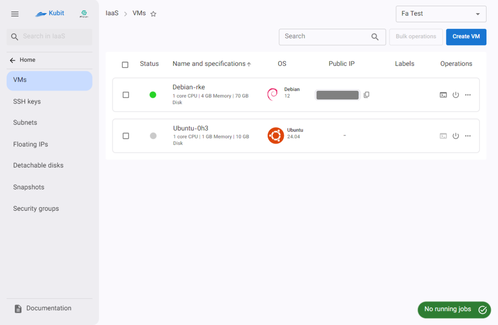
By clicking on any of the machines, you will be redirected to the machine's overview page. For more information, refer to the [Overview](../vm#overview) document.

## Virtual Machine Operations {#vm-operations}

There are various operations available for virtual machines, which we will explain below:

- Power On/Off the Virtual Machine: Powering off or on a virtual machine is similar to shutting down or turning on a physical computer; the operating system shuts down or starts normally.
-
- Power Cut: Cutting the power is equivalent to a sudden shutdown without a proper shutdown process, which may result in data or operating system damage.
-
- Reboot the Machine: Rebooting the virtual machine restarts the operating system without completely powering off and on the virtual machine.
  :::caution[توجه!]
  Please note that some operations depend on the machine's power state. If the required state is not met, the operation cannot be performed.

Power Off Requirement: Operations such as Delete and Resize require the machine to be powered off.
Power On Requirement: Operations such as Reboot and Power Cut require the machine to be powered on.
:::

:::info[Job Creation for Each Operation]
Every operation performed on a machine generates a corresponding task, which shows the operation's status. An operation is considered successful if its task completes successfully and reaches the Success status. You can view the task statuses by accessing the machine’s task list: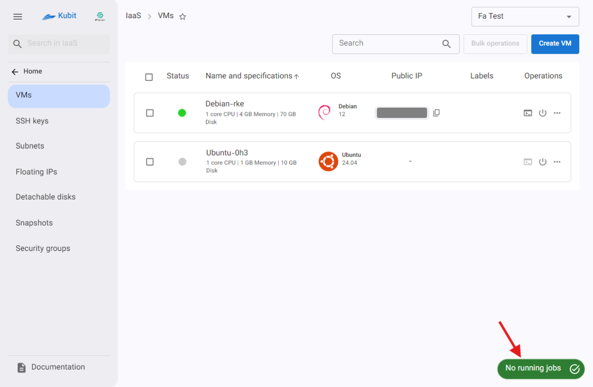

**Example of a job in progress**
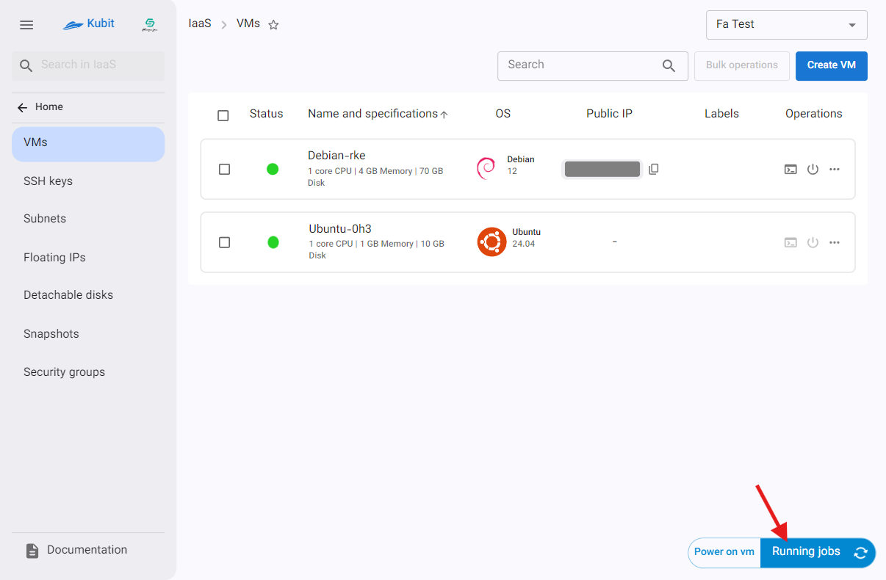
:::

### Accessing the Console

To open the machine’s console, click on the Console icon to open the console window:
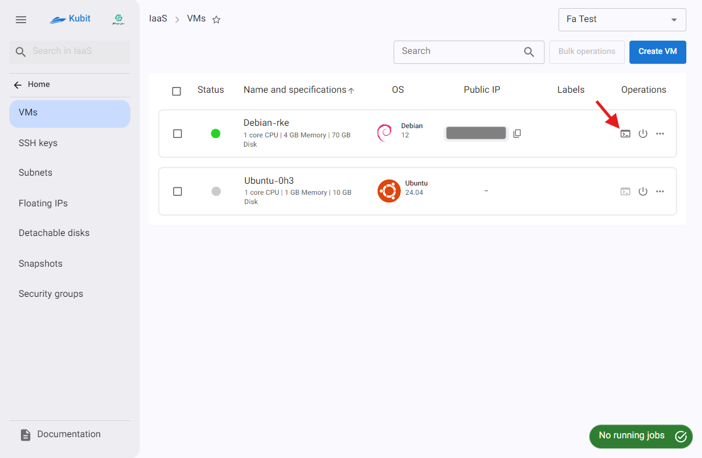

### Shutdown/Power on the Machine

- To Shutdown/Power on a machine, click on the **Shutdown/Power on** icon.
- If powering on, the machine will start without any user confirmation; however, if shutdown, a confirmation dialog will open. If you're sure, click **Shutdown** in the dialog.
- After the job related to the operation is successfully completed, the machine's status will change to either STOPPED or RUNNING.
  
  

For other operations, click the three-dot button in the operations column to display a list of actions:
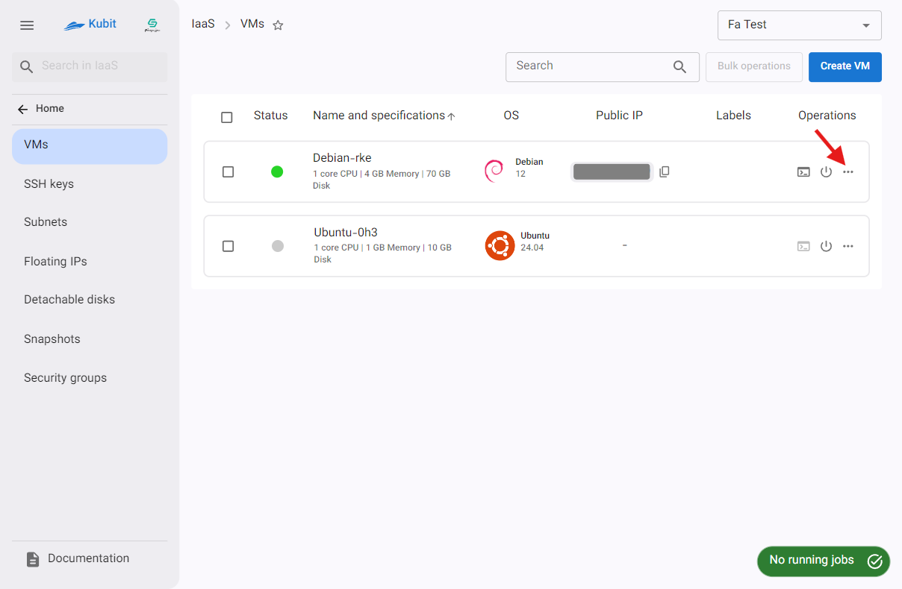
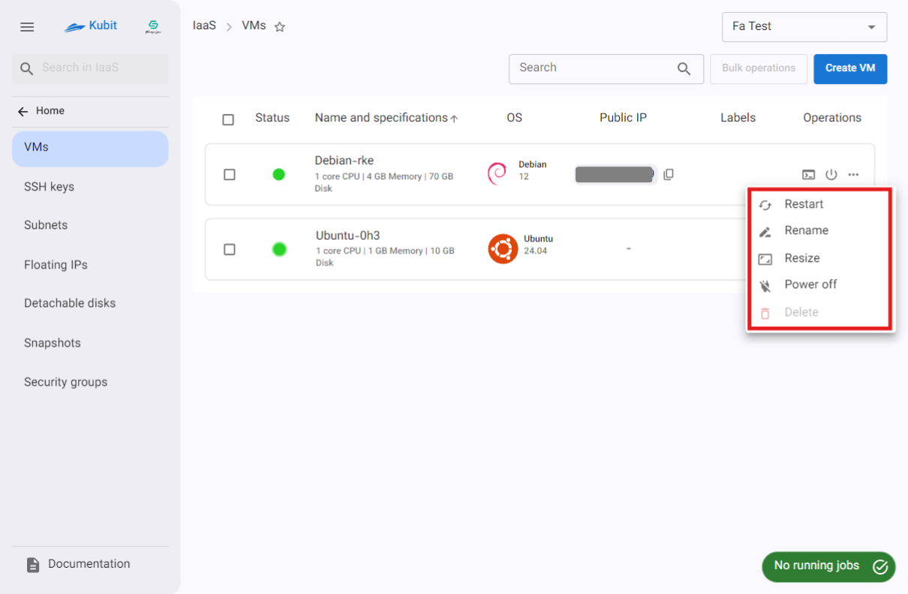

### Restart

- To restart the machine, click the Restart option.
- If you're sure, click Restart.
- Once the associated task is successfully completed, the machine’s status will update accordingly.
  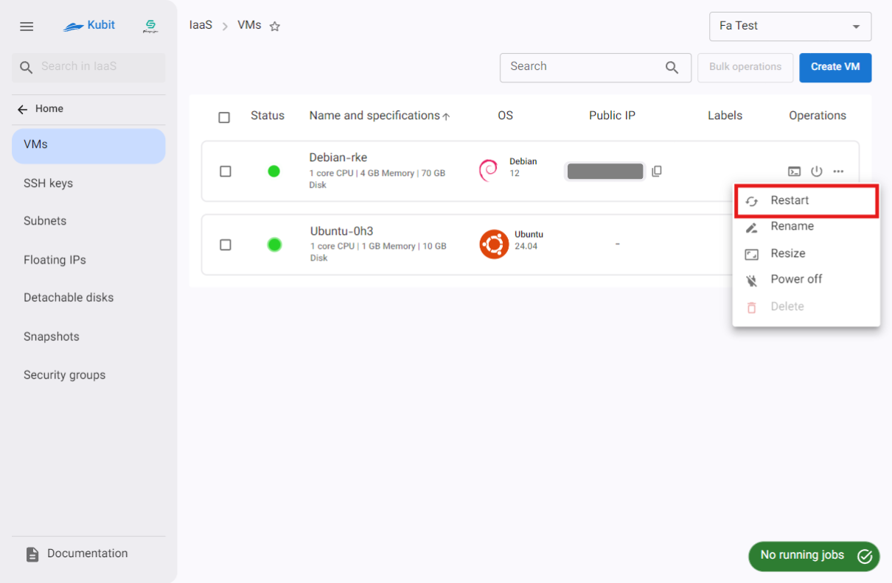
  

### Rename

- To change the machine's name, click Rename.
- In the opened dialog, enter a valid and unique name and click Rename.
  
  

### Resize

- First, ensure the machine is powered off.
- To resize the machine, click Resize.
- In the opened dialog, select the new size for the machine and click **Resize**.
  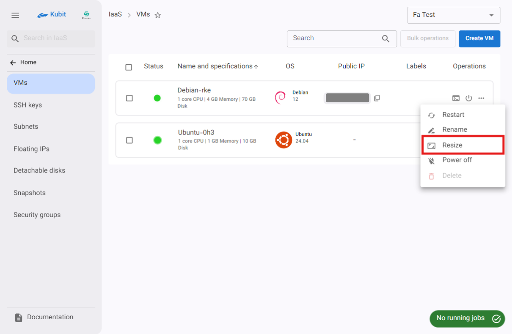
  
  

### Power Off

- First, ensure the machine is powered on.
- To cut the power, click Power Cut.
- If you're sure, click Cut Power in the confirmation dialog.
- After the task is successfully completed, the machine's status will change to powered off.
  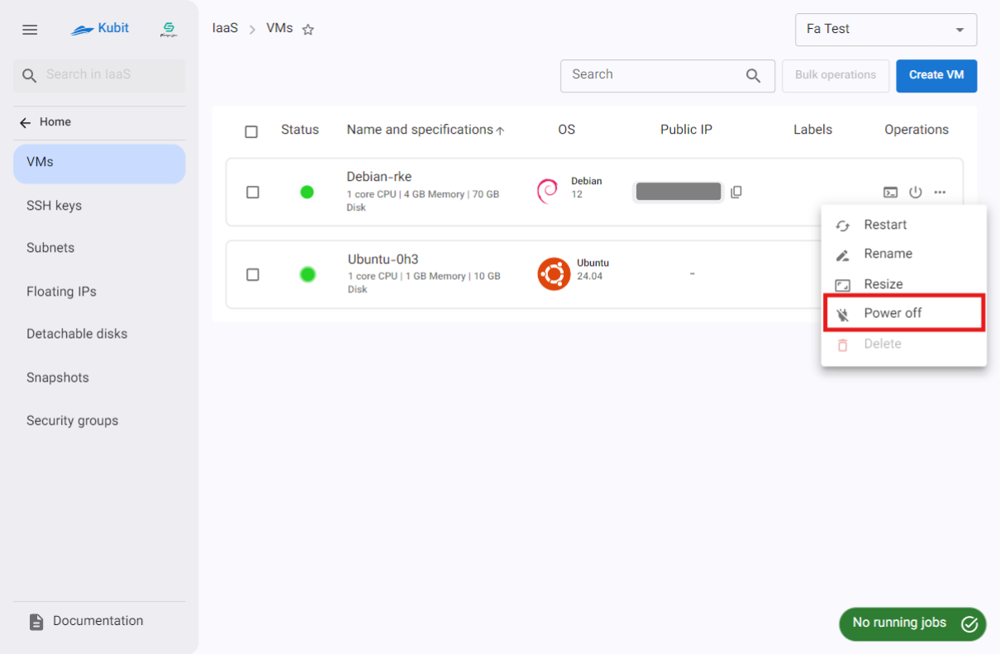
  

### Delete

- First, ensure the machine is powered off.
- To delete the machine, click Delete.
- If you're sure, enter the machine's name as confirmation in the dialog and click Delete.
- After the task is successfully completed, the machine will be removed from the list.
  
  
  

:::tip[Operations on Multiple Machines]
All the above operations can also be performed on multiple machines at once. This functionality is explained below.
:::

## Bulk operations on Machines

To simplify performing operations on multiple machines, all the above operations are available via the Bulk operations option. First, select one or more machines:
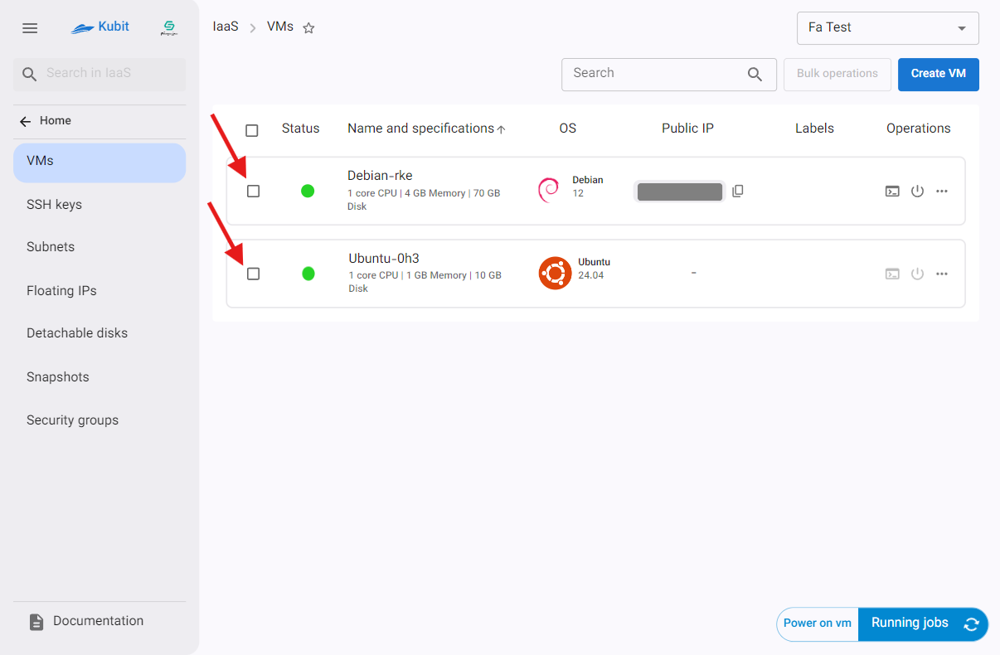

After selecting the machine(s), the Bulk operations button will be enabled:
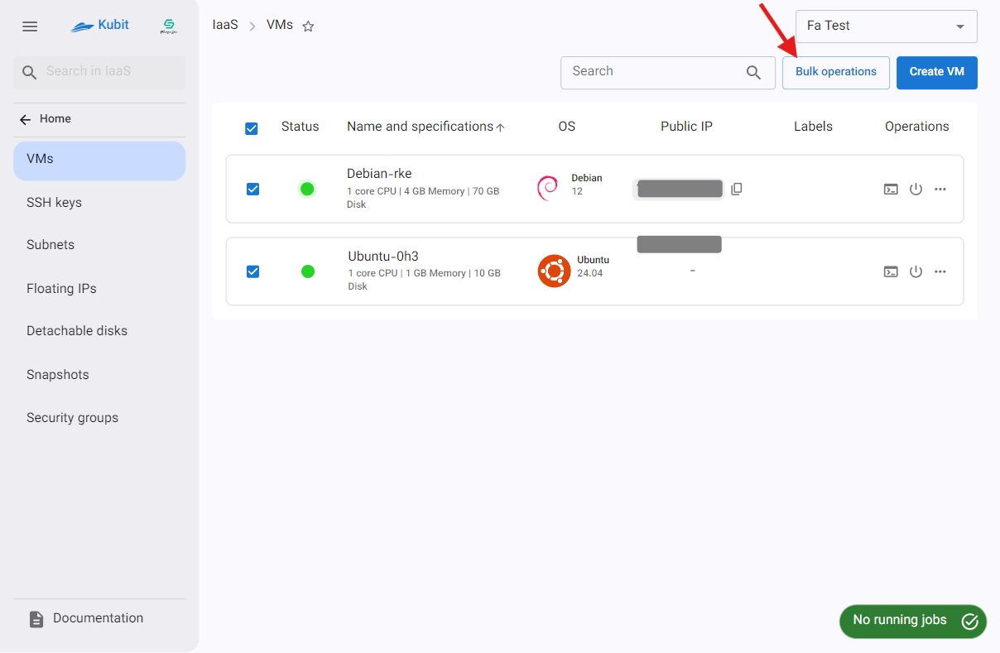

Clicking Bulk operations will display a list of available operations for the selected machines:
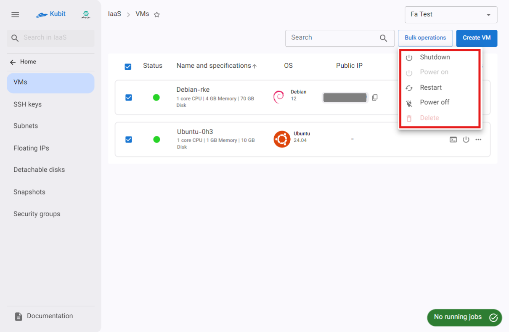

:::tip[Available Operations]
Please note that only operations that can be performed on all selected machines will be displayed. In other words, the available operations depend on the machines having similar statuses. For example, if one machine is powered on and another is powered off, the Power Off and Power On operations will be disabled since they can't be applied to both machines simultaneously.
:::

By clicking any of the operations, the selected action will be applied to all selected machines, following the same steps described in the [Virtual Machine Operations](#vm-operations) section.
