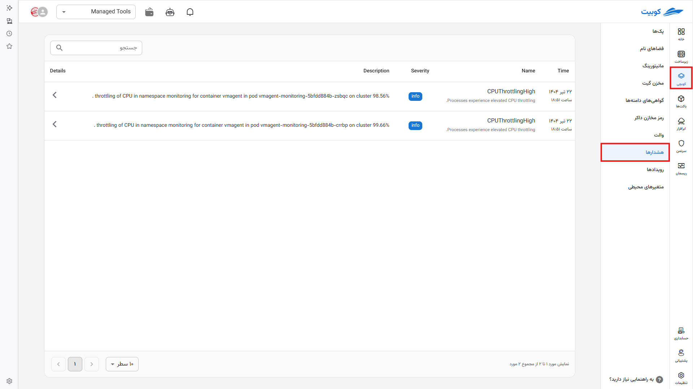
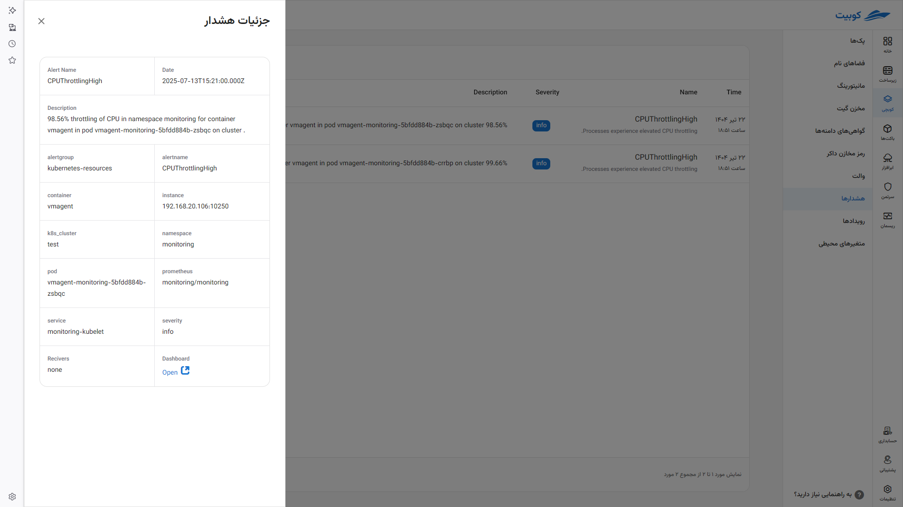

# Alerts

Alert messages issued by [Prometheus](../concepts/#service-monitor) at the **cluster** level (when a rule in Prometheus is triggered or fired) that may indicate potential issues or identify an anomaly in the system (e.g., reaching a specific condition or threshold) are classified as **alerts** in this section. For all commonly used applications (packs in the Kubchi system, such as the Postgres database, Redis, and Docker applications), all necessary alerts are defined and activated by **Kubit**. You can also define your own alerts. The **priority level** of each alert is specified in the system.

These messages are temporary and are cleared once resolved.

By clicking on each alert, you can access its details.

