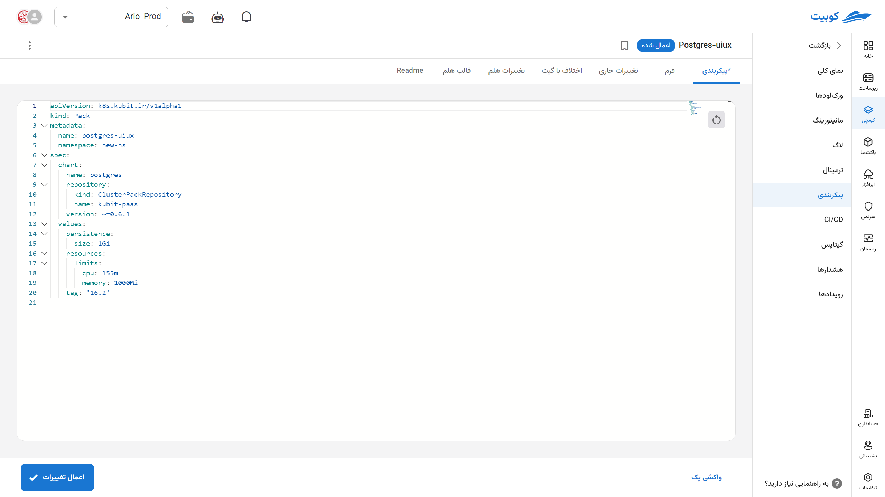
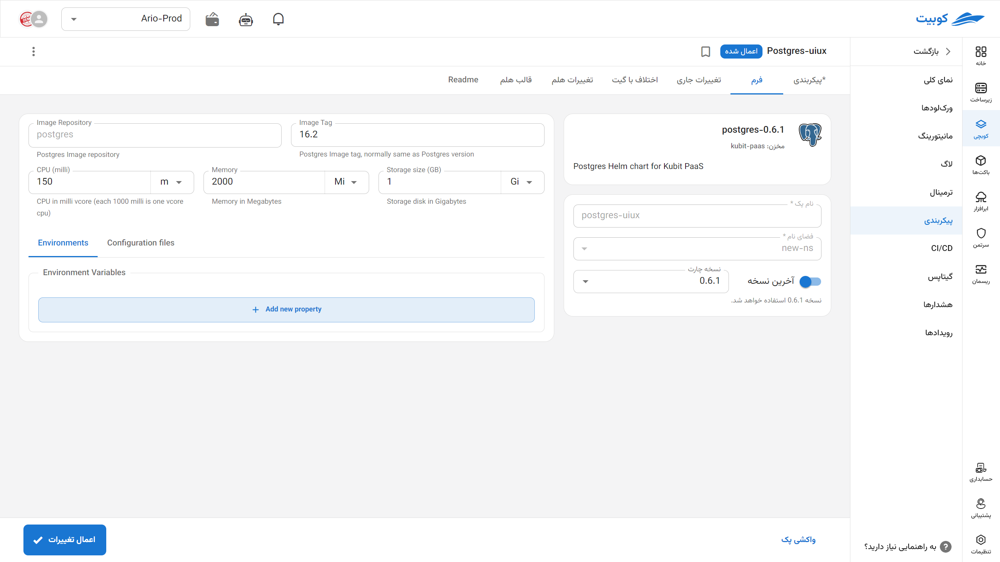
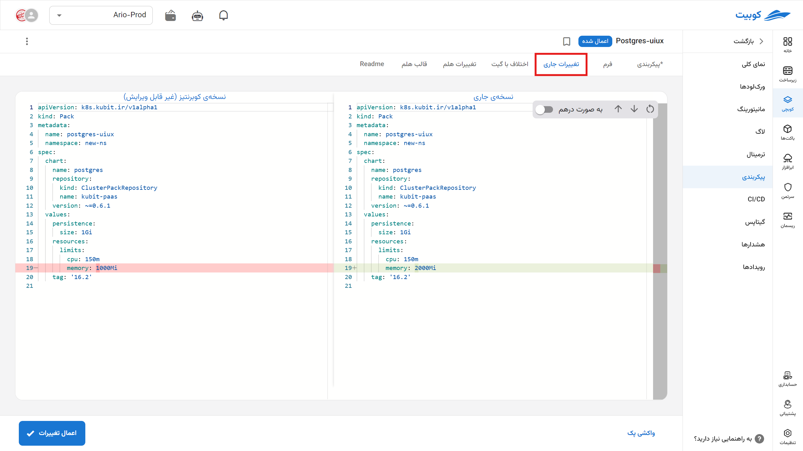
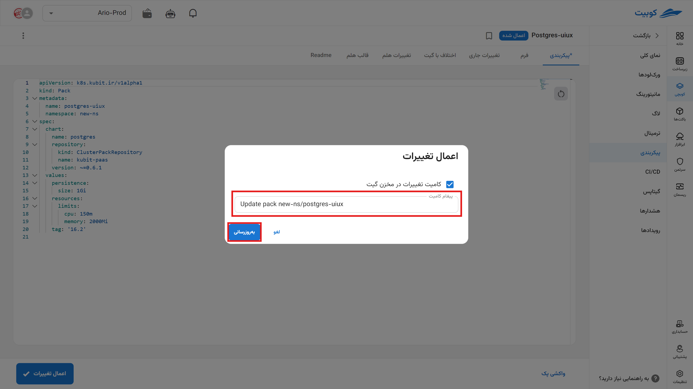
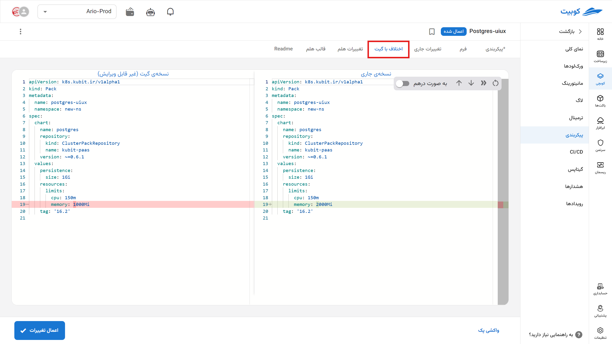
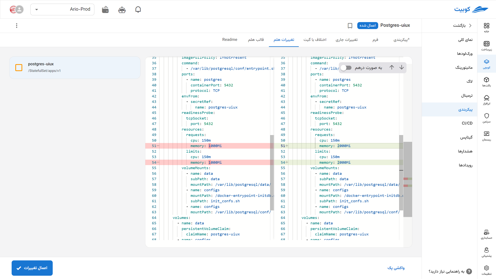
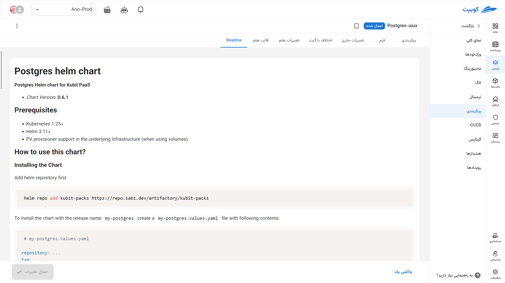

# Configuration

The general [configurations](../concepts/#manifest-config) of your pack can be viewed and edited in this section.
With **Fetch Pack**, first import the latest version available in the Kubernetes cluster (if you previously modified the files using another method, e.g., `kubectl`). Now you can apply the desired changes.

## Form

In the form section, you can view and configure the pack settings graphically. This type of editing is used for common and frequent changes, and only some pack parameters can be modified. To do this:

- Go to the Configuration option in the tab of the desired pack.
- Modify the desired values.
- Click the Update Pack button.

If successful, your changes will be registered in the pack, though it may take some time for the actual changes to apply in the cluster.

## Configuration or Manifest

In this section, the form settings are displayed as a **manifest file** that is automatically read by the **pack operator** with the newly set values, generating a new chart.

You can modify it according to your needs and view the differences with the Kubernetes executable file in the **Current Changes** tab.

This section becomes more meaningful with [GitOps](../gitops). Set it up first to fully utilize the features of this section.

### Committing Pack Changes in GitOps

When updating a pack, if you have configured the pack’s GitOps settings (see the documentation for setting up [GitOps](../gitops) and [CI/CD](../conint)), a dialog will appear to commit the changes made to the pack in the configured Git repository for that pack.

You can specify the commit message in the same dialog or use the system’s default message.

If you prefer not to commit the changes, simply uncheck the “Commit changes to the Git repository” option. In this case, Git changes will not be applied to this pack.

If the pack has uncommitted changes, you can press the “Commit changes to Git” button to commit the current state of the pack to Git. In this case, Git changes will be applied to the pack again.

:::tip[What to do when the warning "Pack differs from GitOps file" appears?]

There are three ways to resolve this warning:

- Apply what is in Git to Kubit.
- Apply what is in Kubit to Git.
- Create a combination of both and apply it to both.

:::

In the other tabs, you can view the final **Helm** chart generated, along with the changes made, in the **Helm Changes** tab.

In the last tab, you can view the **README** file for that pack.

