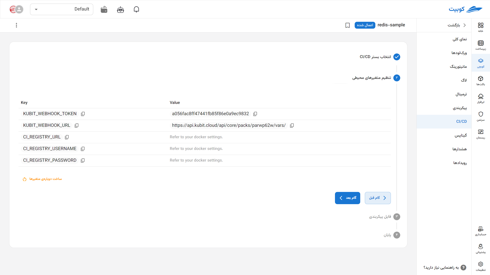
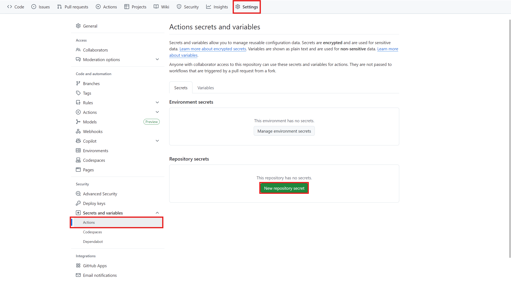
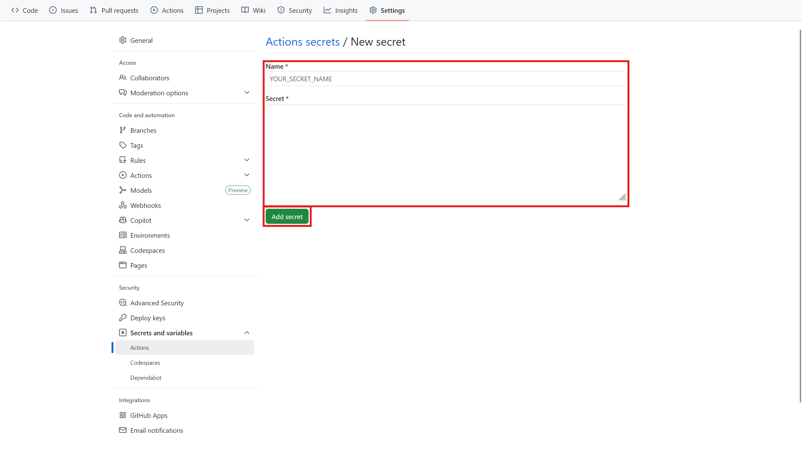
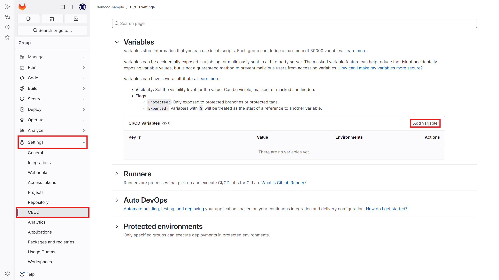
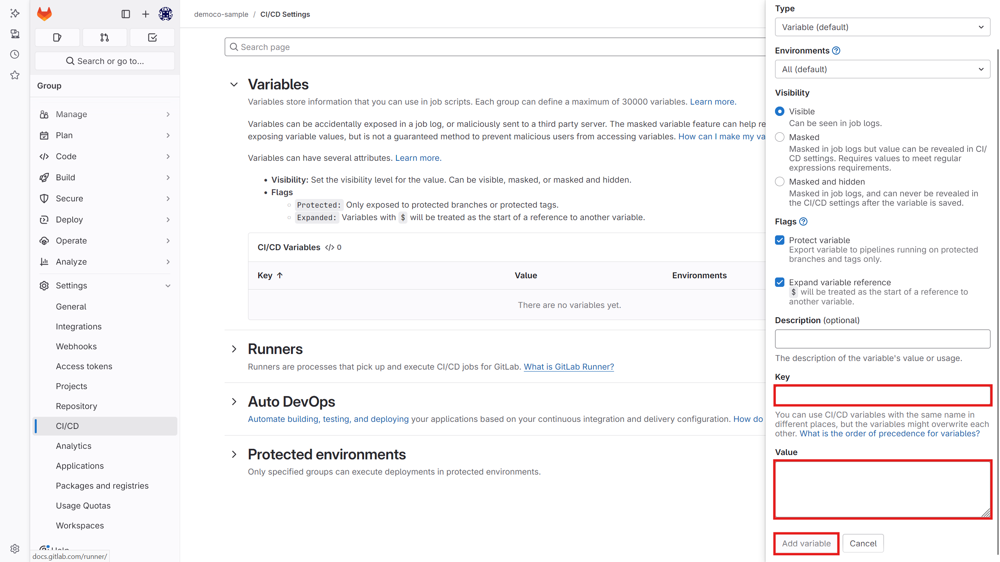
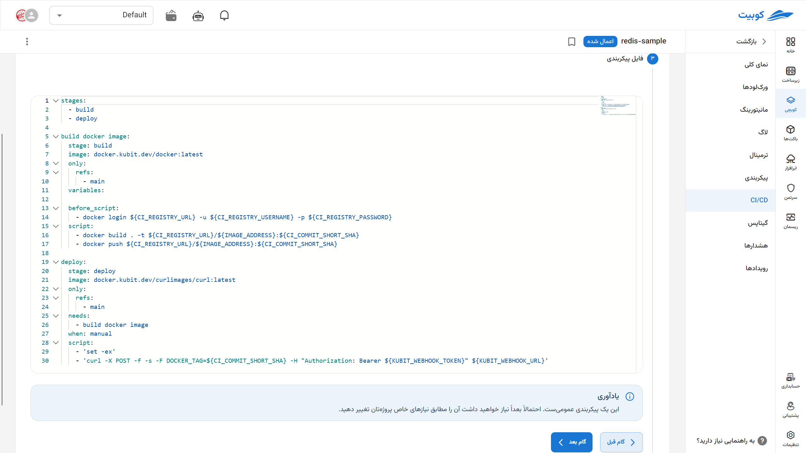

# Continuous Integration and Continuous Deployment (CI/CD)

In this section, a Wizard is available that automatically updates the **variables of your [pack configuration file](../config)** using a **general template** with the `curl` tool and information received from a **GitHub or GitLab webhook**. These changes typically include the image version, resources, or new dependencies, leading to an **automatic deployment of the new application version** on the cluster.

The steps, in summary, include:

1. First, the developer **pushes code changes (commit)** to the GitHub or GitLab repository.

2. Then, GitHub sends a **POST request** to our server; this request is sent to a specific path defined as a **webhook** and includes necessary variables, such as the name, containing information about the recent push.

3. Next, the server interprets the **received request as a signal of new changes in the project**. It then proceeds to execute the command to retrieve the latest container image and settings.

4. Finally, the workload is **restarted with the new changes** to apply the updated changes.

For example, you use a new version of a file in your code, build an image with new resources and dependencies in your pipeline, and push it to your Docker registry (Docker Hub or a private one). Now, you want your application to work with the new version. Automatically, using this section, the new image version is registered in the configuration, and Kubernetes automatically reads this file and creates a new pod with the specifications registered in the configuration file. You can observe these changes in the Workloads and Events sections.

Suppose you have built a new version of your application with the image `my-app:v2.0.1` and published it to the Docker Registry. Using this system:

- The new version number is automatically registered in the configuration file.
- Kubit, by reading this configuration, **executes a new workload** with the updated image.
- In the **Workloads** and **Events** sections, you can see that the new pod has been **deployed** correctly without manual intervention.

## Steps to Set Up CI/CD for Projects Based on Kubit {#setup-cicd}

To enable direct deployment of your projects through Kubit, you need to connect the CI/CD of your development projects to Kubit. Follow these steps to do so.

### Setting the Tag Variable in the Pack

- First, go to the **Configuration** section. In the vars section, create a variable named DOCKER_TAG.

- Then, in the tag section of the main container image of your pack, use this variable.

`sample-django-pack.yaml`:

```yaml
apiVersion: k8s.kubit.ir/v1alpha1
kind: Pack
metadata:
  name: sample-django-app
  namespace: samples
spec:
  ...
  values:
    ...
    workloads:
      web:
        containers:
          web:
            ...
            image:
              pullPolicy: IfNotPresent
              registry: '{{ vars.DOCKER_REGISTRY }}'
              repository: '{{ vars.DOCKER_IMAGE }}'
              tag: '{{ vars.DOCKER_TAG }}'
            ...
        initContainers:
          wait-for-db:
            args:
              - wait_for_db
            image:
              pullPolicy: IfNotPresent
              registry: '{{ vars.DOCKER_REGISTRY }}'
              repository: '{{ vars.DOCKER_IMAGE }}'
              tag: '{{ vars.DOCKER_TAG }}'
    postgresql:
      enabled: false
  vars:
    DOCKER_REGISTRY: registry.sample.dev
    DOCKER_IMAGE: mydjangoproject
    DOCKER_TAG: master-3bafc239
    ...
```

### Steps to Retrieve Variables and Configuration File in a Ready Template

Go to the CI/CD tab of the desired pack and specify the platform where your CI/CD processes take place. Kubit supports both GitHub Actions and GitLab CI/CD. After selecting, click on the Next Step option.

### Retrieving Required Variables from Kubit

- An address and token for this pack are generated and displayed to you.



- Go to your development project in Git and set these variables in your panel.

- Then, from the settings section, go to the CI/CD section, and in the Variables section, define the `KUBIT_WEBHOOK_TOKEN` variable. Assign it the token you received from Kubit in the previous step.

  1. GitHub version:

  
  

2. GitLab version:

   
   

- Go to the editor section in the CI/CD part of the repository (in GitHub, the `.github/workflows/main.yaml` file, and in GitLab, the `.gitlab-ci.yml` file) and add a code snippet similar to the one below.

- Kubit automatically generates a sample file for you, which you can modify based on your needs. All the above files are available as ready templates when you click on the CI/CD option in Kubit.
  

**Important Note**:

If the GitOps file of the pack is in the development project structure (in the same repository as the project), make sure to add a condition in the CI/CD to prevent the webhook from being triggered when the GitOps file changes. Otherwise, this scenario will result in an infinite loop.

`cicd.yaml`:

```yml
---
kubit webhook:
  stage: deploy
  # image: docker.sabz.dev/curlimages/curl:latest
  variables:
    KUBIT_WEBHOOK_TOKEN: '' # <access_token>
  script:
    - 'curl -X POST -F DOCKER_TAG=${DOCKER_TAG} -H "Authorization: Bearer ${KUBIT_WEBHOOK_TOKEN}"  https://api.kubit.ir/api/core/packs/<pack_uid>/vars/'
```

The following formats can also be used for this purpose:

```yml
script:
  - 'curl -X POST -F DOCKER_TAG=${DOCKER_TAG} -F token=${KUBIT_WEBHOOK_TOKEN}  https://api.kubit.ir/api/core/packs/<pack_uid>/vars/'
```

```yml
script:
  - 'curl -X POST -F variables[DOCKER_TAG]=${DOCKER_TAG} -F token=${KUBIT_WEBHOOK_TOKEN}  https://api.kubit.ir/api/core/packs/<pack_uid>/vars/'
```

:::info

To use curl in the CI/CD file, you can use [this image](docker.sabz.dev/curlimages/curl:latest) as the image.

:::

:::info[Other Variables]
**Note:**

To send other variables to the pack, add them to the request parameters in the format below. However, in the current version, if the variable name does not match the regular expression `DOCKER_TAG[\w.-]*`, you must contact Kubit support for confirmation.

     variables[VARIABLE]=VALUE

:::

After setting up the files, your CI/CD is ready at this stage.

Commit your changes and wait for the automatic execution of your project's pipeline jobs.

For more information and customizations, refer to the [official documentation](https://docs.gitlab.com/ee/ci/).
