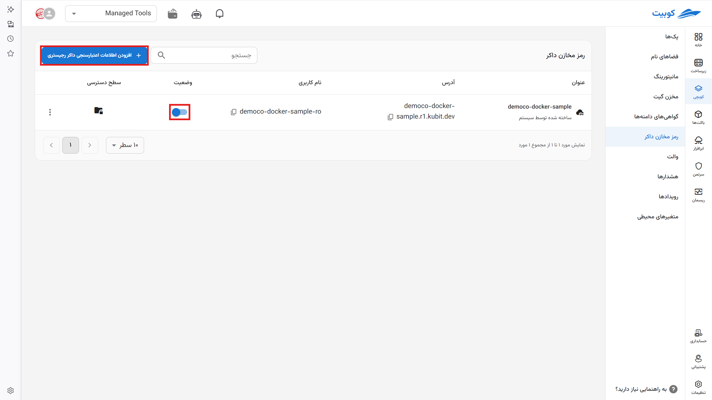
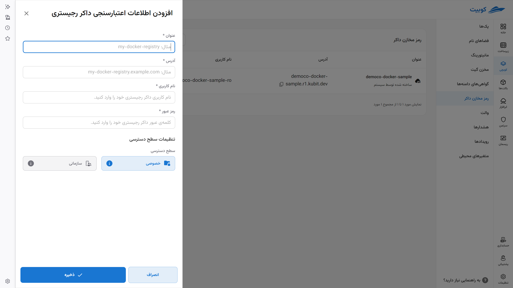
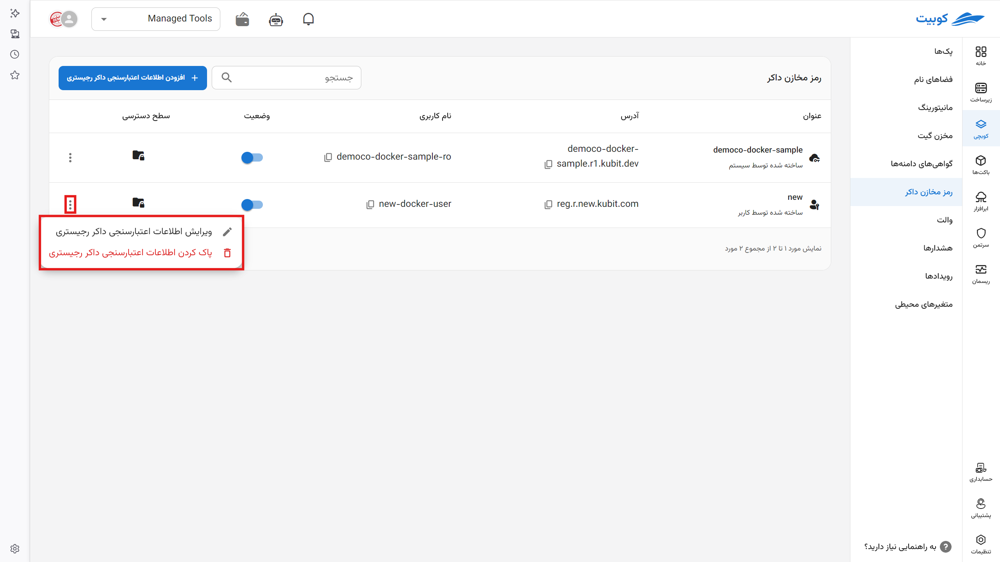

# Docker Registry Credentials

You can view the details of your Docker registry in this section. When you want to install a new pack, save the registry details here and then access them from the pack installation section.

## Connecting a New Registry

Registries created in the [**Cloudware**](../../saas/docker) section are automatically and systematically added to this section. The **name**, **address**, **username** of the registry, **status** (indicating whether it is accessible through Kubchi or not), and **access level** (private or organizational) of each registry are displayed.

To manually add a new registry:

- Click on **Add Docker Registry Credentials**.

- Enter your registry details in the displayed form.

Your registry has been added to the list of registries.

- By clicking on the three-dot icon, you can delete or edit its details.

