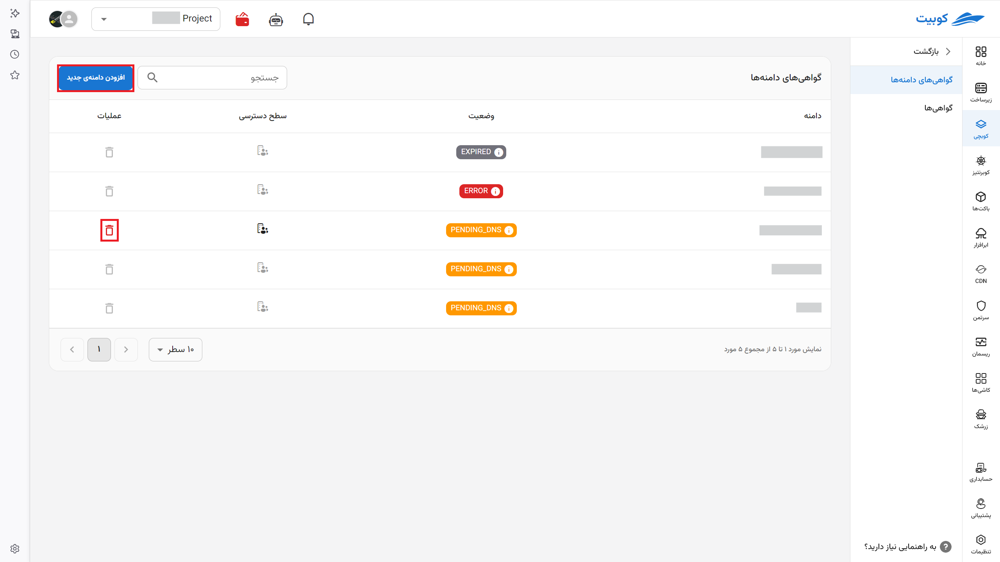
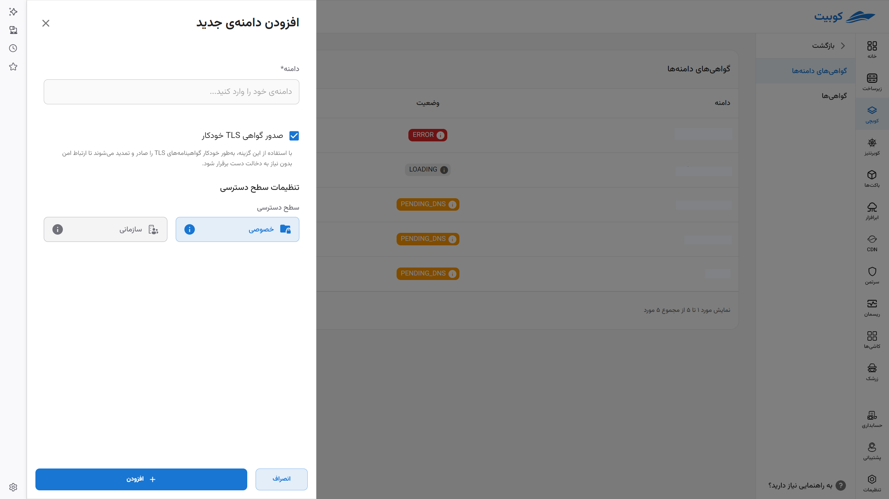
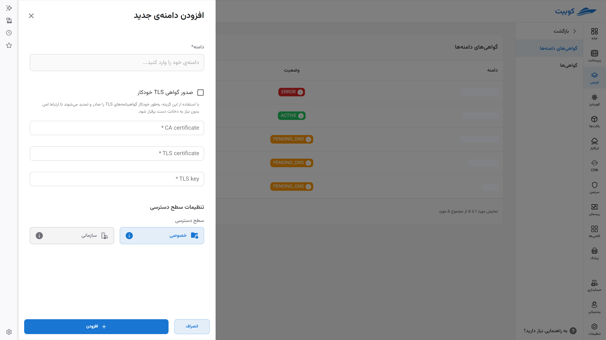
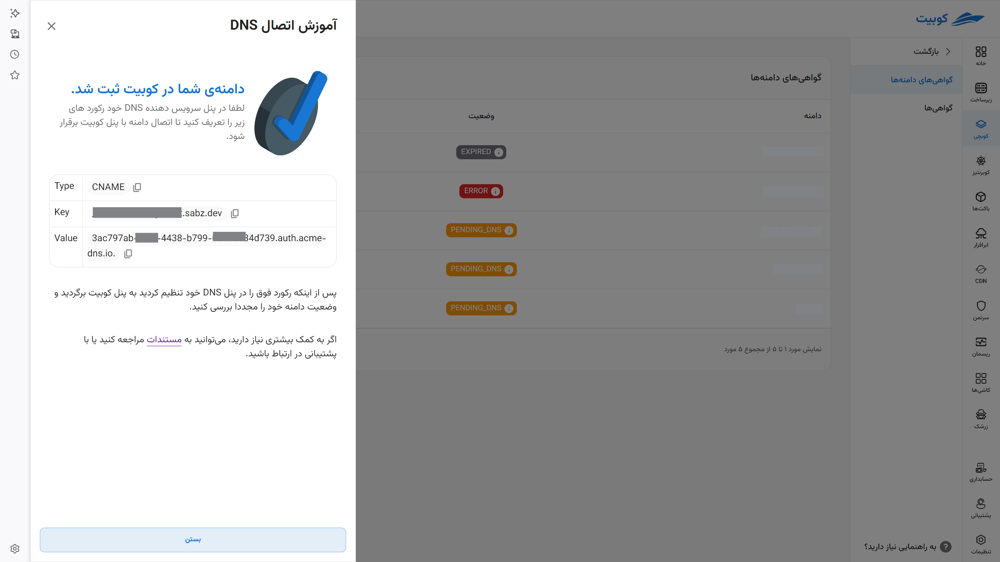
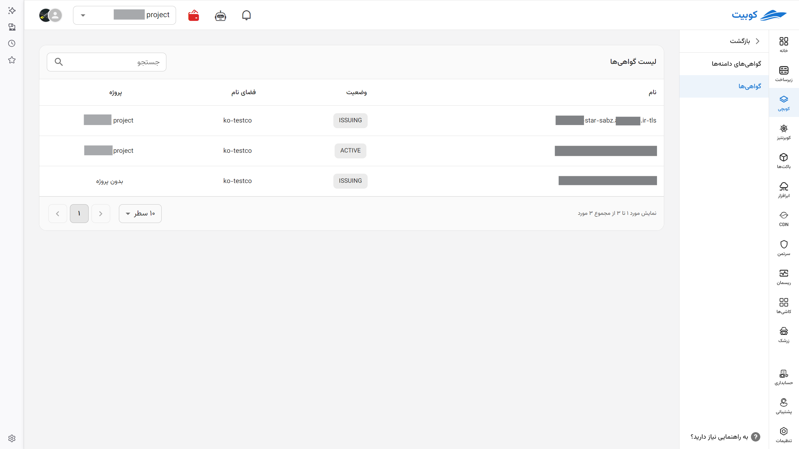

# Domain Certificates

The ability to [connect a domain to a Kubernetes cluster](../concepts#ingress) via **TLS/SSL** certificates is provided **automatically or manually**. This feature allows you to make your applications easily accessible to users through a dedicated, **secure, and reliable** domain.

Without the need for complex configurations:

- First, register your domain with a DNS service.

- Then, add a new domain to your server through this tab.

## Domain Certificates

In this section, you can view your domains along with their statuses.

- To add a new domain, click on the "Add New Domain" option. You can also delete them by clicking on the delete icon.

- In the opened menu, enter your domain.
- You can manually obtain the TLS/SSL certificate details from the certificate provider and enter them here. Alternatively, Kubit allows you to automatically obtain a TLS certificate from the free certificate provider _[Let's Encrypt](https://letsencrypt.org/)_ via the ACME protocol by clicking the "Obtain TLS Automatically" option and configure it for your domain.

In the status section, you will see the following states:

- active: The service and TLS certificate are active on the domain.
- error: An issue occurred while setting up the domain. Click to view the error details.
- pending dns: Waiting for DNS server configuration.
- expired: The TLS certificate has expired.
- unknown: An unknown error occurred. Contact support via ticketing.
  Clicking on each status message will guide you to resolve the issue.

## Certificates

This tab displays information such as the **name** of the issued **certificate**, its **status** (either `ACTIVE` if active or `ISSUING` if there is any issue), the **namespace** it belongs to, and the **project** it is connected to.

