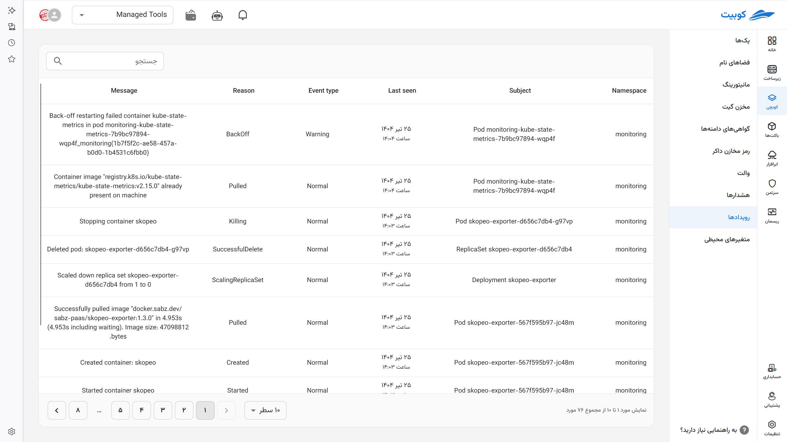

# Events

In Kubernetes, **[Events](../concepts/#event)** are messages that provide insight and information about the status and ongoing activities of the cluster. These messages are crucial for **understanding the reasons for the occurrence or failure of operations** and are typically accessible as logs in tools like `kubectl describe` or Kubernetes user interfaces.

Access events via the path `Kubchi > Events` to review cluster-level events, or through `[Select Desired Pack] > Events` to view events related to the pack and its associated workloads.

In addition to viewing events briefly in the workload section, they are available in detail here. Each event is marked with various labels that help you better understand the activities occurring in the pod.
