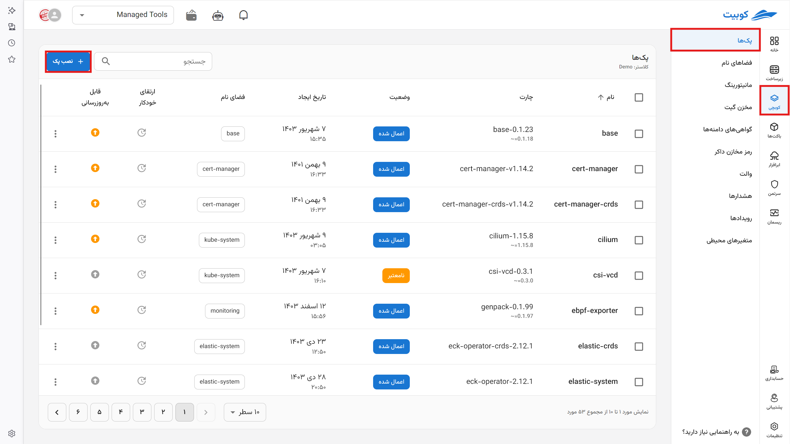
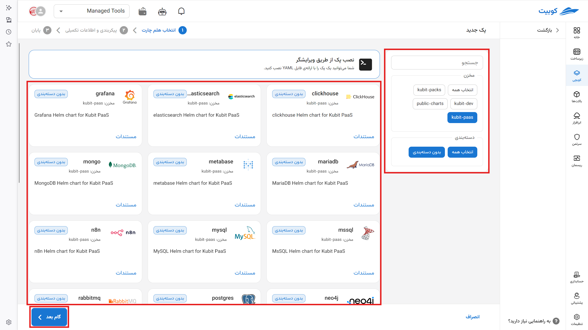
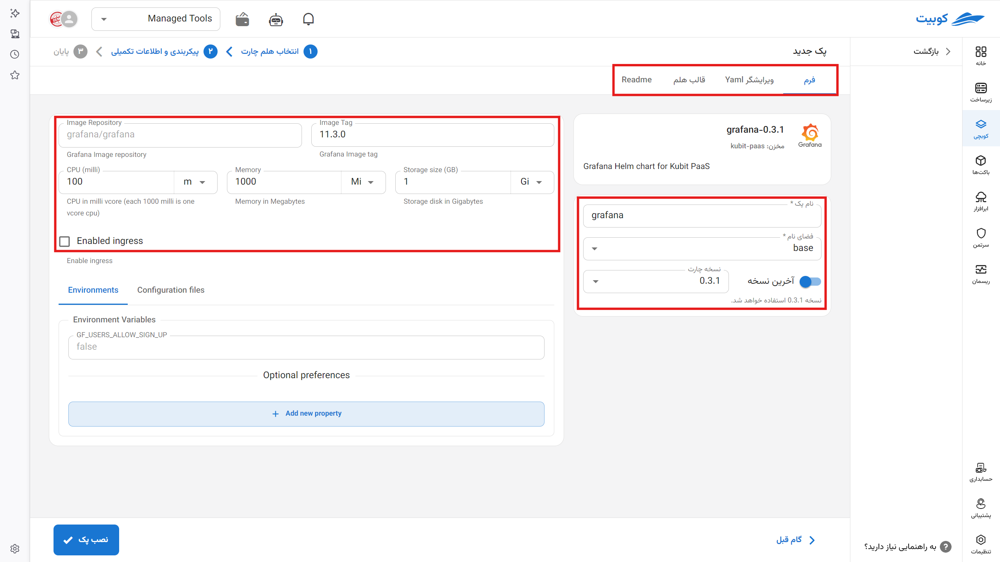
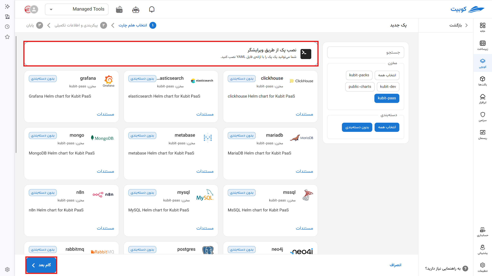
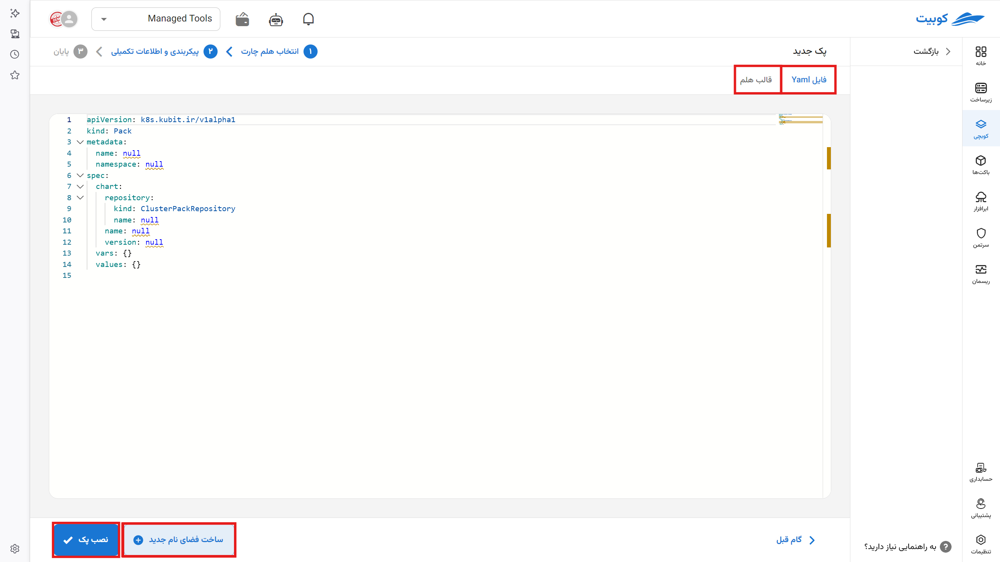
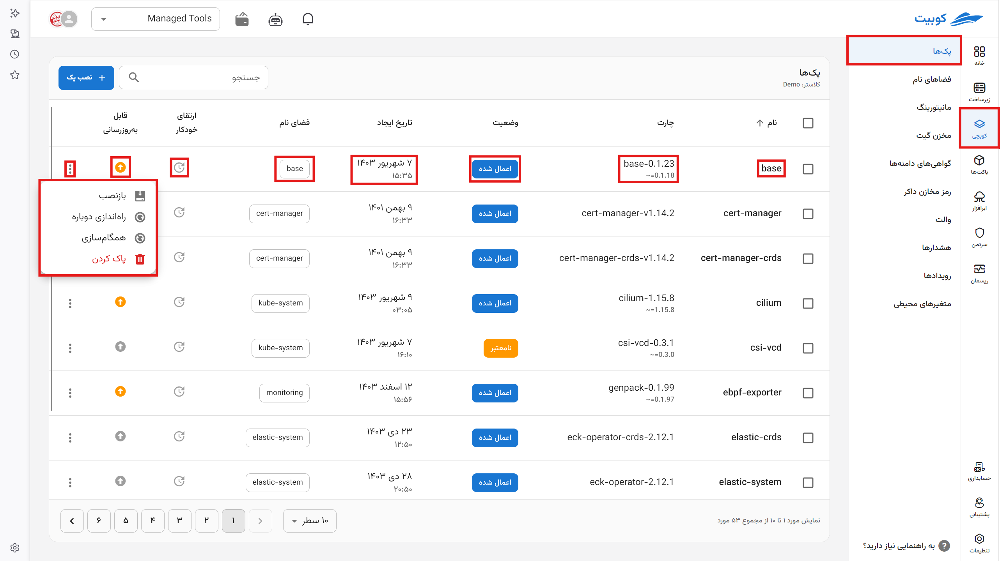
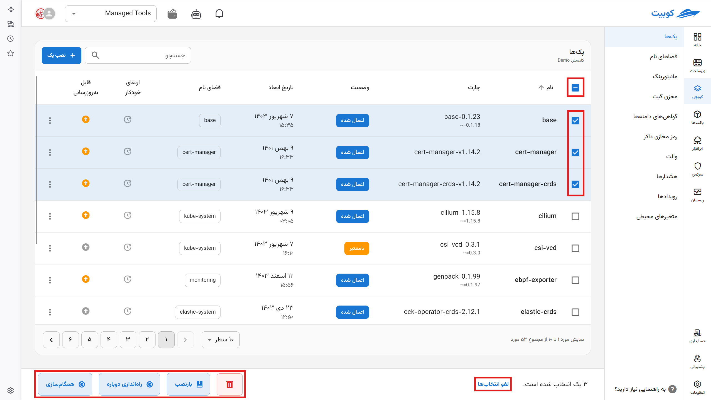
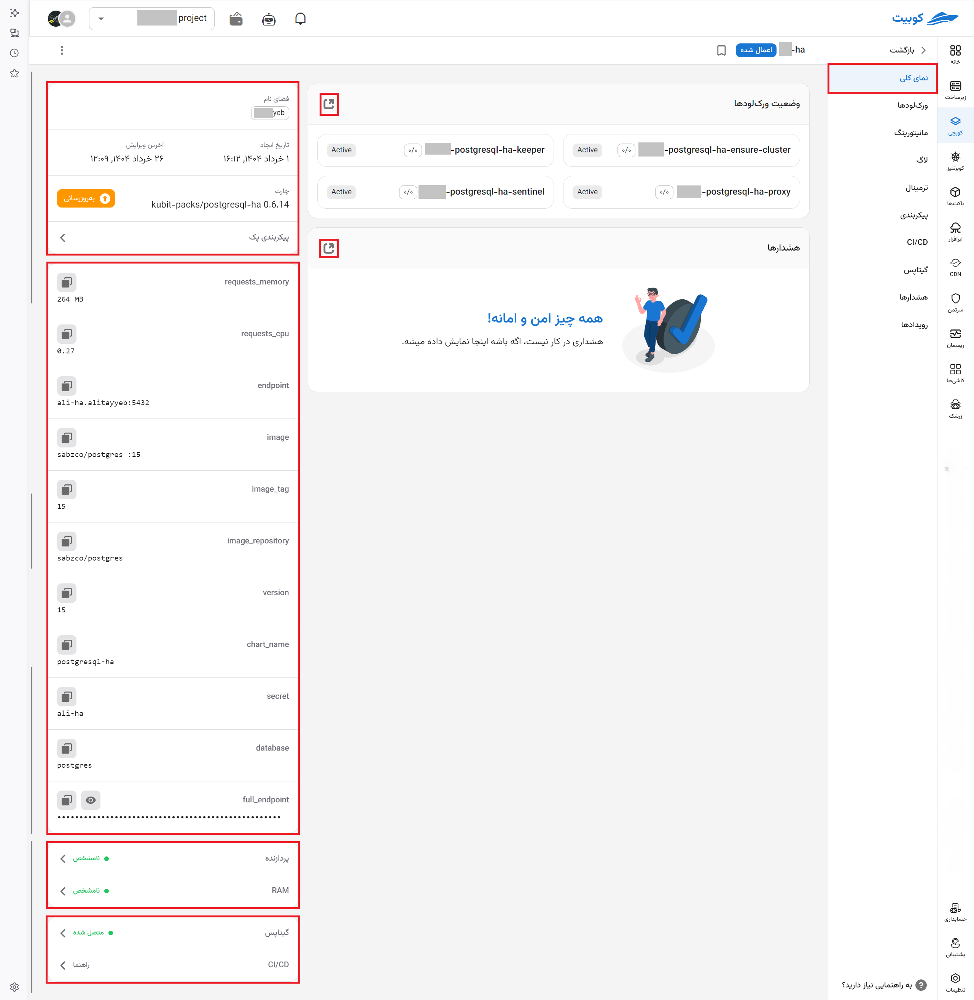

# Getting Started (Step One)

:::warning[Infrastructure Cluster]

**Kubchi service** can be activated on various Kubernetes clusters. If you are using **clusters managed by Kubit**, this service is ready for use by default. If you are using other clusters, contact [support](../../ticketing) to connect this service to your cluster.

:::

The content of this page includes an introduction to the details of the packs page and how to install a pack.

## Installing a Pack

Go to the [**Packs**](../concepts/#pack) section and click on the **Install Pack** option to install a new pack. You can install packs in two ways.

To install ready-made packs through the UI form, select a ready package, enter the package form section, and modify its specifications as needed.

Alternatively, you can enter the required specifications through a text editor or a `yml` file, and the [**pack-operator**](../concepts/#pack-operator) system will automatically read the file and install and set up your package.

### Installing via Form

Find your pack through the search and category section. A list of ready-made packs along with their descriptions is displayed.

After selecting the desired pack in this section:

- Specify the pack name

- Specify the [namespace](../namespace) of the project. You can also define a new one.

- Select the pack installation version or install the latest available version.

:::info[Storage in Kubernetes]

In Kubernetes, memory allocation for containers is defined in **bytes** and can be specified with a number or suffix.

#### Types of Suffixes:

- **Decimal (base 10):**  
   `k`, `M`, `G`, `T`, `P`, `E`  
   Example: `400M` means 400 megabytes
- **Binary (base 2):**  
   `Ki`, `Mi`, `Gi`, `Ti`, `Pi`, `Ei`  
   Example: `400Mi` means 400 mebibytes (approximately 420 megabytes)

#### Important Note:

:::warning[Case Sensitivity]

Units are **case-sensitive**. For example:

- `400m` means 0.4 bytes
- `400M` or `400Mi` represents the actual memory value

For greater accuracy, use binary units like `Mi` and `Gi`, and always pay attention to case sensitivity.

:::

- By default, Kubit assumes suffixes are base 2 (e.g., gib). However, you can manually specify values, such as 1000mb (where mb is base 10).
- Enter the RAM amount according to the standard mentioned (default values are in bits).
- Specify the allocated cores. (Each 1000 milli-core equals one core, and the core type is determined by your infrastructure.)
- By enabling the Ingress option, connect your domains to the [ingress](../domains) service to access your applications.

:::info[Domain Connection]

To connect to a domain, retrieve the required values from your DNS panel and enter them here.

:::

- Select the Docker repository for installing your containers.

:::info[Custom Repository Setup]

Kubchi uses Docker Hub by default to retrieve Docker images. Docker repositories configured in this project under the [cloudware]() section are automatically enabled and accessible here. To set up a dedicated repository, go to the [Docker Registry Credentials](../docker) tab.

:::

- Other specifications will vary depending on the package being installed.

In other tabs, you can view the Helm chart output and configuration (manifest):

- YAML Editor Tab: Manually edit the manifest file and add values if the operation cannot be performed through the form.

:::info[Kubit Editor]

Kubit uses the web version of the VS Code editor. Hotkeys are similar to VS Code and provide its capabilities.

:::

- Helm Template Tab: The final Helm template (release Helm chart) that this application is installed based on.

:::info[Helm Template]

Using the "Helm Changes" tab, you can view the final Helm files created by the **pack operator** based on the settings you applied. Review this section before installation to ensure your pack configuration is correct.

:::

- ReadMe Tab: The readme file for each application

### Installing with YAML

:::info[Kubit Editor]

Kubit uses the web version of the VS Code editor. Hotkeys are similar to VS Code and provide its capabilities.

:::

Since not all charts have forms, you can install any chart by writing the corresponding YAML in Kubit.

To do this, create the pack YAML file according to the following pattern:

- Select the "Install Pack via Editor" option.

  - If you want a new namespace, create the desired namespace from the Namespace tab.

- Enter your pack YAML in the displayed editor.

- For convenience, the general pack structure is pre-displayed in that section.

- For the namespace tag, enter your namespace name, with autocomplete available. Use the **Create New Namespace** option to create a new namespace.

- In the repositories tag, select the registered repository name to connect and retrieve the Helm chart.

:::info[Helm Template]

Using the "Helm Changes" tab, you can view the final Helm files created by the **pack operator** based on the settings you applied. Review this section before installation to ensure your pack configuration is correct.

:::

## Packs Page in Kubchi

By selecting the Kubchi service, the list of packs for a project is displayed on its specific page. This page contains various information about the packs, organized in tabs.

### Important Pack Operations

- **Restart Pack**

By pressing the "Restart Pack" button, all workloads of the pack are restarted, and their current version in the cluster is removed.

- **Reinstall Pack**

Selecting "Reinstall Pack" recreates the pack and updates the chart specifications based on the pack's configuration (manifest).

This applies the chart changes and configuration settings in Kubchi to the cluster.

- **Refresh Pack Information**

By pressing the "Synchronize Pack" button, the pack information is updated based on the latest data and pack status in the cluster.

The above operations can also be performed collectively on packs.

#### Pack Overview

By clicking on each pack, the first tab of this page provides general information, including the pack name, namespace, and chart.

- Next, you can view the list of workloads and pods of the pack, along with brief information about each.
- Recent alerts and a quick access button to alerts
- Information about the installed chart version (chart release) and options for updating and modifying the configuration
- Information about the pack's Helm chart, which is available in the [Configuration > Helm](../config) tab.
- Links to [monitoring](../monitoring) pages for CPU and RAM usage and their types
- Links to [GitOps](../gitops) and connection status
- Links to how to [set up CI/CD](../CI/#setup-cicd) for the project

