# Git Repository (GitOps)

In the **GitOps** architecture, a **Git Repository** serves as the single source of truth, storing all system configuration files that represent infrastructure as code.

This repository connects to the **Kubchi** service to:

- Automatically track changes in various [configuration](../config) files
- Record each change as an **automated commit**
- Keep the current system state synchronized with the state defined in Git

## Setting Up GitOps

First, from the Kubchi menu, go to the Git Repository tab. By clicking the **Edit** option, you can edit the repository information. Clicking **Recheck Status** will update the **repository status** (e.g., whether it is active).

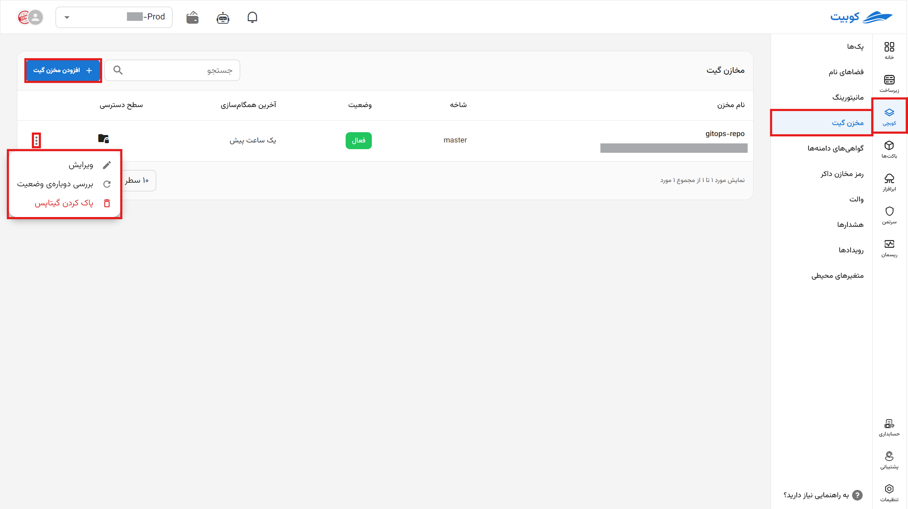

To use your repositories, click on the **Add Git Repository** section.

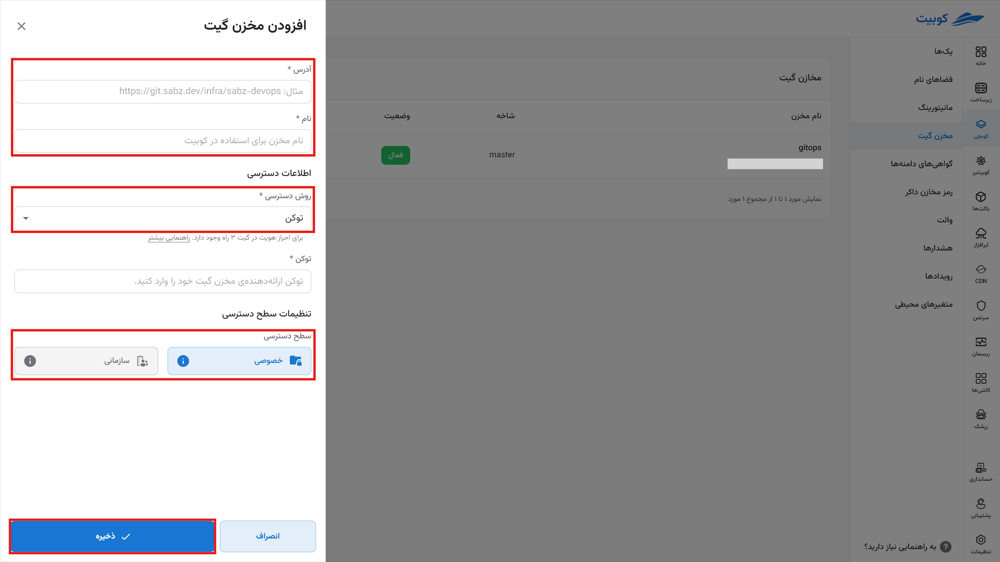

In the opened menu, specify the address, the repository name displayed in the Kubit panel, and the access method for the repository.

### Access Method with Token

#### In GitLab

- Create an access token in the project
  - Go to the `settings > access token` section in the project.
  - Enter the token name, select the desired access permissions, and create the new token. **Be sure to save this token somewhere, as it will not be displayed again later.**
  - **To grant full access in Kubit, ensure the "api" scope is checked in the "Select scopes" section. If you want Kubit to automatically recreate the token after it expires, also enable the rotate access.**
  - **In the "Select a role" section, be sure to choose the Maintainer role.**

Steps to obtain the token:

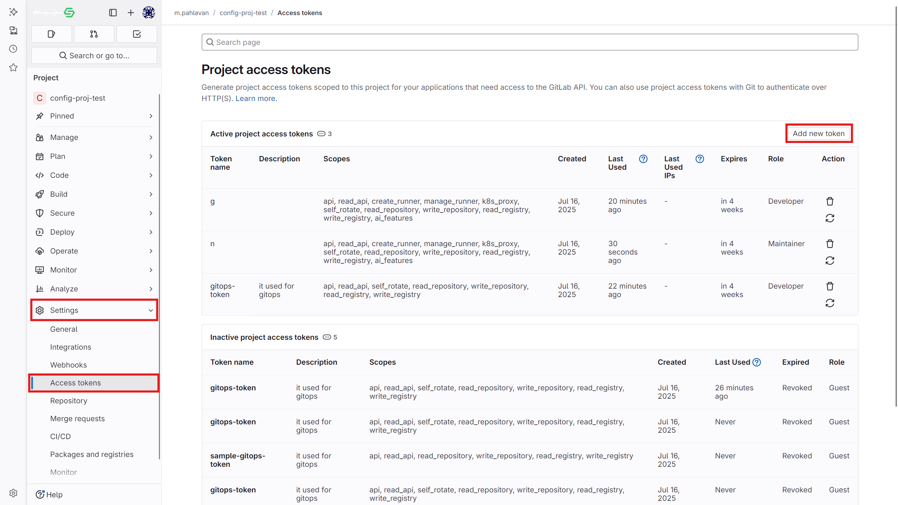
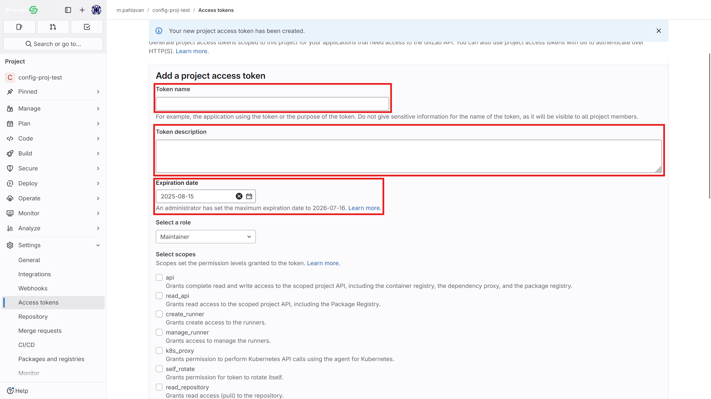
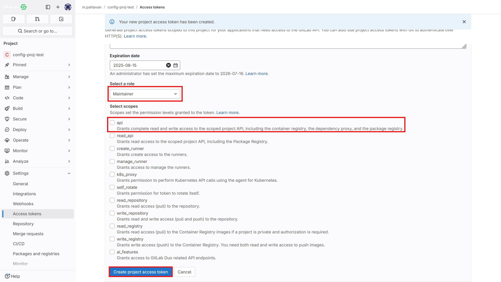
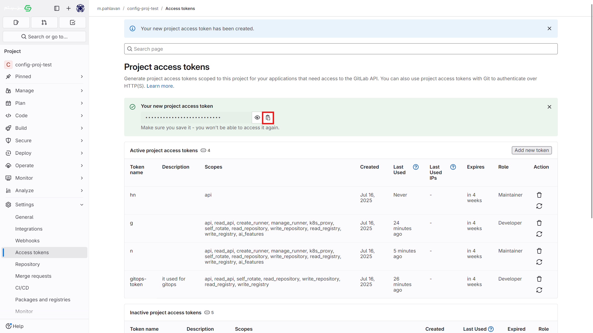

- Using a user access token (as shown in the images above)
  - To create a token, go to user settings
  - Select access token from the sidebar menu.
  - The details for this token are the same as the project access token described above. **It is recommended to create a new user in Git for this purpose and use the access token of that user.**

### Using a Username and Password

#### In GitLab

- If desired, you can use a username and password to connect to Git. **It is recommended to create a user specifically for this purpose in Git and use its username and password.**

:::info[Access Level]

If you set the access level to organizational, other members of the organization and other projects can also use this repository. However, if you keep the access private, only members with access to this project can use it.

:::

Your repository has been added to Kubchi. See the next steps to activate GitOps operations.

:::info[Delete Repository]

To delete a repository, click on the three dots and select the **Delete GitOps** option. If the force delete option is enabled, and the GitOps deletion fails due to lack of access or inability to remove webhooks from Git, the GitOps will be deleted without attempting to remove the webhooks, and the webhooks must be manually removed.

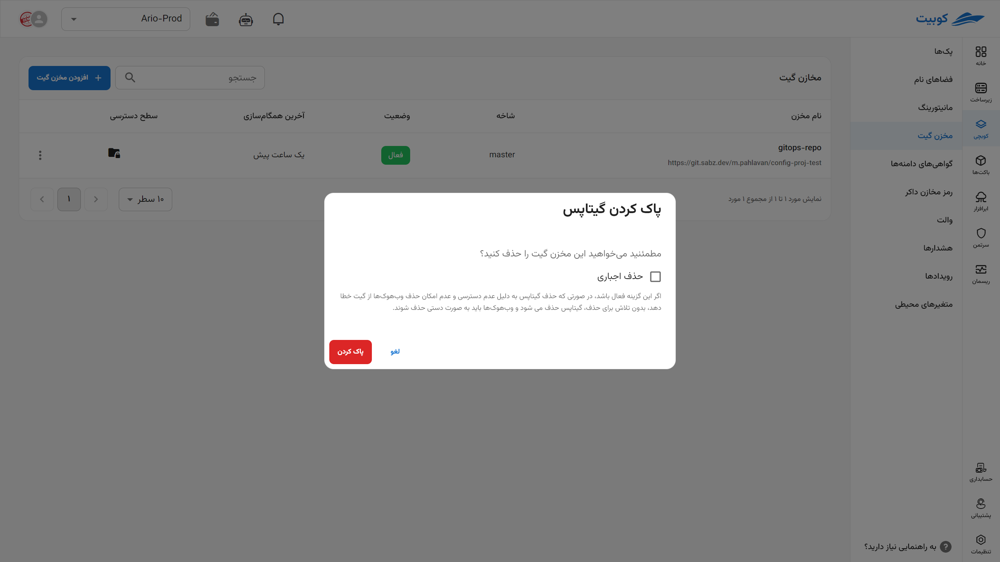

:::

## Storing Configurations in the Repository

After setting up your repository in the **Git Repository** section of the main Kubchi menu, go to the **desired pack** and click on the **GitOps** option. Now, select one of the repositories configured in the previous section, choose a path for storing the configuration file, and select a name for the stored file. From now on, configuration files will be automatically **committed** and stored in this section.

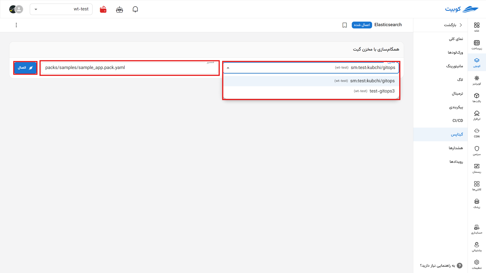

Now that your repository is connected, you can view the list of Kubchi commits in this repository along with their details. After any change in the [configuration](../config) file, you can commit it with your own commit message or Kubit’s default message.

Image of commit and disconnection

## Git Repository Details Menu

By clicking on any repository configured in the Git Repository section, you can access the following tabs.

### Overview

In this section, you can view the **recent commit logs**, **title** of the repository in Kubchi, the **branch** that Kubchi has access to, the **access method** to the repository (token, username, and password), the **project access level** (private at the project level, organizational, accessible in other projects), and the **repository address**. You can modify them if necessary.

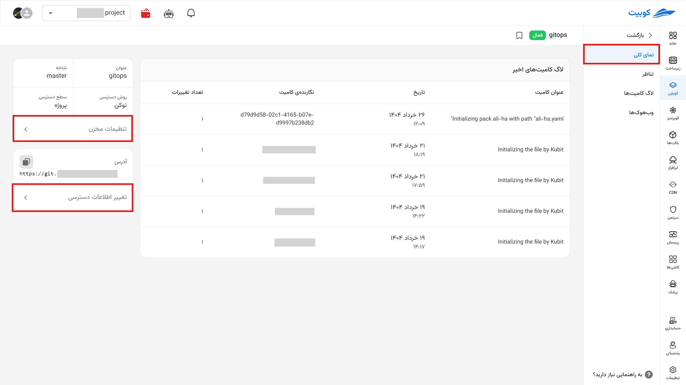
By clicking on this option, you will see a menu similar to the Git Repository section.

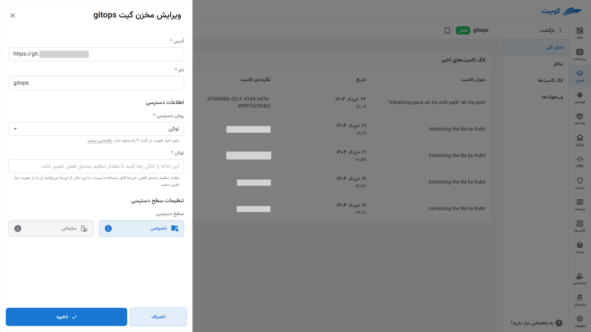

### Mapping

This tab allows you to view the packs connected to the repository, their connection status, and the path where the file is stored. From this section, you can disconnect and reconnect repositories.

By clicking on the option to create a Kubit pack from a configuration file you have set up in the repository, a pack will be created.
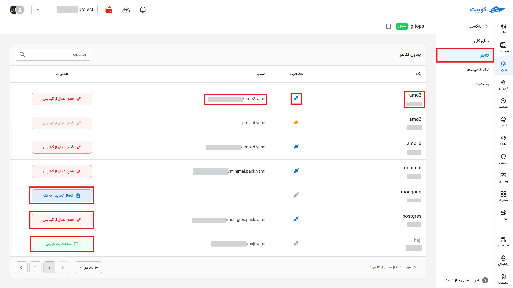

### Commit Logs

Your commit logs through the Kubchi system are fully visible in this section.
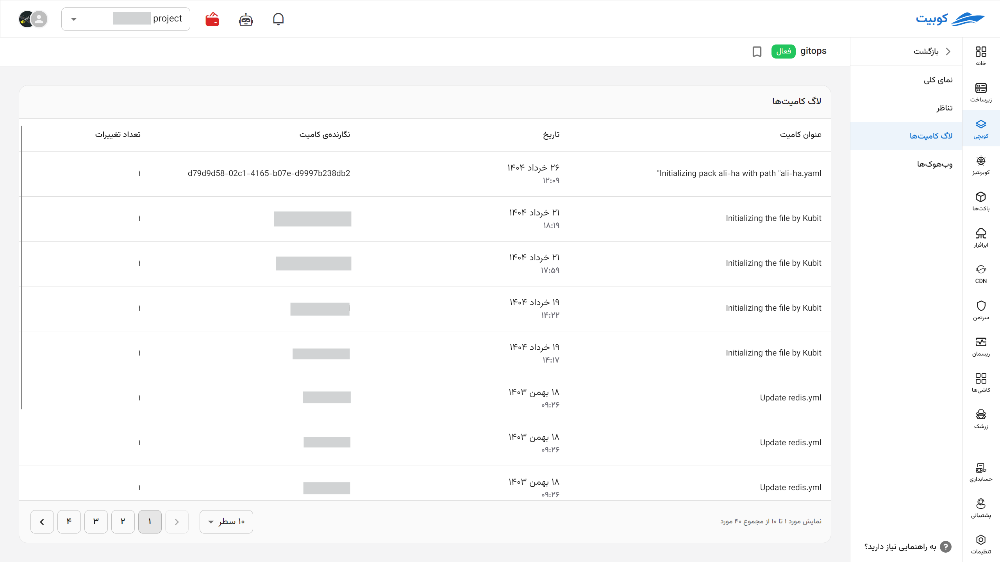

### Webhooks

In this section, the webhook that Kubchi places in the repository is used to send various **notifications** to the system. Kubchi uses this information to inform you about the success of commits, the status of the repository connection with Kubchi, and more. You can copy it or, if there is an issue with the current one, create a new webhook. After the **expiration date**, a new webhook is created and automatically set in the repository if access is available.

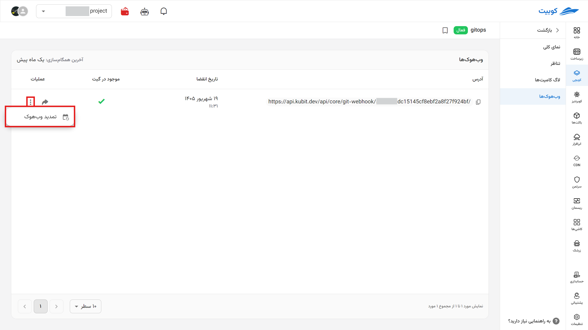
