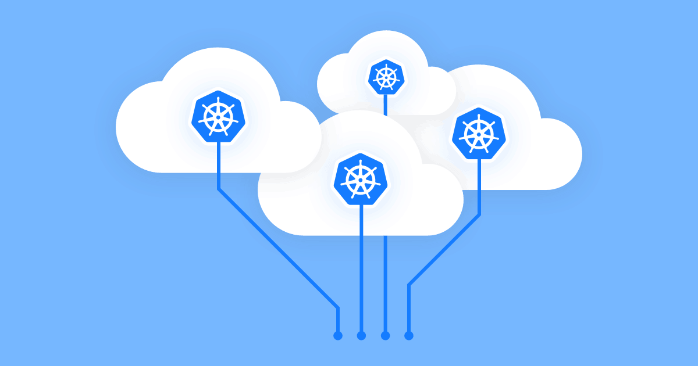

---
subDocuments:
  - concepts
  - charts
  - namespace
  - getting-started
  - config
  - workloads
  - log
  - terminal
  - monitoring
  - alerts
  - events
  - docker
  - gitops
  - CI
  - domains
  - vault
---

# Kubchi (Cloud Platform)

**Kubchi** is a cloud platform (**PaaS**) based on **Kubernetes (K8s)** designed to implement **agile management** principles in software development, with the goal of **simplifying infrastructure management**. This service can be installed and activated on Kubernetes clusters. **Benefits of Kubchi** for managing Kubernetes-based platforms include:

- **Installing containerized packages (Docker images) with pre-configured forms without the need for manual settings**
- **Resource management and automatic notification of system alerts and events**
- **Automation of CI/CD and GitOps**
- **Management of workloads and pods through a web panel without using secondary tools**
- **Connecting various domains to applications**

and more.

After creating your [user account](http://localhost:4000/fa/docs/account) on the **Kubit** website and [selecting the relevant project](http://localhost:4000/fa/docs/organization), follow the step-by-step guide for the subsystems provided by Kubit for this service.

:::info[Prerequisite Concepts]

[Prerequisite Concepts](concepts) introduces the architecture and operation of the **Kubchi platform**. It is recommended to review this section before starting.

:::
**Quick access to Kubchi subsystems:**

**[Application and Resource Management](getting-started) (Pack Management):** In this subsystem, you can easily install containerized packages with a one-click platform.

**[Namespaces](namespace) (namespace):** In this section, manage your workloads more effectively using namespaces.

**[Configuration](config) (Object Manifest):** Configure various resources and their usage in the managed Kubernetes environment of Kubchi.

**[Workloads](workloads) (workloads):** Review the status and manage pods and workloads.

**[Logs](log) (log):** View logs of pods and applications separately.

**[Terminal](terminal) (terminal):** Manage and access pods through a web-based terminal.

**[Monitoring](monitoring) (monitoring):** Monitor the consumption of various system resources.

**[Alerts](alerts) (alerts):** System-generated alerts and their priorities, configured by the Kubit team.

**[Events](events) (events):** Log details of cluster-level events.

**[Docker Registry Credentials](docker) (docker registry credentials):** Connect your Docker registry to the Kubchi platform.

**[Git Repository](gitops) (GitOps repo):** Connect your Git repository to Kubchi and control configuration changes with GitOps.

**[Deployment Automation](conint) (CI/CD):** Through the information provided in this section, automatically generate CI/CD settings and keep your deployed applications synchronized with the latest changes.

**[Domain Certificates](domains) (domain certificates):** Automatically connect domains to the platform for receiving and managing SSL/TLS certificates.

**[Vault](vault) (vault):** A tool for automatic encryption of sensitive data, along with creating and maintaining keys for use in configurations.
