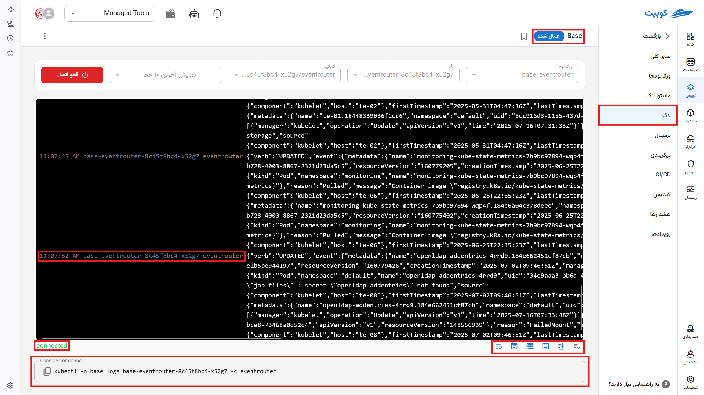

# Log

The history of logs for each workload is displayed in this section. These logs are the output logs of packs and applications. By selecting the desired workload, pod, and container, log transmission for them begins.

Logs for all containers of this pack can be displayed collectively, or they can be selected individually from the **workload**, **pod**, and **containers** lists for display. For each selected container, you can view its logs separately.

By selecting the **Connect** option, log transmission starts, and with **Disconnect**, log reception stops.
This page includes:

- The name of the package you selected along with its status
- Selection of the workload name or workloads from which logs are sent
- Selection of the pod name or pods
- Selection of the container name or containers
- Selection of the number of displayed log lines for the pack:
  - Including the last **10 lines, 100 lines, 1000 lines**
  - Logs from the past **1 minute, 30 minutes, 1 hour, 12 hours**

At the bottom of the page:

- Connection status
- Text command for retrieving logs in your terminal using `kubctl`
- Display mode icons, from right to left, include:
  1. Clear screen button
  2. Auto-scroll with new log reception
  3. Display container name in yellow
  4. Display pod name in blue
  5. Display timestamp in red
  6. Line wrapping (moving to the next line) after printing and displaying a specific number of characters. Without selecting this option, logs are displayed in a single line, requiring you to scroll to the right to read them.
