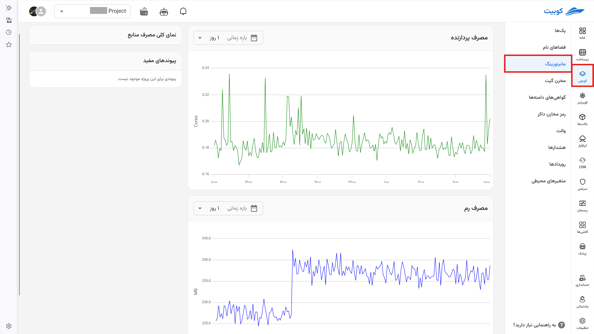

# Monitoring

View the total amount of resources your project consumes in the Kubchi service. Additionally, by clicking on each pack, you can view the resource consumption of that specific pack.

## Cluster

From the Kubchi page in the monitoring tab, you can see an overview of the resource consumption of your [cluster](../concepts/#cluster).

## Pack

By navigating to the management page of a pack, you can view the resource consumption of that pack (broken down by pod and workload).

Details of this page include:

## CPU Usage

In this section, the CPU usage is displayed in milli-core units. (Each milli-core is one-thousandth of a processing core, and the type of processing core is determined by your infrastructure.)

## RAM Usage

In this section, you can specify the amount of RAM usage along with its unit. (The type of units can be configured in the settings.)

## Overview of Resource Consumption

## Useful Links

If external monitoring services (such as Grafana) are enabled, their links will be placed in this section.
