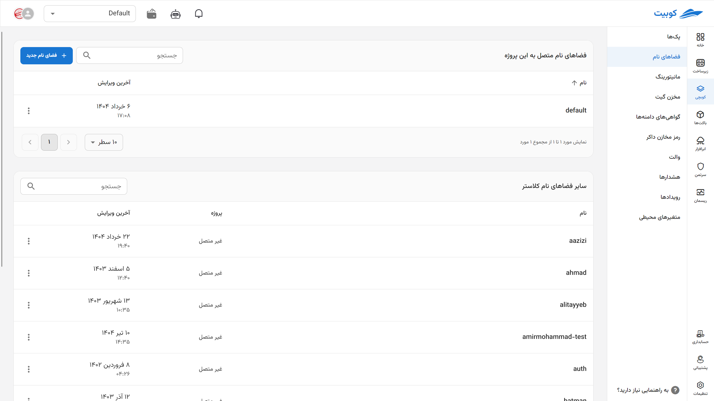
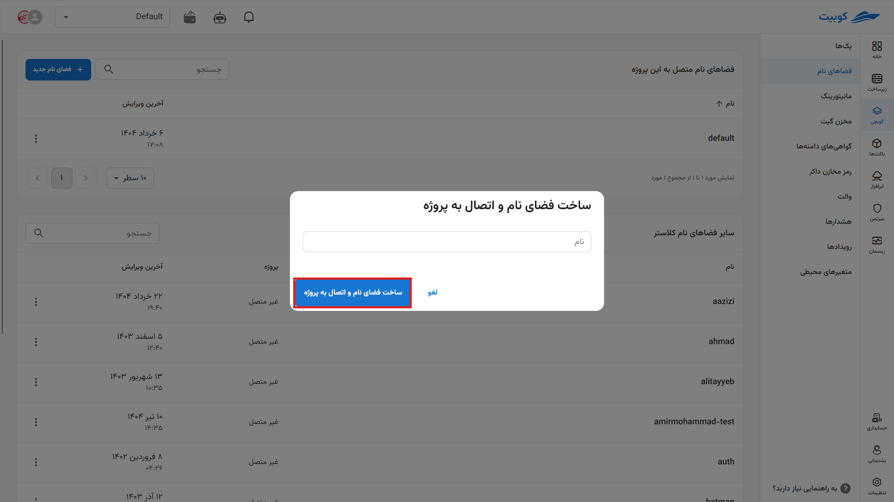
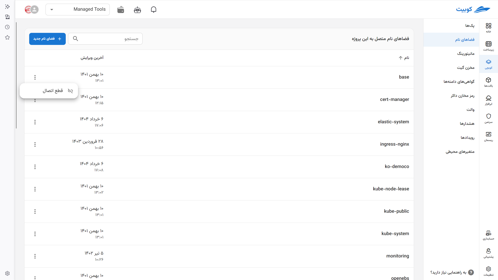

# Namespace (Step Zero)

To install a pack in a project, you need a [namespace](../concepts#namespace) associated with that project, under which [packs](../concepts/#pack) are defined. From this section, select the desired namespace. The namespace will automatically be linked to the project.

Click on **New Namespace**. Enter the namespace and click on the **Create Namespace and Connect to Project** option.

**Note:** Namespaces can also be defined during the installation of packs.

By selecting the three-dot icon, you can disconnect the namespace from the project. After this action, you will no longer be able to use these namespaces.

**Attention**: Note that installed packs will still exist and function correctly.

