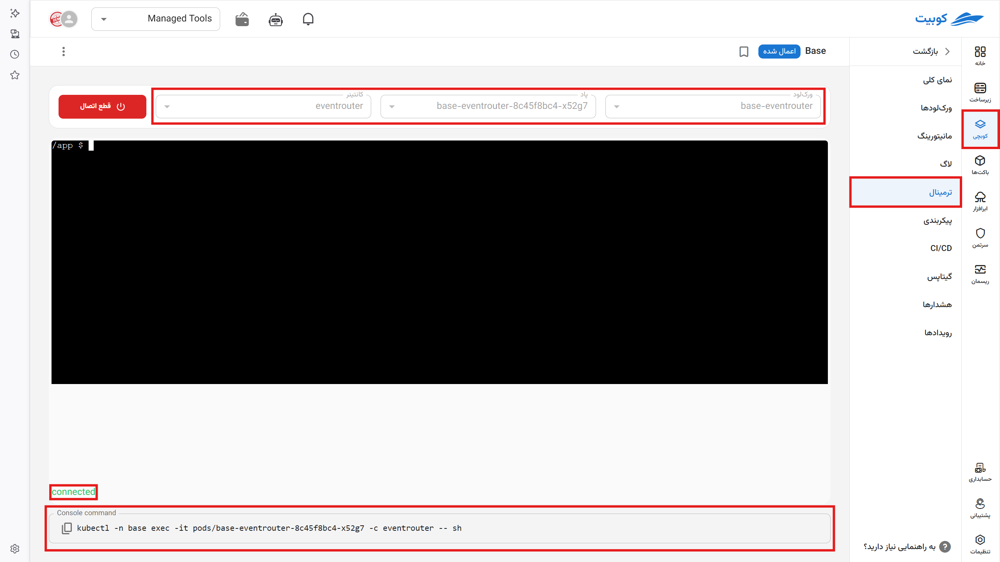

# Terminal

With this tool, it is possible to access an interactive web-based terminal for the containers of each pod. It functions like a system command-line tool.

For example, you enter commands related to an nginx server in this section and can interact with it like a native application.

By selecting the **Connect** option, log transmission starts, and with **Disconnect**, log reception stops.

This page includes:

- The name of the package you selected along with its status
- Selection of the workload name or workloads from which logs are sent
- Selection of the pod name or pods
- Selection of the container name or containers

At the bottom of the page:

- Connection status
- Text command for connecting from your terminal using `kubctl`
