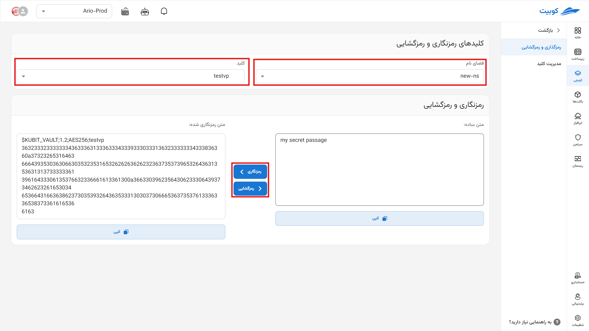

# Vault

Vault is an automated encryption tool that encrypts sensitive data based on keys generated by the user.

You can use this tool to encrypt your sensitive information and store it for reuse in the [Configuration](../config) section. The system is capable of automatically using the keys from this section.

This section becomes relevant after setting up [GitOps](../gitops).

For example, you can set the database password in this section and use it in the configuration file of a pack.

## Encryption and Decryption

In this section, by selecting a **Namespace** and an existing **Key** within it, you can encrypt your text or decrypt your encrypted text. Copy the encrypted text and append it to the required variable (in the [Configuration](config) section).

## Key Management

In this section, you can create new keys by entering a **Key Name**, a **Secret Key**, or generating a new one automatically, and specifying the **Access Level** (personal or organizational).

