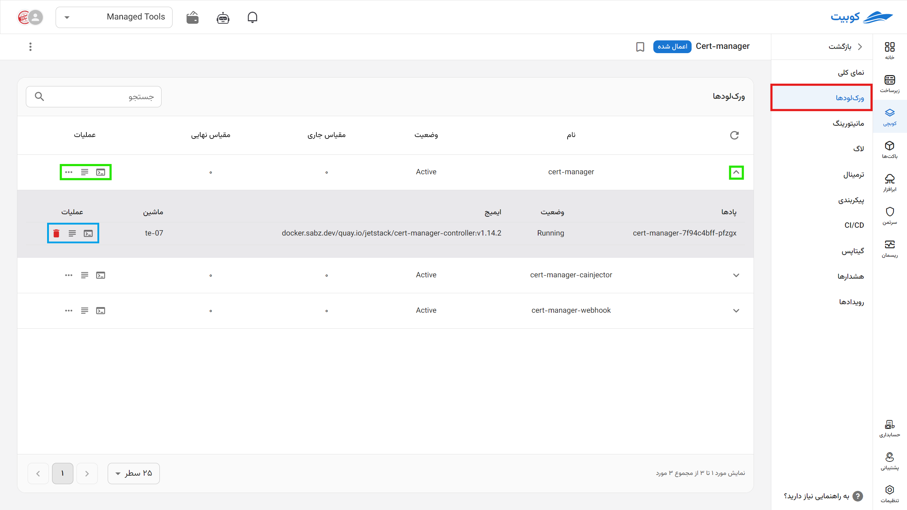
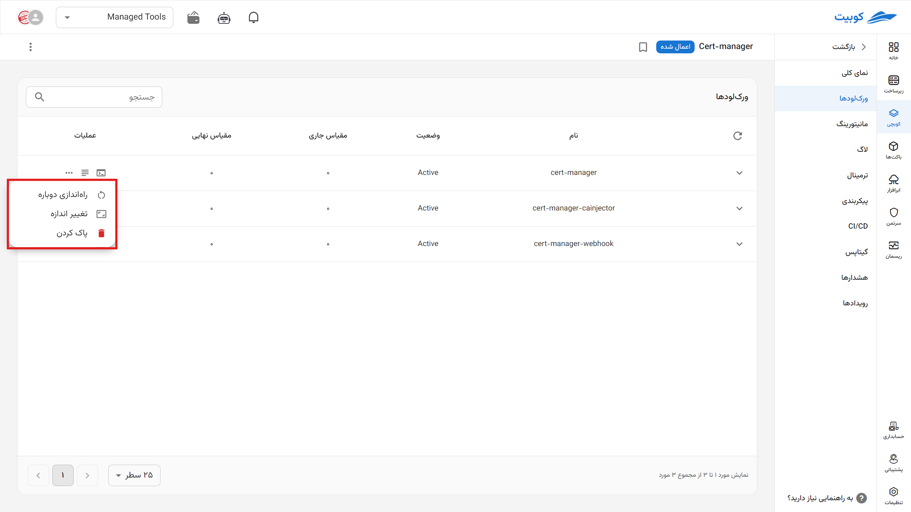

# Workload

In this section, you can view each workload and its associated pods.

## Workload/Pod

**Refreshing Workload Information**

By clicking the **Refresh** button at the top of the workload list, the information displayed in the workloads and their associated pods table is updated.

By clicking on the (▼) icon, the workload expands, allowing you to review its pods and their latest status.

Other information provided in this section about the workload/pod includes:

1. **Name**
2. **Status** of each workload based on Kubernetes standards
3. **Current Scale**:
   The number of active pods for each workload:

   Example:
   Suppose your workload includes the following pods with `5 replicas` each:

   - **2 StatefulSet pods with `5 replicas` =>** 2 \* 5 = 10 pods
   - **1 DaemonSet on 3 workload nodes =>** 3 pods
   - **5 Deployment pods with `5 replicas` =>** 5 \* 5 = 25 pods

   **Current Scale: 38 pods**

4. **Expected (Final) Scale**:

   Specifies the number of pods defined in the **configuration**. This may be the same as the current scale unless there is an issue or change in the pod (e.g., if pods are recreated due to a configuration change).

5. Options from right to left:

   - Quick access to the **terminal** of the workload/pod
   - Quick access to the **logs** of the workload/pod

   - Workload three-dot icon:
     - **Restart Workload**: By selecting the restart operation in each row of the workloads table, the workload is restarted under Kubernetes management, and new instances replace the existing ones.
     - **Resize (Scale)**: Adjust the final scale with a new value

:::info[Deleting a Workload/Pod]

To delete a workload, use the **three-dot** icon. For a pod, click the **trash can** icon next to the pod’s name.

:::
