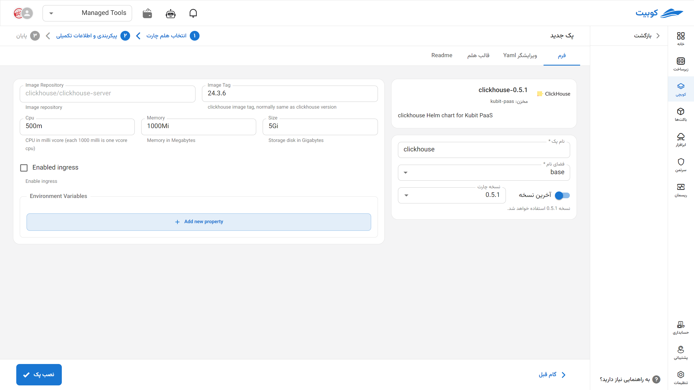
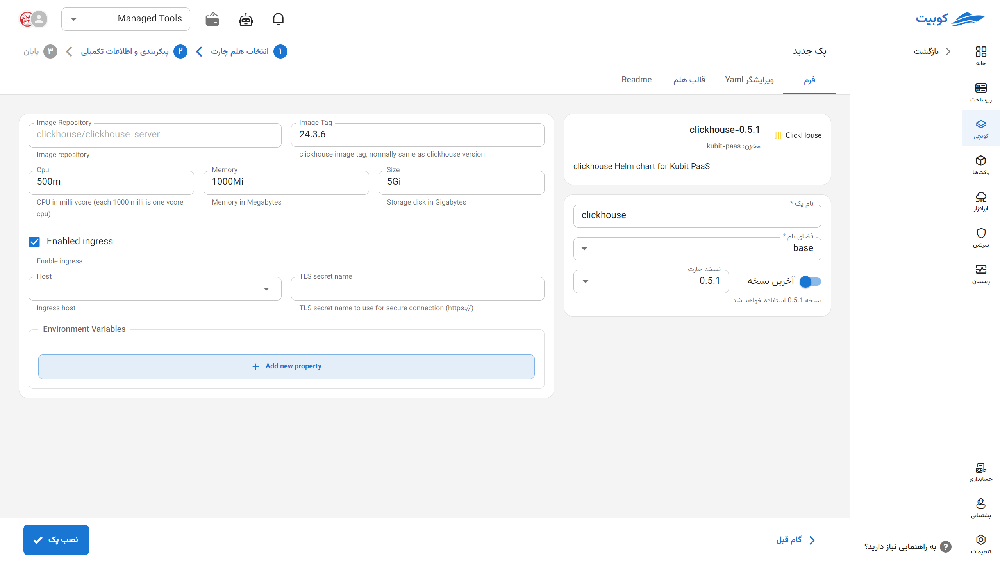

# ClickHouse Database

ClickHouse is a highly fast and scalable columnar database designed for real-time processing of large volumes of analytical data. This system operates in a distributed manner and is particularly suitable for scenarios such as log data analysis, BI systems, monitoring dashboards, and complex reporting. With columnar storage and advanced compression, ClickHouse enables the execution of heavy analytical queries with very high performance.

## Installation via Kubchi Form

After selecting [`Kubchi > Packs > Install Pack`](../../kubchi/getting-started), choose the ClickHouse pack.

## Installation Method and Pack Options

The ClickHouse installation form is similar to [other packs](../../kubchi/getting-started).

### Pack-Specific Options

You can enable ingress settings for this pack (you can also use a certificate from outside Kubit) to access your pack through the domains you have [registered](../../kubchi/domains).

- In the host section, select from your registered domains (you can also use a domain from outside Kubit).
- In the tls section, choose a valid TLS/SSL certificate from your registered certificates (you can also use a certificate from outside Kubit).

**Other Configurations:**

- Environments: By clicking on the add new property section, you can set the environment variables required for the application.

