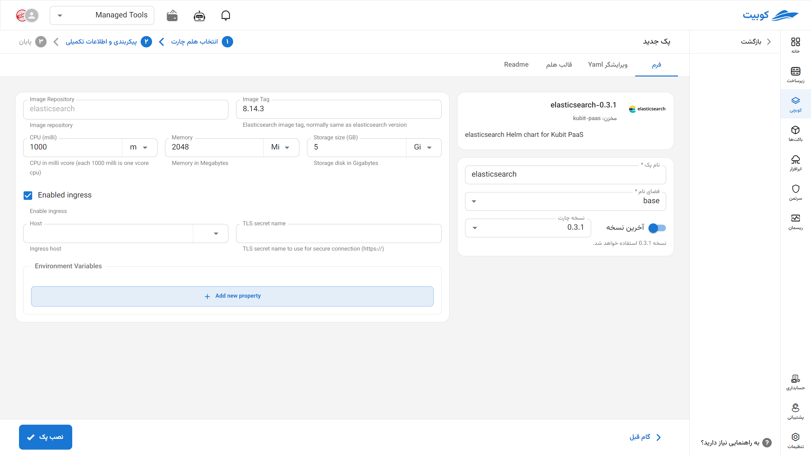

# Elasticsearch Database

Elasticsearch is an open-source distributed search and analytics engine built on Lucene, used for fast searching and storing structured and unstructured data. This platform is widely utilized in monitoring systems, log analysis, text search, and implementing SIEM solutions. With support for full-text searches, complex filters, analytical fields, and horizontal scalability, Elasticsearch has become a key component in ecosystems like ELK (Elasticsearch, Logstash, Kibana).

## Installation via Kubchi Form

After selecting [`Kubchi > Packs > Install Pack`](../../kubchi/getting-started), choose the Elasticsearch pack.

The Elasticsearch installation form is similar to [other packs](../../kubchi/getting-started).

You can enable ingress settings for this pack to access it through the domains you have [registered](../../kubchi/domains).

- In the host section, select from your registered domains (you can also use a domain from outside Kubit).
- In the tls section, choose a valid TLS/SSL certificate from your registered certificates (you can also use a certificate from outside Kubit).

**Other Configurations:**

- Environments: By clicking on the add new property section, you can set the environment variables required for the application.

