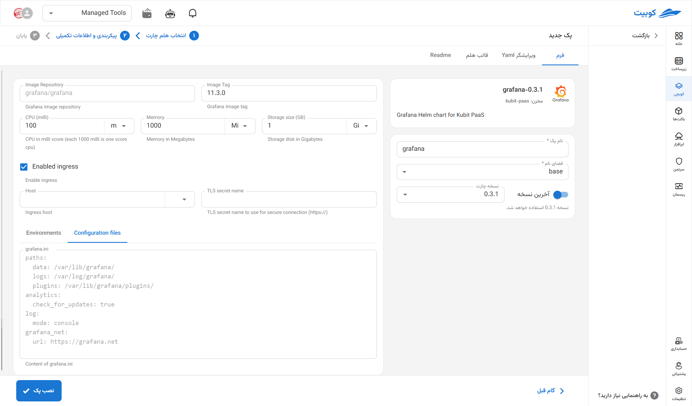

# Grafana Tool

Grafana is an open-source platform for visualization, analysis, and monitoring of time-series data, integrating with various tools such as Prometheus, InfluxDB, Elasticsearch, Loki, and many others. This tool enables the creation of interactive and customizable dashboards, which are highly useful for monitoring the performance of systems, infrastructure, applications, and various services in DevOps, SRE, and Cloud environments. Grafana supports advanced alerting, dashboard sharing, and multiple authentication methods, making it a critical component in modern monitoring architecture.

## Installation via Kubchi Form

After selecting [`Kubchi > Packs > Install Pack`](../../kubchi/getting-started), choose the Grafana pack.

The general installation section of the Grafana form is similar to [other packs](../../kubchi/getting-started).

## Pack-Specific Options

You can enable ingress settings for this pack to access it through the domains you have [registered](../../kubchi/domains).

- In the host section, select from your registered domains (you can also use a domain from outside Kubit).
- In the tls section, choose a valid TLS/SSL certificate from your registered certificates (you can also use a certificate from outside Kubit).

**Other Configurations:**

- Configuration File: Enter the specific configuration file for your pack in this section. A sample file is provided in this section.
- Environments: By clicking on the add new property section, you can set the environment variables required for the application.

