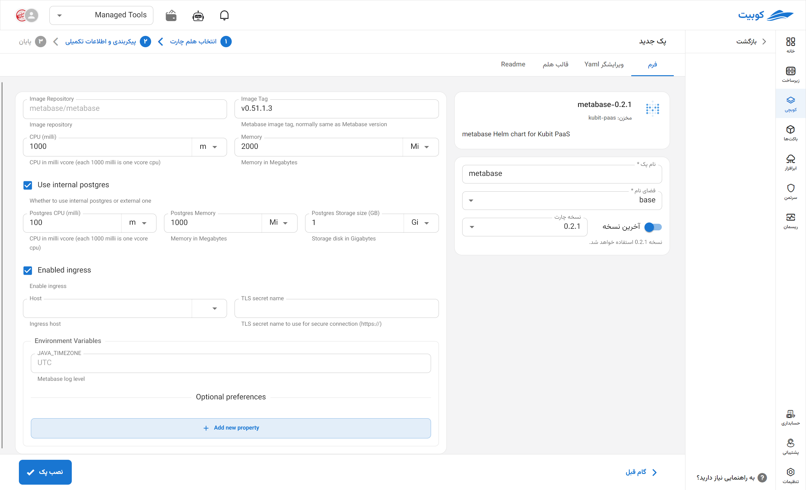

# Metabase Tool

Metabase is a simple open-source business intelligence (BI) tool that allows both technical and non-technical users to analyze and visualize data without writing code. This platform connects directly to various databases (such as PostgreSQL, MySQL, MongoDB, and others), enabling the quick creation of dashboards, charts, and custom reports. Its user-friendly interface, support for automated queries, and report scheduling capabilities make Metabase a suitable choice for data analysis in product, marketing, and operations teams.

## Installation Method and Pack Options

After selecting [`Kubchi > Packs > Install Pack`](../../kubchi/getting-started), choose the Metabase pack.

The general Metabase installation form is similar to [other packs](../../kubchi/getting-started).

### Pack-Specific Options

You can enable ingress settings for this pack to access it through the domains you have [registered](../../kubchi/domains).

- In the host section, select from your registered domains (you can also use a domain from outside Kubit).
- In the tls section, choose a valid TLS/SSL certificate from your registered certificates (you can also use a certificate from outside Kubit).

**Other Configurations:**

- Environment: By clicking on the add new property section, you can set the environment variables required for the application.

