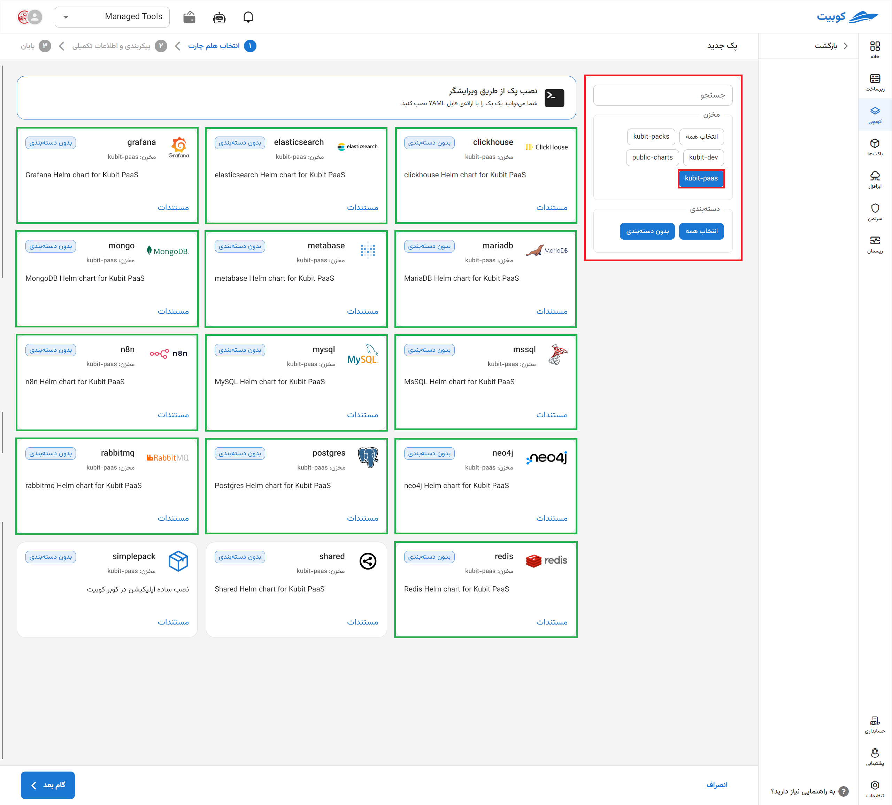
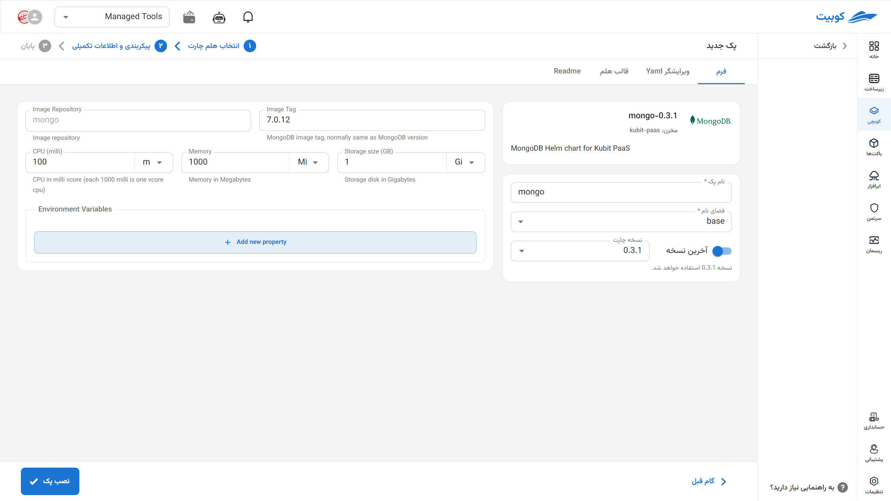

# MongoDB Database

MongoDB is an open-source NoSQL database based on a document-oriented model that stores data in JSON (or BSON) format. This flexible structure allows MongoDB to easily handle semi-structured or unstructured data, making it highly suitable for rapid application development, particularly in microservice-based architectures. MongoDB supports features such as horizontal scalability, replication, advanced indexing, and rich queries, delivering excellent performance in projects with rapidly changing data structures or high read/write volumes.

## Installation Method and Pack Options

After selecting [`Kubchi > Packs > Install Pack`](../../kubchi/getting-started), choose the MongoDB pack.

The general MongoDB installation form is similar to [other packs](../../kubchi/getting-started).

### Pack-Specific Options

**Other Configurations:**

- Environment: By clicking on the add new property section, you can set the environment variables required for the application.
  
