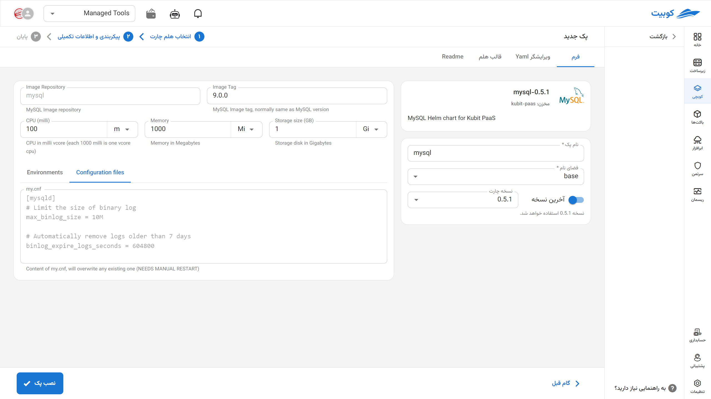

# MySQL Database

MySQL is a widely used open-source relational database management system (RDBMS), particularly renowned in web application development and services based on the LAMP stack (Linux, Apache, MySQL, PHP/Python). With support for transactions, foreign keys, replication, and optimized data structures, this system delivers reliable performance for applications with medium to high data volumes. Due to its ease of installation, extensive user community, and diverse management tools, MySQL is a primary choice for developers and DevOps teams in implementing fast and stable data-driven applications.

## Installation Method and Pack Options

After selecting [`Kubchi > Packs > Install Pack`](../../kubchi/getting-started), choose the MySQL pack.

The general MySQL installation form is similar to [other packs](../../kubchi/getting-started).

### Pack-Specific Options

**Other Configurations:**

- Configuration File: Enter the specific configuration file for your pack in this section. A sample file is provided in this section.

- Environments: By clicking on the add new property section, you can set the environment variables required for the application.

