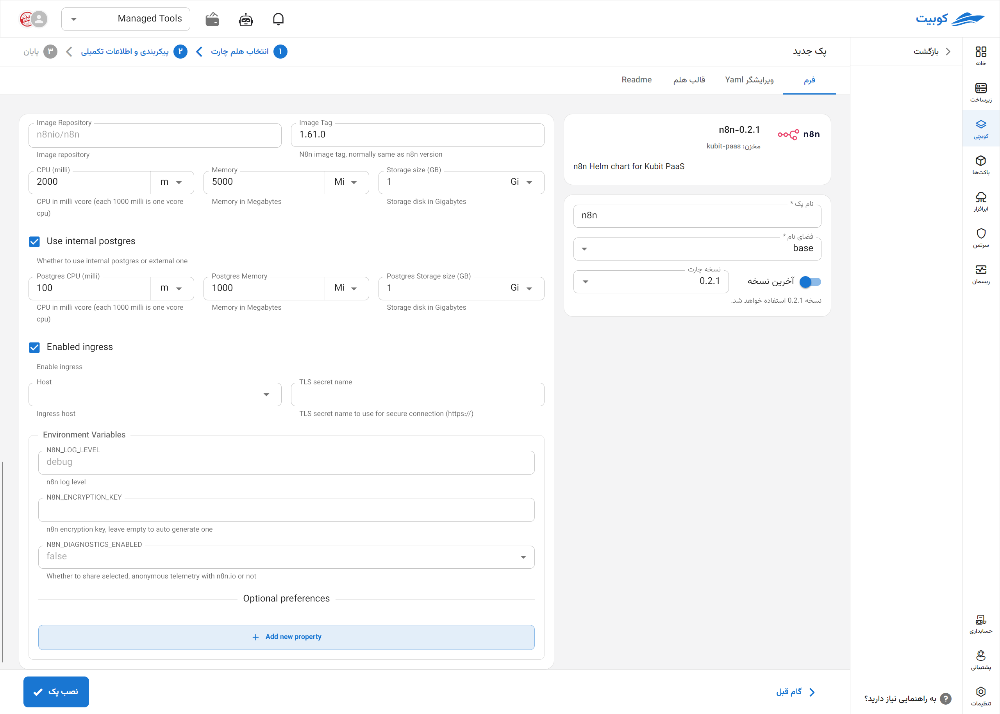

# n8n Tool

n8n is an open-source tool for workflow automation and service integration, enabling users to design and execute complex processes with minimal or no coding. The platform offers over 200 ready-made integrations for various APIs such as GitHub, Slack, Google Sheets, MySQL, and more, facilitating easy service connections and automating operations like data transfer, sending notifications, event coordination, and conditional task execution. n8n also supports dynamic workflows, conditional executions, and intermediate data storage, making it a suitable choice for DevOps, marketing, and data analysis teams seeking a flexible and extensible automation tool.

## Installation Method and Pack Options

After selecting [`Kubchi > Packs > Install Pack`](../../kubchi/getting-started), choose the n8n pack.

The general n8n installation form is similar to [other packs](../../kubchi/getting-started).

### Pack-Specific Options

You can enable ingress settings for this pack to access it through the domains you have [registered](../../kubchi/domains).

- In the host section, select from your registered domains (you can also use a domain from outside Kubit).
- In the tls section, choose a valid TLS/SSL certificate from your registered certificates (you can also use a certificate from outside Kubit).

**Other Configurations:**

- Environments: By clicking on the add new property section, you can set the environment variables required for the application.
  
