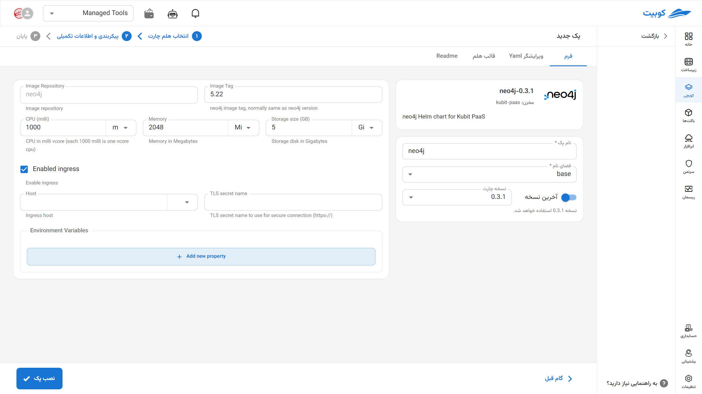

# Neo4j Database

Neo4j is an open-source graph database designed for storing and managing complex, interconnected data. By modeling data as nodes, edges, and properties, it enables the execution of complex queries for social networks, recommendation systems, network analysis, and interconnected data. Leveraging the Cypher query language and high scalability, Neo4j is a key tool for developers and data engineers, particularly in applications requiring the discovery of hidden patterns and analysis of complex structures.

## Installation Method and Pack Options

After selecting [`Kubchi > Packs > Install Pack`](../../kubchi/getting-started), choose the Neo4j pack.

The general Neo4j installation form is similar to [other packs](../../kubchi/getting-started).

### Pack-Specific Options

You can enable ingress settings for this pack to access it through the domains you have [registered](../../kubchi/domains).

- In the host section, select from your registered domains (you can also use a domain from outside Kubit).
- In the tls section, choose a valid TLS/SSL certificate from your registered certificates (you can also use a certificate from outside Kubit).

**Other Configurations:**

- Environments: By clicking on the add new property section, you can set the environment variables required for the application.
  
