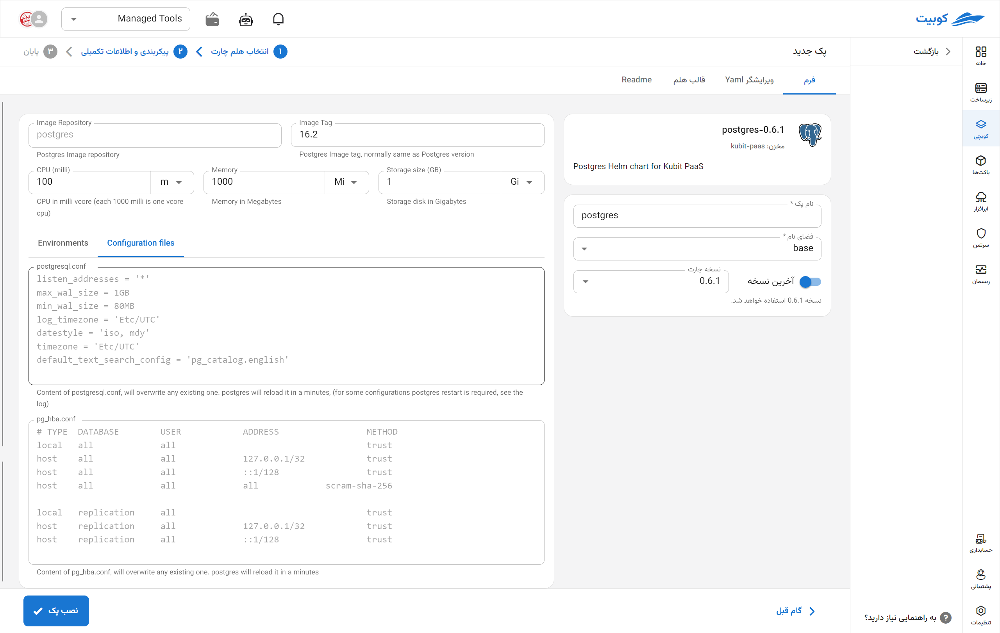

# PostgreSQL Database

PostgreSQL is a powerful open-source relational database management system known for its support of SQL standards, advanced features such as ACID transactions, complex data types, and high extensibility. With capabilities like stored functions, advanced indexing, support for JSON and GIS, and scalability in distributed environments, it is highly suitable for a wide range of applications, from small programs to large enterprise systems. PostgreSQL is recognized as one of the most popular choices among developers and infrastructure teams for implementing reliable and flexible databases.

## Installation Method and Pack Options

After selecting [`Kubchi > Packs > Install Pack`](../../kubchi/getting-started), choose the PostgreSQL pack.

The general PostgreSQL installation form is similar to [other packs](../../kubchi/getting-started).

### Pack-Specific Options

**Other Configurations:**

- Configuration File: Enter the specific configuration file for your pack in this section. A sample file is provided in this section.
- Environments: By clicking on the add new property section, you can set the environment variables required for the application.
  
