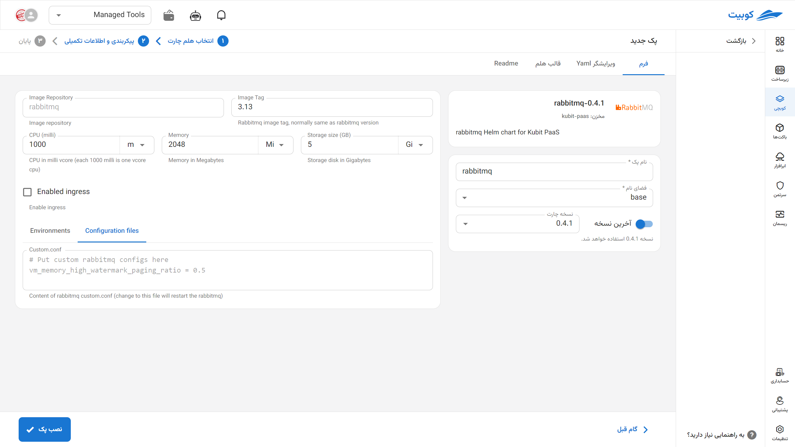

# RabbitMQ Database

RabbitMQ is an open-source message broker designed based on the AMQP protocol, responsible for securely and reliably transferring messages between services and components of a system. This tool supports queues, exchanges, and various routing patterns, enabling asynchronous communication, load balancing, and scalability in distributed systems. RabbitMQ is widely used in microservice-based architectures, stream data processing, and systems requiring guaranteed message delivery, offering monitoring and redundancy features that make it a reliable choice for infrastructure and development teams.

## Installation Method and Pack Options

After selecting [`Kubchi > Packs > Install Pack`](../../kubchi/getting-started), choose the RabbitMQ pack.

The general RabbitMQ installation form is similar to [other packs](../../kubchi/getting-started).

### Pack-Specific Options

You can enable ingress settings for this pack to access it through the domains you have [registered](../../kubchi/domains).

- In the host section, select from your registered domains (you can also use a domain from outside Kubit).
- In the tls section, choose a valid TLS/SSL certificate from your registered certificates (you can also use a certificate from outside Kubit).

**Other Configurations:**

- Configuration File: Enter the specific configuration file for your pack in this section. A sample file is provided in this section.
- Environments: By clicking on the add new property section, you can set the environment variables required for the application.
  
