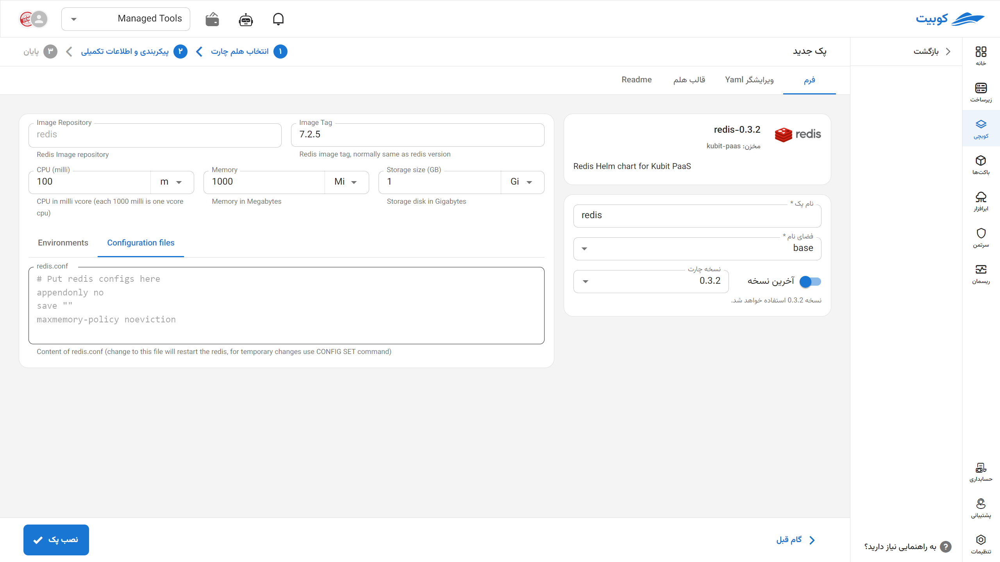

# Redis Database

Redis is an open-source, high-speed in-memory database used for storing structured data in a key-value format. Due to its exceptional speed, support for advanced data types such as lists, sets, and hashes, and features like caching, message queues, and user session management, it is highly popular in web applications and real-time systems. With capabilities for data persistence, clustering, and scalable performance, Redis has become a key tool in modern microservice-based architectures and cloud infrastructures.

## Installation Method and Pack Options

After selecting [`Kubchi > Packs > Install Pack`](../../kubchi/getting-started), choose the Redis pack.

The general Redis installation form is similar to [other packs](../../kubchi/getting-started).

### Pack-Specific Options

**Other Configurations:**

- Configuration File: Enter the specific configuration file for your pack in this section. A sample file is provided in this section.
- Environments: By clicking on the add new property section, you can set the environment variables required for the application.
  
