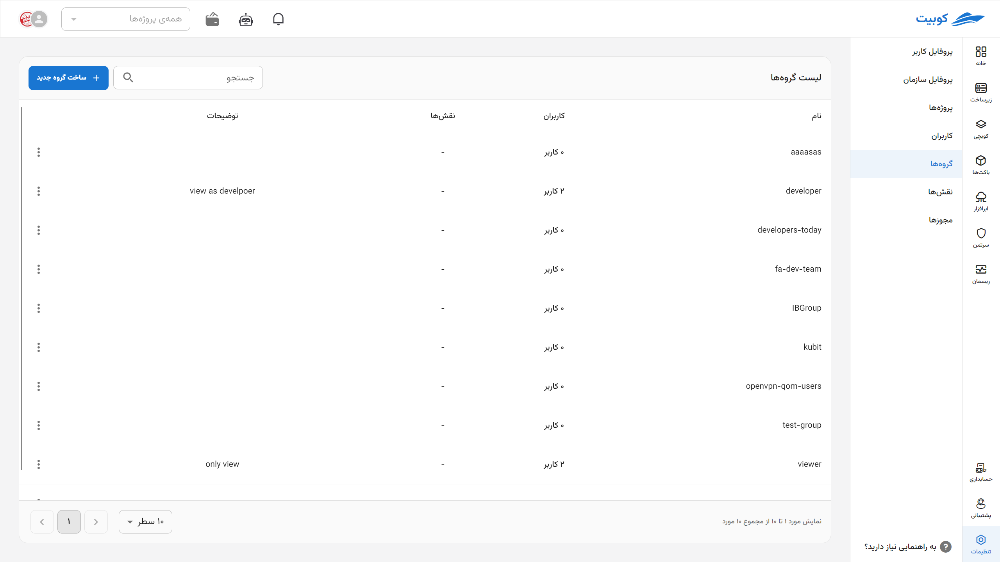

# Groups {#groups}

## Groups

**Groups** are defined to categorize and simplify user management.

Currently in Kubit, **only the assignment of roles to groups** is available; meaning one or more **specific roles** can be assigned to a group, and all members of that group will receive those roles.

#### LDAP Integration

If your organization is connected to **LDAP**, additional features become available, including:

- **Automatic synchronization (Sync) with LDAP groups**
- Unified management of users and access through the LDAP server

Groups are defined for categorizing users and managing access. Currently in Kubit, you can only assign specific roles to a group. If the organization is connected to [LDAP](../user-managment/#ldap), additional features such as synchronization with LDAP groups will be available.

From the **Organization** section, go to the **Groups** section:

In this section, you can view the list of organization groups:

By clicking on the name of any group, you will be directed to the group details page:

## Creating a Group {#create-group}

By clicking on the **New Group** button, you can define a new group:

:::info[Optional Values]
The **description**, **users**, and **roles** fields are optional, and you can create a group by entering only the **name**. This document assumes all required information is provided.
:::

Enter the **name** and description, and select users from the list of organization users:

To add a role to the group, click on the **Add Role** button:

Then select the desired role from the list of available roles and specify the access level in the project:

Finally, click on the **Create New Group** button:

The group is created, and you will be directed to the groups list page:

## Deleting a Group

To delete a group, go to the groups list, click on the three-dot button of the desired group, and select the **Delete** option:

Then, by selecting the **Delete** option, the group will be deleted:

## Editing a Group

When editing a group, you can perform operations such as editing the name and description, adding or removing users, and adding or removing roles in the group.

### Editing Group Information

- To edit the group’s name and description, simply enter the new information.
- Then, by clicking on the **Update Group** button, your changes will be applied.
  
- 

### Adding/Removing Users

#### Adding a User

- To add a user to the user group, from the **Users** section, select the desired users from the list of organization users.
- Then, by clicking on the **Update Group** button, the selected user will be added to the group.
  
  

#### Removing a User

- To remove a user from the group, simply click on the **cross** icon next to the user’s name:
- Then, by clicking on the **Update Group** button, save the applied changes:
  

### Adding/Removing Roles

#### Adding a Role

To add a role to the user group, from the **Roles** section, click on **Add Role**:

Select the desired role along with the access level in the project:

Then, by clicking on the **Update Group** button, the selected role will be added to the group:

#### Removing a Role

- To remove a role from the group, simply click on the **trash bin** icon of the relevant role.
- Then, by clicking on the **Update Group** button, save the applied changes.
  
