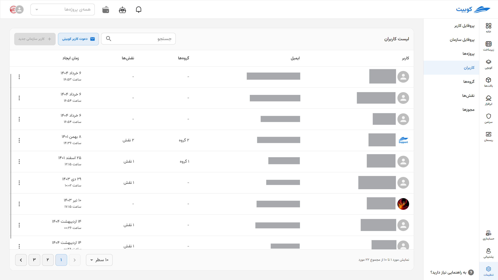

# Users (Member Access Management)

The organization administrator can define access levels for the organization’s users. In Kubit, specific permissions can be issued for each role, and these roles can then be assigned to users.

From the **Organization** section, go to the **Users** section:

In this section, you can view the list of organization users:

By clicking on the name of any user, you will be directed to the user’s information page:

From the user information page, you can also access the list of the user’s groups and roles.

## User Groups

In the **Groups** section, you can view the list of the user’s groups.

### Adding a User to a Group

- To add a user to other groups, click on the **Add to Group** button.
- Select the desired group from the list of organization groups.
- Then, by clicking on **Add**, the user will be added to the selected group.
  
  
  
  

### Removing/Leaving a User from a Group

- To remove or have a user leave a group, click on the three-dot icon in the operations column.
- Then, by clicking on **Leave Group**, the user will be removed from the selected group.
  
  

## User Roles

In the **Roles** section, you can view the list of the user’s roles.

### Assigning a Role to a User

- To add a role to the user’s roles, click on the **Assign Role** button.
- Select the desired role from the list of available roles and specify the access level in the project.
- Then, by clicking on **Add**, the selected role will be assigned to the user.
  
  
  
  

### Removing a Role from a User

- To remove a role from the user’s roles, click on the three-dot icon.
- Then, by clicking on **Delete**, the role will be removed from the user.
  
  
