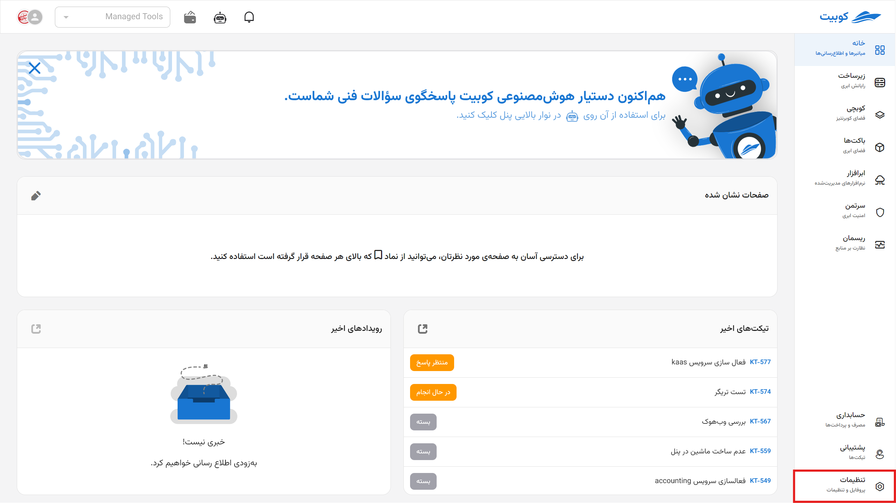

---
subDocuments:
  - profile
  - organization
  - projects
  - iam
  - user-management
  - roles
  - groups
  - permissions
---

# Settings

The **Settings** section in Kubit is the central hub for controlling your organization, where you can create **various projects**, manage **users**, and easily define precise **access levels** for individuals or groups with just a few clicks. This section allows you to fully customize your **organizational structure** according to your needs and manage your **resources and services** confidently in a secure, integrated, and professional environment.

## Quick Access to Available Features:

**[Organization Profile Settings](organization) (Organization):** In this section, you can access and manage the general organization details, services, projects, users, and groups.

**[User Profile Settings](profile) (Profile):** In this section, you can edit user information, view member organizations, change the language and calendar type, select the display theme, and configure notification preferences.

**[Creating a New Project](projects) (Projects):** The ability to **create independent projects** for using various services such as virtual machines, storage, and software packages (Packs) in Kubchi.

**[User Management](user-management) (User Management):** Defining and managing new users\*, including **LDAP users**, with the ability to set different levels of access for users through:

- **[Defining Permissions](projects) (Permissions):** Specifying access to different parts of the system.
- **[Creating Roles](roles) (Roles):** Aggregating permissions into assignable roles.
- **[Grouping Users](groups) (Groups):** Organizing users and assigning shared roles to them.

**\* The [Member Access Management](iam) document provides detailed information on managing user and organization access.**
